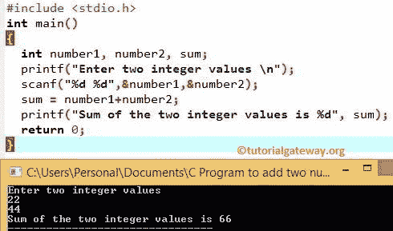

# C 程序：两个数相加

> 原文：<https://www.tutorialgateway.org/simple-c-program-to-add-two-numbers/>

写一个简单的 C 程序加两个整数值打印输出？

## 两个数相加的简单 C 程序

这个 C 程序将两个数字相加，允许用户输入两个整数值。然后，将这两个整数相加，并将总和分配给变量 sum。

在这个简单的 c 程序中添加两个数字，首先，我们声明了三个称为 number1、number2 和 sum 的整数值

下两行[程序](https://www.tutorialgateway.org/c-programming-examples/)代码邀请用户输入两个整数。下一条 scanf 语句将把用户输入的值赋给我们已经声明的变量，它们是 number1 和 number2。

下一行，我们应用[算术运算符](https://www.tutorialgateway.org/arithmetic-operators-in-c/) +对数字 1 和数字 2 求和，并将该总和赋给 sum。然后 printf 将显示两个数字变量的和作为输出(22 + 44 = 66)。

```c
/* Simple add Two numbers program */

#include <stdio.h>
int main()
{
  int number1, number2, sum;

  printf(" Enter two integer values \n ");
  scanf("%d %d", &number1, &number2);

  sum = number1 + number2;

  printf(" Sum of the two integer values is %d", sum);
  return 0;
}
```



这个两个数相加的 c 程序在加正整数的时候表现不错，那加正整数和负整数呢？让我们看看

```c
 Enter two integer values 
 8
-6
 Sum of the two integer values is 2
```

c 语言中两个数的和对负数也很有效