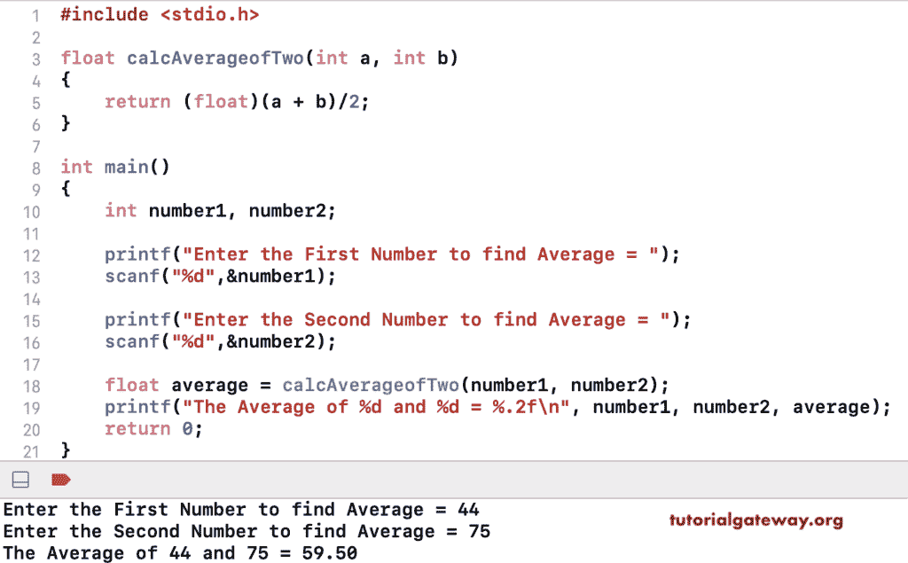

# C 程序：求两个数平均值

> 原文：<https://www.tutorialgateway.org/c-program-to-find-average-of-two-numbers/>

用例子写一个求两个数平均值的 C 程序。这个 C 例子允许输入两个整数，并计算这些数的总和和平均值。

```c
#include <stdio.h>

int main()
{
    int number1, number2;
    float average;

    printf("Enter the First Number to find Average = ");
    scanf("%d",&number1);

    printf("Enter the Second Number to find Average = ");
    scanf("%d",&number2);

    int sum = number1 + number2;

    average = sum/2; //(float)sum/2;

    printf("The Sum of %d and %d     = %d\n", number1, number2, sum);
    printf("The Average of %d and %d = %.2f\n", number1, number2, average);

    return 0;
}
```

c 两个数字的平均值输出

```c
Enter the First Number to find Average = 20
Enter the Second Number to find Average = 60
The Sum of 20 and 60     = 80
The Average of 20 and 60 = 40.00
```

在这个 C 程序中，我们创建了一个新的函数，计算并返回给定两个数字的平均值。

```c
#include <stdio.h>

float calcAverageofTwo(int a, int b)
{
    return (float)(a + b)/2;
}

int main()
{
    int number1, number2;

    printf("Enter the First Number to find Average = ");
    scanf("%d",&number1);

    printf("Enter the Second Number to find Average = ");
    scanf("%d",&number2);

    float average = calcAverageofTwo(number1, number2);

    printf("The Average of %d and %d = %.2f\n", number1, number2, average);

    return 0;
}
```

