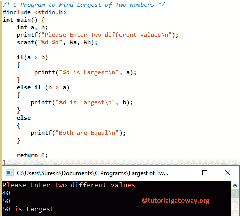

# C 程序：求两个数中的最大值

> 原文：<https://www.tutorialgateway.org/c-program-to-find-largest-of-two-numbers/>

如何使用 Else If 语句、条件运算符和 Switch Case 编写一个 C 程序来查找两个数字中的最大值。

## 用 Else If 语句求两个数中的最大值的 c 程序

这个 C 程序帮助用户输入两个不同的值，然后它会使用 Else If 语句 找到其中最高的数字

```c
/* C Program to Find Largest of Two numbers */ 

#include <stdio.h>  

int main() {  
    int a, b;  
    printf("Please Enter Two different values\n");  
    scanf("%d %d", &a, &b);  

    if(a > b) 
    {
        printf("%d is Largest\n", a);          
    } 
    else if (b > a)
    { 
        printf("%d is Largest\n", b);  
    } 
    else 
    {
	printf("Both are Equal\n");
    }

    return 0;  
}
```

在这个寻找 C 中两个数中的最大值的程序例子中，[否则 If 语句](https://www.tutorialgateway.org/else-if-statement-in-c/ "Else If Statement in C")的执行是

1.  首先，如果条件检查 a 是否大于 b。如果该条件为真，则 a 大于 b
2.  第一个“否则”条件检查 b 是否大于 a。如果该条件为“真”，则 b 大于 a
3.  如果以上两个条件都失败了，说明它们是相等的。

输出 1:让我们输入值 a = 40，b = 50



输出 2:让我们输入值 a = 20，b = 10

```c
Please Enter Two different values
20
10
20 is Largest
```

让我们输入值 a = 50，b = 50

```c
Please Enter Two different values
50
50
Both are Equal
```

## 用条件算子求两个数中的最大值的 c 程序

这个 C 程序帮助用户输入两个不同的值。接下来，它将使用[条件运算符](https://www.tutorialgateway.org/conditional-operator-in-c/ "CONDITIONAL OPERATOR IN C")在这两个数字中找到最大的数字

```c
/* C Program to Find Largest of Two numbers */ 

#include <stdio.h>  

int main() {  
    int a, b, largest;
    printf("Please Enter Two Different Values\n");  
    scanf("%d %d", &a, &b);  

    if(a == b)
    {
        printf("Both are Equal\n");
    }
    else { 
        largest = (a > b) ? a : b;
        printf("%d is Largest\n", largest);
    }
    return 0;  
}
```

在这个 C 程序中找到两个数字中最大的例子，

1.  首先，我们声明了三个整数变量，称为 a、b 和最大。接下来，我们允许用户输入他们自己的 a 和 b 值
2.  首先 [C 编程](https://www.tutorialgateway.org/c-programming/) If 条件检查 a 是否等于 b。如果这个条件为真，那么它将返回两者相等。
3.  接下来，我们使用条件运算符来检查 a 是否大于 b。如果此条件为真，则它将返回？符号，它是变量 a (a 大于 b)。如果第一个条件失败，那么它将返回:符号之后的值，即变量 b。

输出 1:对于这个两个数中 c 最大的演示，让我们输入值 a = 15，b = 25

```c
Please Enter Two Different Values
15
25
25 is Largest
```

让我们输入值 a = 35，b = 12

```c
Please Enter Two Different Values
32
12
32 is Largest
```

输出 3:让我们输入值 a = 25，b = 25

```c
Please Enter Two Different Values
25
25
Both are Equal
```

## 用开关盒求两个数中的最大值的 c 程序

这个[程序](https://www.tutorialgateway.org/c-programming-examples/)帮助用户输入两个不同的值。然后，这个 c 程序使用[开关盒](https://www.tutorialgateway.org/switch-case-in-c/)找到两个数字中的最大值

```c
/* C Program to Find Largest of Two numbers */ 

#include <stdio.h>  

int main() {  
    int a, b, largest;
    printf("Please Enter Two Values\n");  
    scanf("%d %d", &a, &b);  

    switch(a > b) 
    {     
        case 1: printf("%d is Largest", a);  
                break;  
        case 2: printf("%d is Largest", b);  
                break;  
    }  
    return 0;  
}
```

在这个寻找两个数中的最大值的 C 程序示例中，我们声明了三个整数变量，分别叫做 a、b 和最大值。接下来，我们允许用户输入他们自己的 a 和 b 值。接下来，我们使用 Switch Case 检查最大值。

输出 1:让我们输入值 a = 25，b = 56。

```c
Please Enter Two Values
25
56
56 is Largest
```

让我们输入值 a = 13，b = 5

```c
Please Enter Two Values
13
5
13 is Largest
```