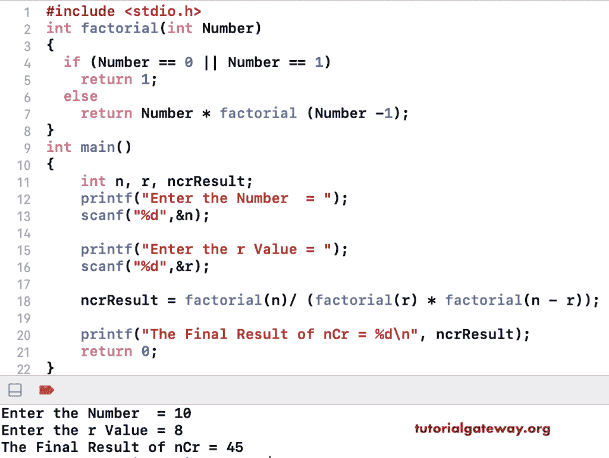

# C 程序：计算 nCr 

> 原文：<https://www.tutorialgateway.org/c-program-to-calculate-the-ncr/>

写一个 C 程序来寻找或计算 nCr。这个组合公式也可以表示为 C(n，r)。计算 nCr 的数学公式是 nCr = n！/( r！(n–r)！).该程序允许输入 n 和 r 值，并计算 nCr。在这里，我们创建了一个函数，返回给定数字的阶乘。

```c
#include <stdio.h>

int factorial(int Number)
{
  if (Number == 0 || Number == 1)
    return 1;
  else
    return Number * factorial (Number -1);
}

int main()
{
    int n, r, ncrResult;

    printf("Enter the Number  = ");
    scanf("%d",&n);

    printf("Enter the r Value = ");
    scanf("%d",&r);

    ncrResult = factorial(n)/ (factorial(r) * factorial(n - r));

    printf("The Final Result of nCr = %d\n", ncrResult);

    return 0;
}
```

