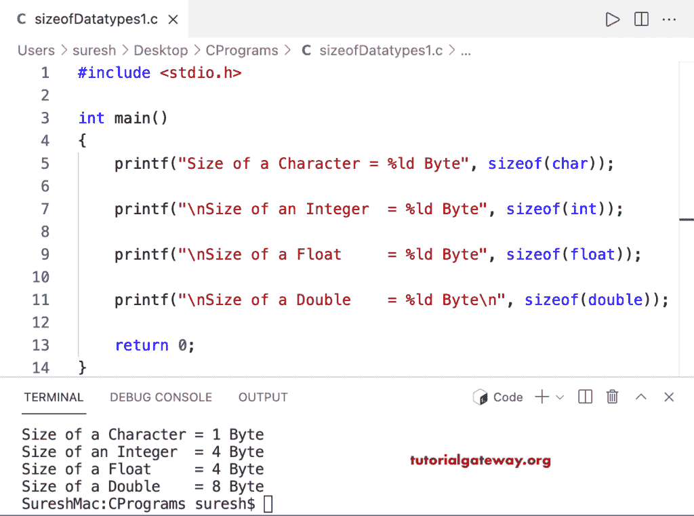

# C 程序：计算整型浮点双精度和字符的大小

> 原文：<https://www.tutorialgateway.org/c-program-to-find-the-size-of-int-float-double-and-char/>

写一个 C 程序，用一个例子找出 int 或 integer，float，double，char 或 char 字符的大小。在 [C](https://www.tutorialgateway.org/c-programming-examples/) 编程中，我们有一个 sizeof 运算符，它允许我们打印或获取任何数据类型的大小。

```c
#include <stdio.h>

int main()
{   
    printf("Size of a Character = %ld Byte", sizeof(char));

    printf("\nSize of an Integer  = %ld Byte", sizeof(int));

	printf("\nSize of a Float     = %ld Byte", sizeof(float));

	printf("\nSize of a Double    = %ld Byte\n", sizeof(double));

    return 0;
}
```

