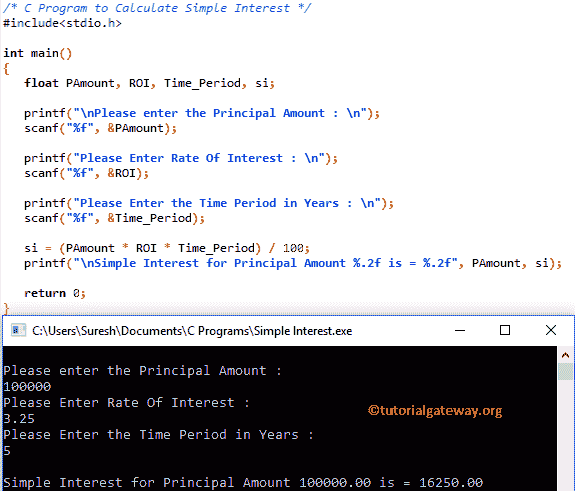

# C 程序：计算单利

> 原文：<https://www.tutorialgateway.org/c-program-to-calculate-simple-interest/>

如何用例子编写 C 程序计算单利？在我们进入示例之前，让我向您展示计算背后的公式:

单利=(本金*利率*年数)/ 100

## 计算单利的 c 程序

这个 [C 程序](https://www.tutorialgateway.org/c-programming-examples/)允许用户输入本金金额、利率和年数。通过使用上述公式，我们将在本程序中计算这些值。

```c
#include<stdio.h>

int main() 
{
   float PAmount, ROI, Time_Period, si;

   printf("\nPlease enter the Principal Amount : \n");
   scanf("%f", &PAmount);

   printf("Please Enter Rate Of Interest : \n");
   scanf("%f", &ROI);

   printf("Please Enter the Time Period in Years : \n");
   scanf("%f", &Time_Period);

   si = (PAmount * ROI * Time_Period) / 100;
   printf("\nSimple Interest for Principal Amount %.2f is = %.2f", PAmount, si);

   return 0;
}
```

