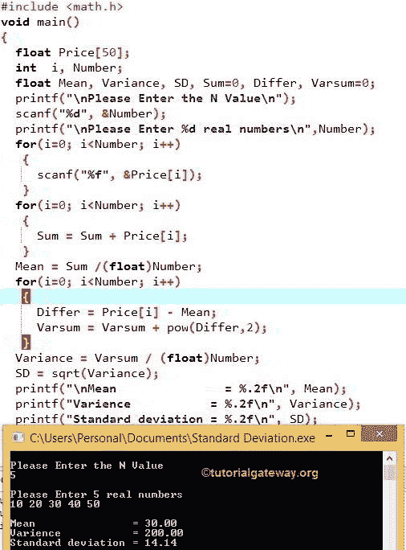

# C 程序：计算标准差

> 原文：<https://www.tutorialgateway.org/c-program-to-calculate-standard-deviation/>

如何用例子编写计算标准差、均值和方差的 C 程序？。在这个例子之前，我们必须先了解一些概念，比如均值和方差，然后才能理解标准差。为了更好地理解这些概念，我们在这里取一些示例数据。

例如，我们有 5 个项目，它们的价格值是 10、25、30、67、92。让我们计算 C 编程中的平均值、方差和标准差。

## C 中的平均值

平均值也可以称为平均值，我们可以使用以下公式进行计算:

平均值=各单项之和/项目总数
平均值= (10 + 25 + 30 + 67+ 92) / 5
平均值= 224 / 5 = 44.8

### C 中的差异

在计算 C 中的方差之前，我们必须找到原始值和平均值之间的差异，因为

差值=((原始值–平均值)+(原始值–平均值)+…。)/项目总数
差异=(10–48)+(25–48)+(30–48)+(67–48)+(92–48)
差异= (- 38) + (- 23) + (- 18) + (19) + (44)

我们可以用公式计算方差:
方差=(-38)+(-23)+(-18)+(19)+(44))/5
方差= (1444 + 529 + 324 +361 + 1936) / 5
方差= 4594 / 5
方差= 918.8

### 标准差单位

方差的平方根称为标准差。
标准差= √918.8
标准差= 30.31

## 计算标准差、均值和方差的 c 程序

这个 C 程序计算给定数字数组的平均值、方差和标准差。

```c
/* C Program to Calculate Standard Deviation, Mean and Variance */
#include <stdio.h>
#include <math.h>

void main()
{
  float Price[50];
  int  i, Number;
  float Mean, Variance, SD, Sum=0, Differ, Varsum=0;

  printf("\nPlease Enter the N Value\n");
  scanf("%d", &Number);

  printf("\nPlease Enter %d real numbers\n",Number);
  for(i=0; i<Number; i++)
   {
     scanf("%f", &Price[i]);
   }

  for(i=0; i<Number; i++)
   {
     Sum = Sum + Price[i];
   }

  Mean = Sum /(float)Number;

  for(i=0; i<Number; i++)
   {
     Differ = Price[i] - Mean;
     Varsum = Varsum + pow(Differ,2);
   }

  Variance = Varsum / (float)Number;
  SD = sqrt(Variance);

  printf("Mean               = %.2f\n", Mean);
  printf("Varience           = %.2f\n", Variance);
  printf("Standard deviation = %.2f\n", SD);
}
```



在这个计算标准差的 C 程序中，First Printf 语句要求用户输入 N 值(价格数组中的项目数)

```c
printf("\n Please Enter the N Value \n");
```

scanf("%d "，&Number ")语句会将用户输入值分配给变量 Number

第一个用于循环

```c
for(i=0; i<Number; i++)
{
  scanf("%f", &Price[i]);
}
```

(i

```c
scanf("%f", &Price[i]) )
```

该 [C 程序](https://www.tutorialgateway.org/c-programming-examples/)中的 scanf 语句将用户输入值分配给价格数组。因此，第一个值将分配给价格[0]，第二个值分配给价格[1]等。

第二个 For 循环

```c
for(i=0; i<Number; i++)
{
   Sum = Sum + Price[i];
}
```

总和=总和+价格[I]；语句将计算价格数组中每个单独元素的总和

最初，我们指定 Sum = 0。所以，第一次迭代将是
Sum = 0+Price[0]= 0+10 = 10
Sum = 10+Price[1]= 10+20 = 30
Sum = 30+Price[2]= 30+30 = 60
Sum = 60+Price[3]= 60+40 = 100
Sum = 100+Price[4]= 100+50 = 150

下一行，我们在计算 C
中的均值或平均值均值=和/(浮点数)；
平均值= 150 / 5 = 30

由于数字是一个整数值，平均值是一个浮点值，我们必须将数字值转换为浮点(即(浮点)数字)。如果你忘记了类型转换，那么它会给出错误的值。

第三个为循环

```c
for(i=0; i < Number; i++)
{
   Differ = Price[i] - Mean;

   Varsum = Varsum + pow(Differ, 2);
}
```

在 for 循环中，power()是计算相差 2 倍(等于 2)的幂的数学函数。

我们也可以用一行代码编写上面的代码，而不是用两行代码:

Varsum = Varsum+pow((Price[I]–Mean)，2)；

第一次迭代时的 var sum
var sum = 0+幂((Price[0]–30)，2)
= 0 +幂((10–30)，2)
= 0 + (20 * 20) = 400

第二次迭代时的瓦尔苏姆
瓦尔苏姆= 400 +幂( (价格[1]–30)，2)
= 400 +幂((20–30)，2)
= 400 + (10 * 10) = 500

第三次迭代时的瓦尔苏姆
瓦尔苏姆= 500 +幂( (价格[2]–30)，2)
= 500 +幂((30–30)，2)
= 500+(0 * 0)= 500

第四次迭代时的瓦尔苏姆
瓦尔苏姆= 500 +幂( (价格[3]–30)，2)
= 500 +幂((40–30)，2)
= 500 + (10 * 10) = 600

第五次迭代时的瓦尔苏姆
瓦尔苏姆= 600 +幂( (价格[4]–30)，2)
= 600 +幂((50–30)，2)
= 600 + (20 * 20) = 1000

下一行，我们在 [C 编程](https://www.tutorialgateway.org/c-programming/) 中计算方差

方差=变量总和/(浮点数)；

方差= 1000 / 5 = 200

现在，是时候在 c 编程中计算标准差 了

SD = sqrt(方差)；

SD = sqrt (200) = 14，142

[sqrt()](https://www.tutorialgateway.org/c-sqrt-function/) 是一个计算任意给定数目的平方根的数学函数

## 用函数计算标准差的 c 程序

这个 C 程序使用函数计算数组中给定数字的平均值、方差和标准差。

我们已经在上面的例子中看到了。有许多 for 循环和许多计算。把它们放在一起经常会让人感到困惑，所以在这个程序中，我们使用[函数](https://www.tutorialgateway.org/functions-in-c/)的概念来分离计算。

```c
#include<stdio.h>
#include<math.h>
float StandardDeviation (float Price[],int Number);

int main()
{
  float Price[50], SD;
  int  i, Number;

  printf("\nPlease Enter the N Value\n");
  scanf("%d", &Number);

  printf("\nPlease Enter %d real numbers\n",Number);
  for(i=0; i<Number; i++)
   {
     scanf("%f", &Price[i]);
   }

  //Calling the Function StandardDeviation
  SD = StandardDeviation (Price, Number);

  printf("Standard deviation = %.2f\n", SD);
    return 0;
}

float StandardDeviation (float Price[],int Number)
{
  float Mean, Variance, SD, Sum=0, Varsum=0;
  int i;

  for(i=0; i<Number; i++)
   {
     Sum = Sum + Price[i];
   }
  Mean = Sum /(float)Number;

  for(i=0; i<Number; i++)
   {
     Varsum = Varsum + pow((Price[i] - Mean),2);
   }

  Variance = Varsum / (float)Number;
  SD = sqrt(Variance);

  printf("Mean               = %.2f\n", Mean);
  printf("Varience           = %.2f\n", Variance);

  return SD;
}
```

```c
Please Enter the N Value
6

Please Enter 6 real numbers
5
15
25
35
45
55
Mean               = 30.00
Varience           = 291.67
Standard deviation = 17.08
```

在这个计算标准差的 C 程序中，当编译器到达语句 时

```c
SD = StandardDeviation (Price, Number);
```

然后它将跳转到功能

```c
float StandardDeviation (float Price[ ], int Number)
```

为了更好的理解，我们在函数声明和[函数调用](https://www.tutorialgateway.org/call-by-value-and-call-by-reference-in-c/)中使用了相同的参数。实时情况下，名称可能会改变，但数据类型应该是相同的。

```c
float StandardDeviation (float Price[ ],int Number)
```

在上面的函数中，我们计算了`N`个数数组的平均值、方差和标准差。函数内部的逻辑与我们在第一个示例中解释的相同。所以要理解，请参考第一个示例分析部分。

不如修改我们博客[函数](https://www.tutorialgateway.org/functions-in-c/)中的函数文章，了解函数。