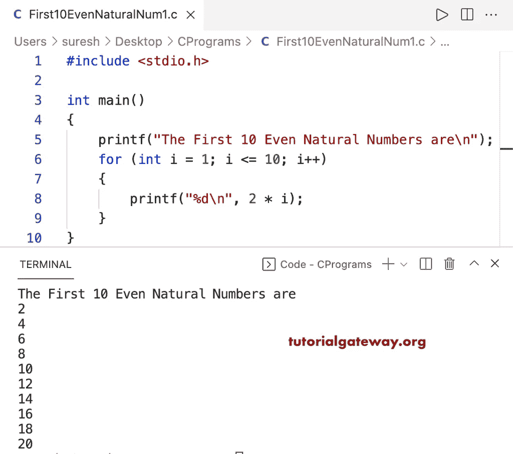

# C 程序：打印前 10 个偶数自然数

> 原文：<https://www.tutorialgateway.org/c-program-to-print-first-10-even-natural-numbers/>

编写一个 C 程序，使用 for 循环打印前 10 个偶数自然数。

```c
#include <stdio.h>

int main()
{
	printf("The First 10 Even Natural Numbers are\n");
	for (int i = 1; i <= 10; i++)
	{
		printf("%d\n", 2 * i);
	}
}
```



这个 [C 程序](https://www.tutorialgateway.org/c-programming-examples/)使用 while 循环显示前 10 个偶数自然数。

```c
#include <stdio.h>

int main()
{
	printf("The First 10 Even Natural Numbers are\n");

	int i = 1;

	while (i <= 10)
	{
		printf("%d\n", 2 * i);
		i++;
	}
}
```

```c
The First 10 Even Natural Numbers are
2
4
6
8
10
12
14
16
18
20
```

这个 C 程序使用 do while 循环打印前 10 个偶数自然数。

```c
#include <stdio.h>

int main()
{

	printf("The First 10 Even Natural Numbers are\n");

	int i = 1;

	do
	{
		printf("%d\n", 2 * i);

	} while (++i <= 10);
}
```

```c
The First 10 Even Natural Numbers are
2
4
6
8
10
12
14
16
18
20
```