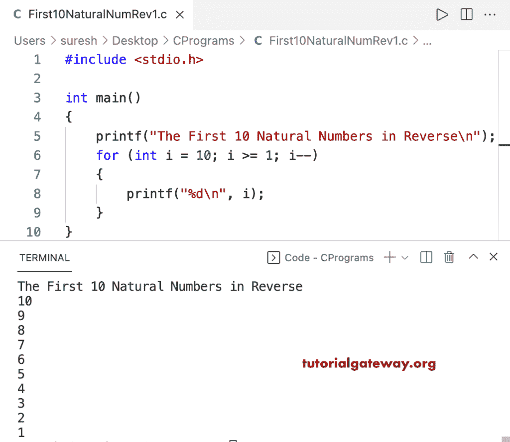

# C 程序：反向打印前 10 个自然数

> 原文：<https://www.tutorialgateway.org/c-program-to-print-first-10-natural-numbers-in-reverse/>

编写一个 C 程序，使用 for 循环以相反的顺序打印前 10 个自然数。

```c
#include <stdio.h>

int main()
{
	printf("The First 10 Natural Numbers in Reverse\n");

	for (int i = 10; i >= 1; i--)
	{
		printf("%d\n", i);
	}
}
```



这个 C 程序使用 while 循环以逆序或降序显示前 10 个自然数。

```c
#include <stdio.h>

int main()
{
	int i = 10;

	printf("The First 10 Natural Numbers in Reverse\n");
	while (i >= 1)
	{
		printf("%d\n", i);
		i--;
	}
}
```

```c
The First 10 Natural Numbers in Reverse
10
9
8
7
6
5
4
3
2
1
```

这个 [C 程序](https://www.tutorialgateway.org/c-programming-examples/)使用 do while 循环以逆序或降序打印前 10 个自然数。

```c
#include <stdio.h>

int main()
{
	int i = 10;

	printf("The First 10 Natural Numbers in Reverse\n");

	do
	{
		printf("%d\n", i);

	} while (--i >= 1);
}
```

```c
The First 10 Natural Numbers in Reverse
10
9
8
7
6
5
4
3
2
1
```