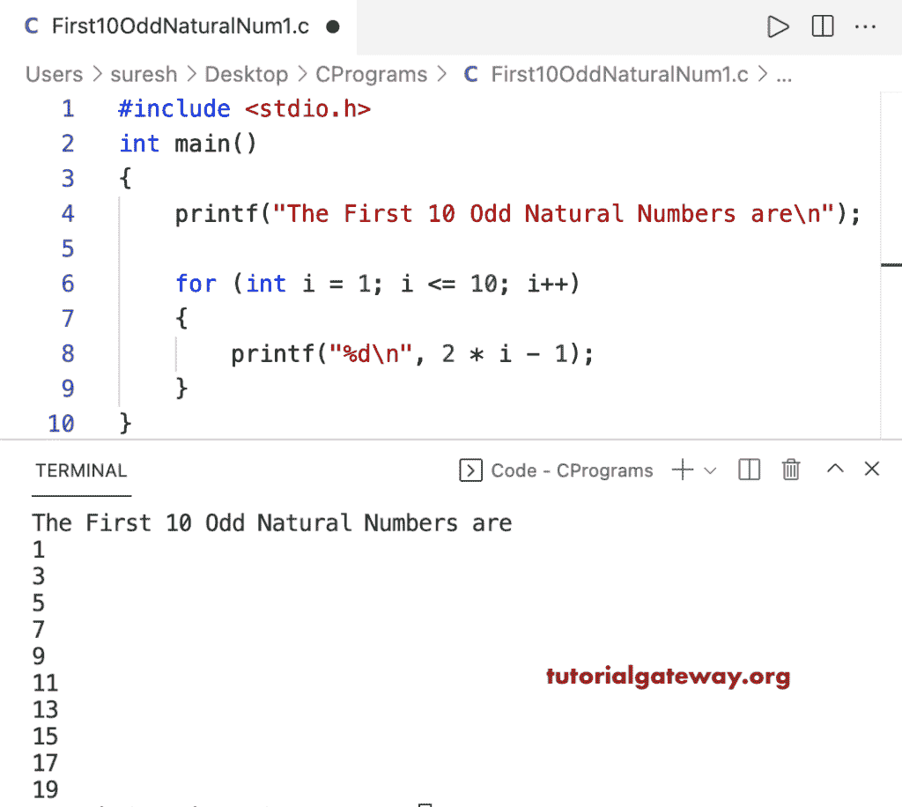

# C 程序：打印前 10 个奇数

> 原文：<https://www.tutorialgateway.org/c-program-to-print-first-10-odd-natural-numbers/>

写一个 C 程序打印前 10 个奇数自然数，用于循环。

```c
#include <stdio.h>

int main()
{
	printf("The First 10 Odd Natural Numbers are\n");

	for (int i = 1; i <= 10; i++)
	{
		printf("%d\n", 2 * i - 1);
	}
}
```



这个 C 程序使用 while 循环显示前 10 个奇数自然数。

```c
#include <stdio.h>

int main()
{
	int i = 1;

	printf("The First 10 Odd Natural Numbers are\n");

	while (i <= 10)
	{
		printf("%d\n", 2 * i - 1);
		i++;
	}
}
```

```c
The First 10 Odd Natural Numbers are
1
3
5
7
9
11
13
15
17
19
```

这个 [C 示例](https://www.tutorialgateway.org/c-programming-examples/)使用 do while 循环打印前 10 个奇数自然数。

```c
#include <stdio.h>

int main()
{
	int i = 1;

	printf("The First 10 Odd Natural Numbers are\n");

	do
	{
		printf("%d\n", 2 * i - 1);

	} while (++i <= 10);
}
```

```c
The First 10 Odd Natural Numbers are
1
3
5
7
9
11
13
15
17
19
```