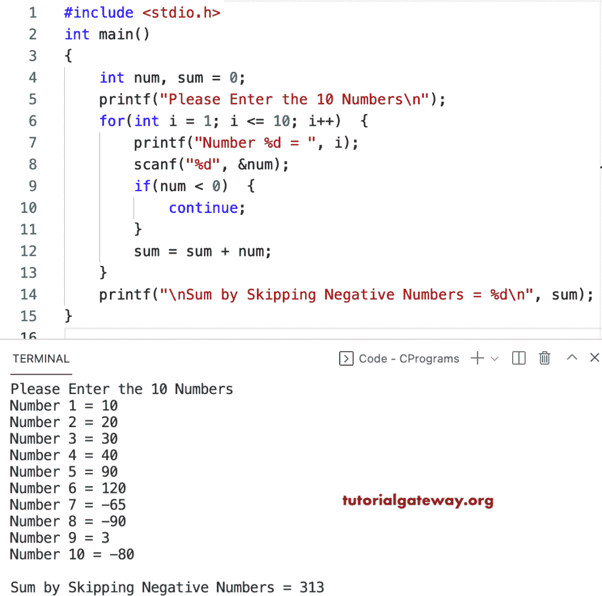

# C 程序：寻找 10 个数之和并跳过负数

> 原文：<https://www.tutorialgateway.org/c-program-to-find-sum-of-10-numbers-and-skip-negative-numbers/>

写一个 c 程序，找出 10 个数的和，用 for 循环跳过负数。在这个 c 示例中，对于从 1 到 10 的循环迭代，if 语句检查数字是否小于零。如果为真，continue 语句将跳过该数字来执行加法。

```c
#include <stdio.h>

int main()
{   
    int num, sum = 0;

    printf("Please Enter the 10 Numbers\n");
    for(int i = 1; i <= 10; i++)
    {
        printf("Number %d = ", i);
        scanf("%d", &num);

        if(num < 0)
        {
            continue;
        }
        sum = sum + num;
    }

    printf("\nSum by Skipping Negative Numbers = %d\n", sum); 
}
```



该 [c 程序](https://www.tutorialgateway.org/c-programming-examples/)从用户输入中读取十个数字，并通过 while 循环跳过负数来计算十个数字的总和。

```c
#include <stdio.h>

int main()
{   
    int i, num, sum = 0;

    printf("Please Enter the 10 Numbers\n");
    i = 1; 
    while(i <= 10)
    {
        printf("Number %d = ", i);
        scanf("%d", &num);

        if(num < 0)
        {
            i++;
            continue;
        }
        sum = sum + num;
        i++;
    }

    printf("\nSum by Skipping Negative Numbers = %d\n", sum); 
}
```

```c
Please Enter the 10 Numbers
Number 1 = 12
Number 2 = 23
Number 3 = -99
Number 4 = 14
Number 5 = -3
Number 6 = 77
Number 7 = 88
Number 8 = -98
Number 9 = -14
Number 10 = 109

Sum by Skipping Negative Numbers = 323
```