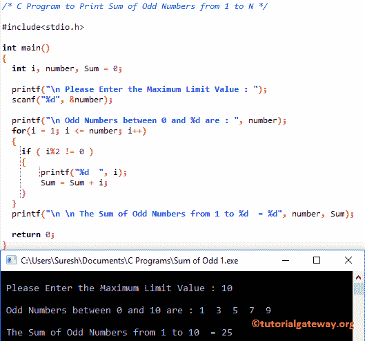

# C 程序：打印奇数和

> 原文：<https://www.tutorialgateway.org/c-program-print-sum-odd-numbers/>

如何用例子编写 C 程序打印奇数之和？。

## 打印从 1 到 n 的奇数总和的 c 程序

该程序允许用户输入最大限值。接下来，这个 c 程序计算 1 和最大极限值 之间的奇数之和

提示:我们已经在 [C 程序检查奇数或偶数](https://www.tutorialgateway.org/c-program-for-even-or-odd/)文章中解释了检查给定是否为偶数的逻辑。

```c
/* C Program to Print Sum of Odd Numbers from 1 to N */

#include<stdio.h>

int main()
{
  int i, number, Sum = 0;

  printf("\n Please Enter the Maximum Limit Value : ");
  scanf("%d", &number);

  printf("\n Odd Numbers between 0 and %d are : ", number);
  for(i = 1; i <= number; i++)
  {
  	if ( i%2 != 0 ) 
  	{
  		printf("%d  ", i);
        Sum = Sum + i;
  	}
  }
  printf("\n \n The Sum of Odd Numbers from 1 to %d  = %d", number, Sum);

  return 0;
}
```



在这个打印从 1 到 n 的奇数总和的程序中，例如 [For Loop](https://www.tutorialgateway.org/for-loop-in-c-programming/) 将确保该数在 1 和最大极限值之间。

```c
for(i = 1; i <= number; i++)

```

在下一行，我们声明了 [If 语句](https://www.tutorialgateway.org/if-statement-in-c/ "If Statement in C")

```c
if ( number % 2 != 0 )
```

任何不能被 2 整除的数都是奇数。If 条件将检查该数除以 2 的余数是否不等于 0。如果条件为真，则为奇数， [C 编程](https://www.tutorialgateway.org/c-programming/)编译器将 I 值相加。

## 打印从 1 到 n 的奇数总和的 c 程序

这个求 C 中奇数和的程序和上面一样，但是我们修改了循环，去掉了 [If 语句](https://www.tutorialgateway.org/if-statement-in-c/)。

```c
/* C Program to Print Sum of Odd Numbers from 1 to N */

#include<stdio.h>

int main()
{
  int i, number, Sum = 0;

  printf("\n Please Enter the Maximum Limit Value : ");
  scanf("%d", &number);

  printf("\n Odd Numbers between 0 and %d are : ", number);
  for(i = 1; i <= number; i=i+2)
  {
    Sum = Sum + i;
    printf("%d  ", i);
  }
  printf("\n \n The Sum of Odd Numbers from 1 to %d  = %d", number, Sum);

  return 0;
}
```

c 奇数之和用于循环输出

```c
 Please Enter the Maximum Limit Value : 40

 Odd Numbers between 0 and 40 are : 1  3  5  7  9  11  13  15  17  19  21  23  25  27  29  31  33  35  37  39  

 The Sum of Odd Numbers from 1 to 40  = 400
```

## 打印给定范围内奇数总和的程序

该 [C 程序](https://www.tutorialgateway.org/c-programming-examples/)允许用户输入最小和最大限值。接下来，C 程序将计算最小值和最大值之间的奇数之和。

```c
/* C Program to Print Sum of Odd Numbers in a Given Range */

#include<stdio.h>

int main()
{
  int i, Minimum, Maximum, Sum = 0;

  printf("\n Please Enter the Minimum, and Maximum Limit Values : \n");
  scanf("%d %d", &Minimum, &Maximum);

  printf("\n Odd Numbers between %d and %d are : \n", Minimum, Maximum);
  for(i = Minimum; i <= Maximum; i++)
  {
  	if ( i%2 != 0 )
	{
		printf("%d  ", i);
		Sum = Sum + i;
	}   
  }
  printf("\n \n The Sum of Odd Numbers betwen %d and %d  = %d", Minimum, Maximum, Sum);

  return 0;
}
```

```c
 Please Enter the Minimum, and Maximum Limit Values : 
15
105

 Odd Numbers between 15 and 105 are : 
15  17  19  21  23  25  27  29  31  33  35  37  39  41  43  45  47  49  51  53  55  57  59  61  63  65  67  69  71  73  75  77  79  81  83  85  87  89  91  93  95  97  99  101  103  105  

 The Sum of Odd Numbers betwen 15 and 105  = 2760
```