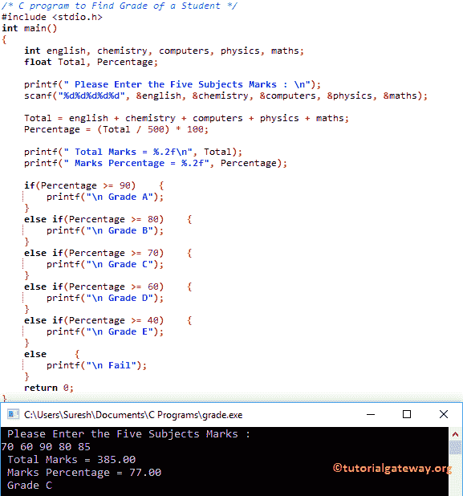

# C 程序：计算学生成绩

> 原文：<https://www.tutorialgateway.org/c-program-to-find-grade-of-a-student/>

写一个 C 程序找到一个学生的分数。为此，首先，我们必须计算五个受试者的总数和百分比，或`N`个受试者

## 寻找学生成绩的程序示例

该程序帮助用户为五个主题输入五个不同的值。然后它会在 C. 中找到这五个被试的总数和百分比

对于这个[程序](https://www.tutorialgateway.org/c-programming-examples/)来寻找一个学生的分数，我们使用[算术运算符](https://www.tutorialgateway.org/arithmetic-operators-in-c/)来执行算术运算。接下来，我们使用[否则如果语句](https://www.tutorialgateway.org/else-if-statement-in-c/)来检查和显示等级。

提示:否则如果语句检查第一个条件，如果它为真，那么它将执行该块中存在的语句。如果条件为假，它将检查下一个(否则如果条件)等等。

```c
#include <stdio.h>

int main()
{
    int english, chemistry, computers, physics, maths; 
    float Total, Percentage;

    printf(" Please Enter the Five Subjects Marks : \n");
    scanf("%d%d%d%d%d", &english, &chemistry, &computers, &physics, &maths);

    Total = english + chemistry + computers + physics + maths;
    Percentage = (Total / 500) * 100;

    printf(" Total Marks = %.2f\n", Total);
    printf(" Marks Percentage = %.2f", Percentage);

    if(Percentage >= 90)
    {
    	printf("\n Grade A");
	}
	else if(Percentage >= 80)
    {
    	printf("\n Grade B");
	}
	else if(Percentage >= 70)
    {
    	printf("\n Grade C");
	}
	else if(Percentage >= 60)
    {
    	printf("\n Grade D");
	}
	else if(Percentage >= 40)
    {
    	printf("\n Grade E");
	}
	else 
    {
    	printf("\n Fail");
	} 
    return 0;
}
```



让我试试另一个学生分数

```c
 Please Enter the Five Subjects Marks : 
95
90
85
92
87
 Total Marks = 449.00
 Marks Percentage = 89.80
 Grade B
```