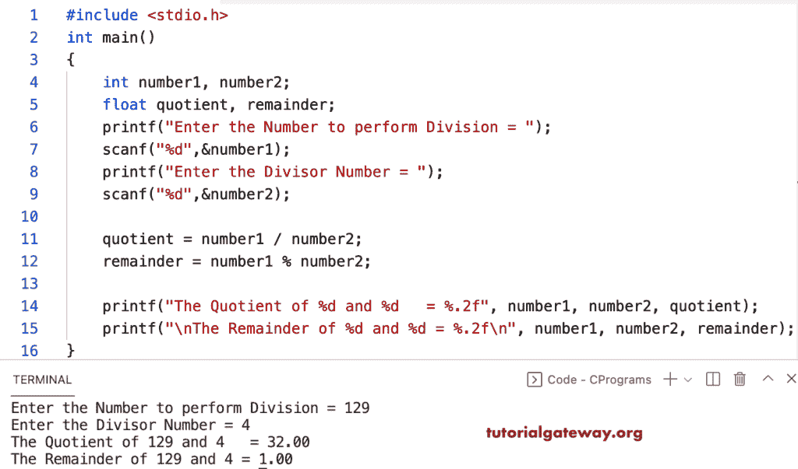

# C 程序：求商和余数

> 原文：<https://www.tutorialgateway.org/c-program-to-find-quotient-and-remainder/>

写一个 C 程序求商和余数。这个 C 示例允许用户输入两个整数值，并使用/和%运算符计算商和余数。

```c
#include <stdio.h>

int main()
{
    int number1, number2;
    float quotient, remainder;

    printf("Enter the Number to perform Division = ");
    scanf("%d",&number1);

    printf("Enter the Divisor Number = ");
    scanf("%d",&number2);

    quotient = number1 / number2;

    remainder = number1 % number2;

    printf("The Quotient of %d and %d   = %.2f", number1, number2, quotient); 
    printf("\nThe Remainder of %d and %d = %.2f\n", number1, number2, remainder);
}
```



在这个 [C 程序](https://www.tutorialgateway.org/c-programming-examples/)中，calc 商数和 calcRemainder 函数接受两个整数值，求商和余数。

```c
#include <stdio.h>

float calcQuotient(int a, int b) {
    return a / b;
}

float calcRemainder(int a, int b) {
    return a % b;
}

int main()
{
    int number1, number2;
    float quotient, remainder;

    printf("Enter the Number to perform Division = ");
    scanf("%d",&number1);

    printf("Enter the Divisor Number = ");
    scanf("%d",&number2);

    quotient = calcQuotient(number1, number2);

    remainder = calcRemainder(number1, number2);

    printf("The Quotient of %d and %d = %.2f\n", number1, number2, quotient); 
    printf("The Remainder of %d and %d = %.2f\n", number1, number2, remainder);

    return 0;
}
```

```c
Enter the Number to perform Division = 229
Enter the Divisor Number = 5
The Quotient of 229 and 5 = 45.00
The Remainder of 229 and 5 = 4.00
```