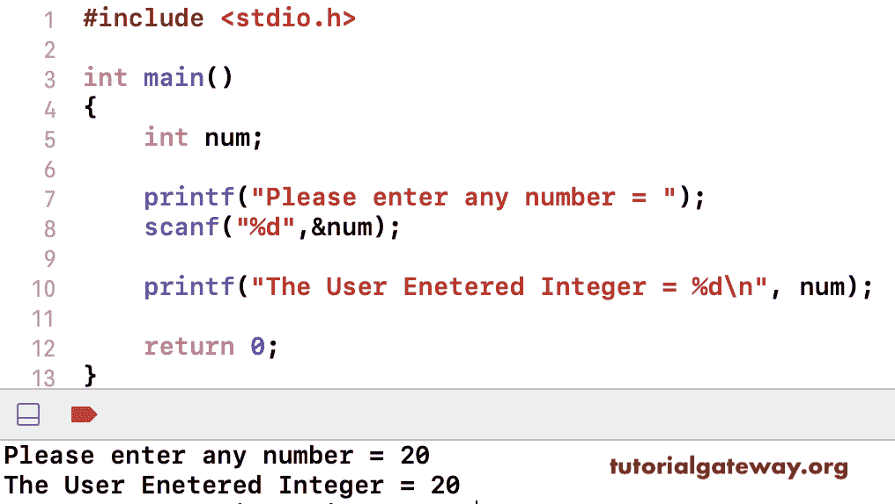

# C 程序：接受和打印用户输入

> 原文：<https://www.tutorialgateway.org/c-program-to-accept-user-input-and-print/>

编写一个 C 程序来接受用户输入，并将其打印为输出。C 语言有一个 scanf 语句，它接受基于字符串格式的用户输入。这个程序允许用户插入数值并打印出来。

```c
#include <stdio.h>

int main()
{
    int num;

    printf("Please enter any number = ");
    scanf("%d",&num);

    printf("The User Enetered Integer = %d", num); 

    return 0;
}
```



这个 C 程序接受浮点和字符用户输入并打印它们。

```c
#include <stdio.h>

int main()
{
    float num;
    char ch;

    printf("\nPlease enter any Character = ");
    scanf("%c",&ch);

    printf("The User Enetered Charcater = %c\n", ch);

    printf("\nPlease enter any number = ");
    scanf("%f",&num);

    printf("The User Enetered Float Value = %.2f\n", num);

    return 0;
}
```

```c
 Please enter any Character = G
The User Enetered Charcater = G

Please enter any number = 22.4
The User Enetered Float Value = 22.40
```