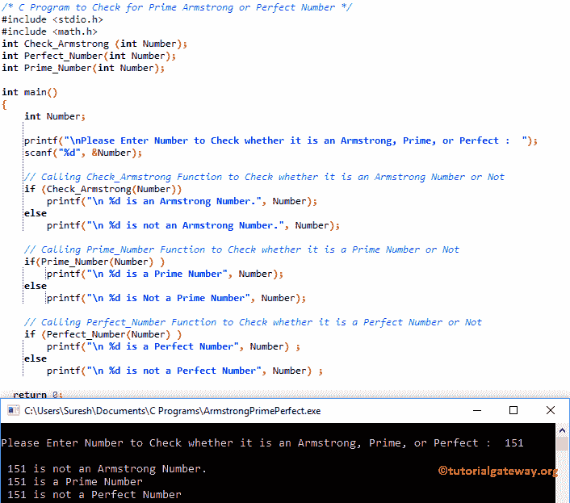

# C 程序：检查质数、阿姆斯特朗数或完全数

> 原文：<https://www.tutorialgateway.org/c-program-check-prime-armstrong-perfect-number/>

如何用例子编写 C 程序检查质数阿姆斯特朗或完全数？。

我们在前面的文章中已经解释了质数、阿姆斯特朗数或完全数的概念。所以，建议大家参考 [C 编程](https://www.tutorialgateway.org/c-programming/)中【阿姆斯壮数】的 [C 程序、](https://www.tutorialgateway.org/c-program-for-armstrong-number/) [C 程序找完全数](https://www.tutorialgateway.org/c-program-to-find-perfect-number/)和 [C 程序找质数](https://www.tutorialgateway.org/c-program-to-find-prime-number/)文章了解代码。

## 检查质数阿姆斯特朗或完全数的程序

这个检查质数、阿姆斯壮数或完全数的[程序](https://www.tutorialgateway.org/c-programming-examples/)允许用户输入[一维数组](https://www.tutorialgateway.org/array-in-c/)的大小和行元素。接下来，我们创建了一个单独的[函数](https://www.tutorialgateway.org/functions-in-c/)来查找它是质数、阿姆斯壮数还是完全数。

```c
/* C Program to Check for Prime Armstrong or Perfect Number */

#include <stdio.h>
#include <math.h>

int Check_Armstrong (int Number);
int Perfect_Number(int Number); 
int Prime_Number(int Number); 

int main()
{
	int Number;

  	printf("\nPlease Enter Number to Check whether it is an Armstrong, Prime, or Perfect :  ");
  	scanf("%d", &Number);

 	// Calling Check_Armstrong Function to Check whether it is an Armstrong Number or Not
 	if (Check_Armstrong(Number))
    	printf("\n %d is an Armstrong Number.", Number);
  	else
    	printf("\n %d is not an Armstrong Number.", Number);

     // Calling Prime_Number Function to Check whether it is a Prime Number or Not
	if(Prime_Number(Number) )
   		printf("\n %d is a Prime Number", Number);
   	else
   		printf("\n %d is Not a Prime Number", Number);

	// Calling Perfect_Number Function to Check whether it is a Perfect Number or Not
	if (Perfect_Number(Number) ) 
    	printf("\n %d is a Perfect Number", Number) ;   
 	else   
    	printf("\n %d is not a Perfect Number", Number) ;   

  return 0;
}

/* C Program for Armstrong Number */
int Check_Armstrong (int Number)
{
	int Temp, Reminder, Times = 0, Sum = 0;
	Temp = Number;

	while (Temp != 0) 
	{
		Times = Times + 1;
     	Temp = Temp / 10;
 	}

  	for(Temp = Number; Temp > 0; Temp =  Temp /10 )
   	{
    	Reminder = Temp % 10;
    	Sum = Sum + pow(Reminder, Times);
   	}
  	if ( Number == Sum )
  		return 1;
  	else
	 	return 0; 	
}

/* C Program for Perfect Number */
int Perfect_Number(int Number)   
{
	int i, Sum = 0 ;   

 	for(i = 1 ; i < Number ; i++)   
  	{
  		if(Number % i == 0)
		    Sum = Sum + i ;   
  	}    

 	if (Sum == Number) 
    	return 1;   
 	else   
    	return 0;   
}

/* C Program to Find Prime Number  */
int Prime_Number(int Number)
{
	int i, Count = 0;

	for (i = 2; i <= Number/2; i++)
   	{
    	if(Number%i == 0)
     	{
       		Count++;
     	} 
    }
   	if(Count == 0 && Number != 1 )
   		return 1;
   	else
   		return 0;
}
```



第二输出

```c
Please Enter Number to Check whether it is an Armstrong, Prime, or Perfect :  2

 2 is an Armstrong Number.
 2 is a Prime Number
 2 is not a Perfect Number
```

输出 3

```c
Please Enter Number to Check whether it is an Armstrong, Prime, or Perfect :  6

 6 is an Armstrong Number.
 6 is Not a Prime Number
 6 is a Perfect Number
```