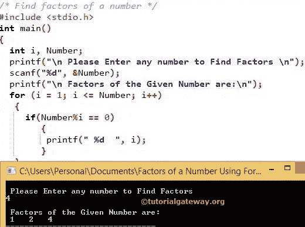

# C 程序：寻找一个数的因数

> 原文：<https://www.tutorialgateway.org/c-program-to-find-factors-of-a-number/>

被给定值完全整除的数(它意味着余数应该是 0)在 C 中被称为给定数的因数。让我们看看如何编写一个 C 程序，使用 FOR 循环、WHILE 循环、指针和函数来寻找一个数的因数。

## 用 For 循环求一个数的因数的 c 程序

该程序允许用户输入任何整数值。通过使用这个值，这个 C 程序使用 For 循环找到一个数的因数。

```c
/* C Program to Find factors of a number */

#include <stdio.h>

int main()
{
  int i, Number; 

  printf("\n Please Enter any number to Find Factors \n");
  scanf("%d", &Number);

  printf("\n Factors of the Given Number are:\n");
  for (i = 1; i <= Number; i++)
   {
     if(Number%i == 0)
        {
		 printf(" %d  ", i);
		}
   }

  return 0;
}
```



在这个寻找 C 中一个数的因数的程序中，我们声明了两个整数变量 I 和 number。接下来，我们将整数 I 值初始化为 1，并且(i <= Number)条件将在条件失败时帮助循环终止。

```c
for (i = 1; i <= Number; i++)
   {
     if(Number%i == 0)
        {
		 printf(" %d  ", i);
		}
   }
```

在循环的[中，有一个](https://www.tutorialgateway.org/for-loop-in-c-programming/) [If 语句](https://www.tutorialgateway.org/if-statement-in-c/)来检查被 I 整除的数是否正好等于 0。如果条件为真，那么它将打印 I 值，否则它将跳过该特定值，并检查下一个值的条件。用户在上面的 [C 编程](https://www.tutorialgateway.org/c-programming/)例子中输入的整数是 4

第一次迭代
i = 1，Number = 4–这意味着(i < = Number)为真。

现在，检查 if 条件–if(Number % I = = 0)Number % I = = 0 = >(4% 1 = = 0)-该条件为真。所以，1 被打印出来

i++意味着我将变成 2

第二次迭代
i = 2，Number = 4–表示(2 < = 4)为真
if(Number % I = = 0)= if(4% 2 = = 0)–该条件为真因此，打印 2

第三次迭代
i = 3，Number = 4–表示(3 < = 4)为真
如果(Number % I = = 0)= if(3% 2 = = 0)–该条件为 FLASE 所以，3 将被跳过

第四次迭代
i = 4，数字= 4–表示(4 < = 4)为真
如果(数字%i == 0) =如果(4% 4 = = 0)–该条件为真，则打印 4

i++表示我将变成 5–表示(5 <= 4)为 False。因此，For 循环将被终止。

4 的因数= 1，2，4

## 用 While 循环求一个数的因数的 c 程序

这个程序使用 While 循环找到一个数的因数。

我们刚刚用 While 循环替换了上面程序中的 For 循环。如果您不理解 While Loop，请在此参考 While Loop 文章:[While Loop](https://www.tutorialgateway.org/while-loop-in-c/ "C While Loop")

```c
#include <stdio.h>

int main()
{
  int Number, i = 1; 

  printf("\n Please Enter number to Find Factors\n");
  scanf("%d", &Number);

  printf("\n The Factors of a Number are:\n");
  while (i <= Number)
   {
     if(Number%i == 0)
      {
        printf("%d  ", i);  
      }
    i++;
   }

  return 0;
}
```

使用 while 循环输出的 c 因数

```c
 Please Enter number to Find Factors
125

 The Factors of a Number are:
1  5  25  125 
```

## 用函数求一个数的因数的 c 程序

这个寻找编号因数的程序将用户输入的值传递给[功能](https://www.tutorialgateway.org/functions-in-c/)。在这个用户定义的函数[程序](https://www.tutorialgateway.org/c-programming-examples/)中，我们使用 For 循环使用 For 循环来查找一个数的因数。

```c
/* C Program to Find Factors of a Number using Functions */

#include <stdio.h>

void Find_Factors(int);  

int main()
{
  int Number; 

  printf("\nPlease Enter number to Find Factors\n");
  scanf("%d", &Number);

  printf("\nFactors of a Number are:\n");
  Find_Factors(Number); 

  return 0;
}

void Find_Factors(int Number)
{ 
  int i; 

  for (i = 1; i <= Number; i++)
   {
    if(Number%i == 0)
     {
       printf("%d ", i);
     } 
   }
}
```

```c
Please Enter number to Find Factors
222

Factors of a Number are:
1 2 3 6 37 74 111 222 
```

## 用指针求一个数的阶乘的 c 程序

这个 C 程序使用指针找到一个数的因数。请参考本例前 C 文章中的[指针。它将帮助你理解指针和指针变量的概念。](https://www.tutorialgateway.org/pointers-in-c/ "Pointers")

```c
/* C Program to Find Factors of a Number using Pointers */

#include <stdio.h>

void Find_Factors(int *);  

int main()
{
  int Number, *P; 

  printf("\n Please Enter number to Find Factors\n");
  scanf("%d", &Number);

  P = &Number;

  printf("\n Factors of a Number are:\n");
  Find_Factors(P); 

  return 0;
}

void Find_Factors(int *Number)
{ 
  int i; 

  for (i = 1; i <= *Number; i++)
   {
    if(*Number % i == 0)
     {
       printf("%d ", i);		
     }
   }

}
```

```c
 Please Enter number to Find Factors
1589

 Factors of a Number are:
1 7 227 1589 
```

在这个寻找数字因数的 C 程序中，我们把数字变量的地址分配给指针变量的地址。

P = &Number;

这里，P 是我们已经声明的指针变量的地址(*P)，我们都知道&Number 是 Number 的地址。

在 For 循环中，我们对照指针变量*Number 检查了值，因为*Number 表示指针变量内部的值，而不是地址。