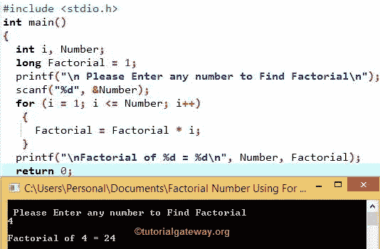

# C 程序：求一个数的阶乘

> 原文：<https://www.tutorialgateway.org/c-program-to-find-factorial-of-a-number/>

如何用 For 循环、While 循环、指针、函数、引用调用和递归编写一个 C 程序来求一个数的阶乘。它用符号(！).阶乘是所有小于或等于该数且大于 0 的数的乘积。

n！= n * (n-1) * (n -2) * ……。* 1

例如，5 的阶乘表示为 5！= 5 *4 * 3 * 2 * 1 = 120

## 用 For 循环求一个数的阶乘的 c 程序

这个阶乘程序允许用户输入任何整数值。通过使用这个值，这个 C 程序使用 For 循环找到一个数的阶乘。

```c
#include <stdio.h>

int main()
{
  int i, Number; 
  long Factorial = 1;

  printf("\n Please Enter any number to Find Factorial\n");
  scanf("%d", &Number);

  for (i = 1; i <= Number; i++)
   {
     Factorial = Factorial * i;
   }

  printf("\nFactorial of %d = %d\n", Number, Factorial);

  return 0;
}
```



在这个 c 语言的阶乘程序中，我们声明了两个整数变量 I 和 number。我们还声明了一个长变量，并赋值为 1。

虽然我们在计算一个整数变量，但我们将输出声明为一个长变量。因为当我们计算大整数的阶乘时，结果肯定会超过整数极限

第一个 [C 编程](https://www.tutorialgateway.org/c-programming/) printf 语句会要求用户输入自己的整数值进行计算。scanf 语句会将用户输入的值赋给 Number 变量

在 [For Loop](https://www.tutorialgateway.org/for-loop-in-c-programming/) 中，我们将整数 I 值初始化为 1，并且(i < = Number)条件将在条件失败时帮助循环终止。

在上面的例子中，用户为 c 中的阶乘程序输入的整数是 4

第一次迭代
i = 1，阶乘= 1，数= 4–表示(i < =数)为真
阶乘=阶乘* i = > 1 *1 = 1
i++表示我将变成 2

第二次迭代
i = 2，阶乘= 1，数= 4–表示(2 < = 4)为真
阶乘= 1 *2 = 2
i++表示我将变成 3

求一个数的阶乘的 c 程序第三次迭代
i = 3，阶乘= 2，数= 4–表示(3 < = 4)为真
阶乘= 2 *3 = 6
i++表示我将变成 4

第四次迭代
i = 4，阶乘= 6，数= 4–这意味着(4 < = 4)为真
阶乘= 6 * 4 = 24

i++表示我将变成 5–表示(5 <= 4) is False. So, For loop will terminate.

最后一个 printf 语句将打印用户输入的整数的输出。在 printf 语句中，第一个%d 指的是 Number，第二个%d 指的是输出。

```c
printf("Factorial of %d = %d\n", Number, Factorial);
```

## 用 While 循环计算一个数的阶乘的 c 程序

这个 c 程序使用 while 循环对一个数进行阶乘，允许你输入任何整数值。通过使用该值，这将找到一个数的阶乘

```c
#include <stdio.h>

int main()
{
  int Number, i = 1; 
  long Factorial = 1;

  printf("\n Please Enter any value \n");
  scanf("%d", &Number);

  while (i <= Number)
   {
     Factorial = Factorial * i;
     i++;
   }
  printf("Factorial of %d = %d\n", Number, Factorial);

  return 0;
}
```

```c
 Please Enter any value 
6
Factorial of 6 = 720
```

我们刚刚用 While 循环替换了上面例子中的 For 循环。如果您不了解 While Loop [程序](https://www.tutorialgateway.org/c-programming-examples/)，请在此参考 While Loop 文章:[While Loop](https://www.tutorialgateway.org/while-loop-in-c/ "While Loop in C")

## 用指针求一个数的阶乘的 c 程序

这个 c 语言的程序将使用指针找到给定数字的阶乘。

我建议你在这个例子之前参考[指针](https://www.tutorialgateway.org/pointers-in-c/)文章。它将帮助你理解指针和指针变量的概念。

```c
#include <stdio.h>

int main()
{
  int i, Number, *P; 
  long Factorial = 1;

  printf("\n Please Enter any number \n");
  scanf("%d", & Number);

  P = &Number;

  for (i = 1; i <= *P; i++)
   {
     Factorial = Factorial * i;
   }

  printf("\nFact of %d Using Normal Variable  = %d\n", Number, Factorial);
  printf("Fact of %d Using Pointer Variable = %d\n", *P, Factorial);

  return 0;
}
```

```c
 Please Enter any number 
7

Fact of 7 Using Normal Variable  = 5040
Fact of 7 Using Pointer Variable = 5040
```

在这个 c 语言的阶乘程序中，我们把 Number 变量的地址赋给了指针变量的地址。这里，P 是我们已经声明的指针变量的地址(*P)。众所周知，&Number 是数字的地址。

```c
P = &Number;
```

在 For 循环中，我们根据指针变量*P 而不是数字变量检查了 I 值。

这里，*P 表示指针变量内部的值

## 用函数求一个数的阶乘的 c 程序

该程序允许用户输入任何整数值。用户输入的值将被传递给我们创建的函数。在这个用户定义的函数中，这个 C 程序使用 For 循环找到一个数的阶乘。

```c
#include <stdio.h>

long Calculate_Factorial(int);  

int main()
{
  int Number; 
  long Factorial = 1;

  printf("\n Please Enter any number \n");
  scanf("%d", &Number);

  Factorial = Calculate_Factorial(Number);
  printf("Factorial of %d = %d\n", Number, Factorial);

  return 0;
}

long Calculate_Factorial(int Number)
{ 
  int i; 
  long Factorial = 1;

  for (i = 1; i <= Number; i++)
   {
     Factorial = Factorial * i;
   }
  return Factorial;
}
```

```c
 Please Enter any number 
10
Factorial of 10 = 3628800
```

在这个 c 程序中寻找一个数的阶乘的例子，由于函数 Calculate_Factorial()将返回长值作为输出，我们把函数调用赋给了长变量。

```c
Factorial = Calculate_Factorial(Number);
```

当编译器到达 main()函数中的 Calculate_Factorial(Number)行时，编译器会立即跳转到下面的函数:

```c
long Calculate_Factorial(int Number)
```

在上面的[程序](https://www.tutorialgateway.org/c-programming-examples/)例子中，我们已经解释了寻找一个数的阶乘逻辑的 C 程序。

最后一行以返回语句结束。这意味着每次我们从 main()或任何子函数调用 Calculate_Factorial()函数时，它都会返回值。

## 用递归求一个数的阶乘的 c 程序

该程序允许您输入任何整数值。用户输入的值将被传递给我们创建的函数。在这个用户定义的函数中，这个 C 程序递归地寻找一个数的阶乘。

请参考本例前 C 篇[递归。它将帮助你理解递归概念。](https://www.tutorialgateway.org/recursion-in-c/ "Recursion")

```c
#include <stdio.h>

long Calculate_Factorial(int);  

int main()
{
 int Number; 
 long Fact = 1;

 printf("\n Please Enter any number \n");
 scanf("%d", &Number);

 Fact = Calculate_Factorial(Number);

 printf("\nFactorial of %d = %d\n", Number, Fact);

 return 0;
}

long Calculate_Factorial(int Num)
{ 
  if (Num == 0 || Num == 1)  
    return 1;

  else
    return Num * Calculate_Factorial (Num -1);
}
```

```c
 Please Enter any number 
9

Factorial of 9 = 362880
```

在该程序的用户定义功能中，

```c
long Calculate_Factorial(int Num)
```

[If 语句](https://www.tutorialgateway.org/if-statement-in-c/ "C If Statement")将检查给定的数字是等于 0 还是等于 1

*   如果条件为真，函数将返回 1。
*   并且，如果条件为真，函数将递归返回数字*(数字-1)。

在这个 c 程序中寻找一个数的阶乘的例子，用户输入的值= 9。意思是，如果第一条语句失败，那么，

阶乘=数*计算 _ 阶乘(数-1)；
= 9 *计算 _ 阶乘(9 -1)
= 9 *计算 _ 阶乘(8)
= 9 * 8 *计算 _ 阶乘(7)
= 9 * 8 * 7 *计算 _ 阶乘(6)
= 9 * 8 * 7 * 6 *计算 _ 阶乘(5)
= 9 * 8 * 7 * 6 * 5 *计算 _ 阶乘(4)
= 9 * 8 * 7 * 6 * 5 * 4 *计算 _ 阶乘(3)
5 * 4 * 3 *计算 _ 阶乘(2)
= 9 * 8 * 7 * 6 * 5 * 4 * 3 * 2 *计算 _ 阶乘(1)
= 9 * 8 * 7 * 6 * 5 * 4 * 3 * 2
= 362880

## 用引用调用求一个数的阶乘的 c 程序

这允许用户输入任何整数值。变量的地址将传递给我们创建的函数，而不是用户输入的值。在这个用户定义的函数中，这个 c 程序使用 For 循环找到一个数的阶乘。

请参阅本程序示例前的[按值调用和按引用调用](https://www.tutorialgateway.org/call-by-value-and-call-by-reference-in-c/ "Passing Parameters to the Function")文章。它将帮助您理解按值调用和按引用调用概念之间的区别。

```c
#include <stdio.h>

long CalculateFactorial(int *);  

int main()
{
  int Num; 
  long Fact = 1;

  printf("\n Please Enter any value \n");
  scanf("%d", &Num);

  Fact = Calculate_Factorial(&Num);

  printf("Factorial of %d = %d\n", Num, Fact);

  return 0;
}

long CalculateFactorial(int *Num)
{ 
  int i; 
  long Fact = 1;

  for (i = 1; i <= *Num; i++)
   {
     Fact = Fact * i;
   }

  return Fact;
}
```

```c
 Please Enter any value 
8
Factorial of 8 = 40320
```