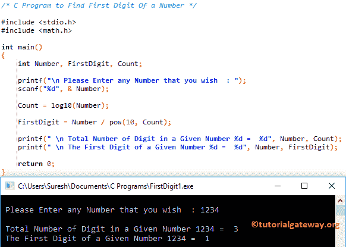

# C 程序：寻找数字第一位

> 原文：<https://www.tutorialgateway.org/c-program-to-find-first-digit-of-a-number/>

如何用例子写 C 程序求数字的第一位？。

## 寻找数字第一位的 c 程序

这个程序将允许用户输入任何数字。然后，它会找到用户输入值的第一个数字。

```c
/* C Program to Find First Digit Of a Number */

#include <stdio.h>
#include <math.h>

int main()
{
  	int Number, FirstDigit, Count;

  	printf("\n Please Enter any Number that you wish  : ");
  	scanf("%d", & Number);

  	Count = log10(Number);

  	FirstDigit = Number / pow(10, Count);

  	printf(" \n Total Number of Digit in a Given Number %d =  %d", Number, Count);
	printf(" \n The First Digit of a Given Number %d =  %d", Number, FirstDigit);

  	return 0;
}
```



在这个寻找数字第一位的 C 程序中，用户输入的值:数字= 1234

计数= log10(数字)–这将返回数字-1 中的数字总数
计数= 3

FirstDigit = 1234 / pow(10，3)= 1234/1000 = 1.234 = 1

## 返回数字第一位的程序

该[程序](https://www.tutorialgateway.org/c-programming-examples/)将使用[同时循环](https://www.tutorialgateway.org/while-loop-in-c/)找到用户输入值的第一位数字。

```c
/* C Program to Find First Digit Of a Number */

#include <stdio.h>

int main()
{
  	int Number, FirstDigit;

  	printf("\n Please Enter any Number that you wish  : ");
  	scanf("%d", & Number);

  	FirstDigit = Number;

  	while(FirstDigit >= 10)
  	{
  		FirstDigit = FirstDigit / 10;
	}

	printf(" \n The First Digit of a Given Number %d =  %d", Number, FirstDigit);

  	return 0;
}
```

```c
 Please Enter any Number that you wish  : 354

 The First Digit of a Given Number 354 =  3
```

在这个程序中找到一个数字的第一个数字，数字= 354

While 循环第一次迭代 while(354 > = 10)
First digit = First digit/10 = 354/10 = 35

While 循环第二次迭代 while(35 > = 10)
first digit = first digit/10 = 35/10 = 3

当循环第三次迭代 while (3 >= 10)
条件为假时，则 [C 编程](https://www.tutorialgateway.org/c-programming/)编译器将退出 While 循环并输出 3

## 用函数求数字第一位的程序

这个显示数字第一位的 C 程序和上面的一样。然而，这一次，我们使用[函数](https://www.tutorialgateway.org/functions-in-c/)概念来划分代码。

```c
#include <stdio.h>
#include <math.h>

int First_Digit(int num);

int main()
{
  	int Number, FirstDigit;

  	printf("\n Please Enter any Number that you wish  : ");
  	scanf("%d", & Number);

  	FirstDigit = First_Digit(Number);

	printf(" \n The First Digit of a Given Number %d =  %d", Number, FirstDigit);

  	return 0;
}

int First_Digit(int num)
{
	while(num >= 10)
	{
		num = num / 10;
	}
	return num;
}
```

```c
 Please Enter any Number that you wish  : 657489

 The First Digit of a Given Number 657489 =  6
```