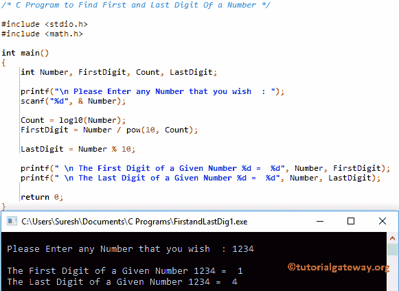

# C 程序：获取数字的第一位和最后一位

> 原文：<https://www.tutorialgateway.org/c-program-to-find-first-and-last-digit-of-a-number/>

如何用例子编写 C 程序求一个数的首末数字？。

## 寻找数字的第一位和最后一位的程序

这个程序允许用户输入任何数字。然后，它将找到用户输入值的第一位和最后一位。

```c
/* C Program to Find First and Last Digit Of a Number */

#include <stdio.h>
#include <math.h>

int main()
{
  	int Number, FirstDigit, Count, LastDigit;

  	printf("\n Please Enter any Number that you wish  : ");
  	scanf("%d", & Number);

  	Count = log10(Number); 	
  	FirstDigit = Number / pow(10, Count);

  	LastDigit = Number % 10;

	printf(" \n The First Digit of a Given Number %d =  %d", Number, FirstDigit);
	printf(" \n The Last Digit of a Given Number %d =  %d", Number, LastDigit);

  	return 0;
}
```



在本程序中查找数字的第一位和最后一位，数字= 1234

计数= log10(数字)–这将返回数字-1 中的总位数

计数= 3

first digit = 1234/pow(10.3)= 1234/1000 = 1，234 = 1

负载数字= 1234 % 10 = 4

## 用函数求一个数的第一个和最后一位的程序

这个[程序](https://www.tutorialgateway.org/c-programming-examples/)查找第一个和最后一位和上面一样，但是这次我们用[函数](https://www.tutorialgateway.org/functions-in-c/)的概念来划分代码。我们已经在前面的文章中解释了分析部分。所以，请参考 [C 编程](https://www.tutorialgateway.org/c-programming/)中[第一位](https://www.tutorialgateway.org/c-program-to-find-first-digit-of-a-number/)和[最后一位](https://www.tutorialgateway.org/c-program-find-last-digit-number/)的文章来理解。

```c
/* C Program to Find First and Last Digit Of a Number using Function */

#include <stdio.h>

int First_Digit(int num);
int Last_Digit(int num); 

int main()
{
  	int Number, FirstDigit, LastDigit;

  	printf("\n Please Enter any Number that you wish  : ");
  	scanf("%d", & Number);

  	FirstDigit = First_Digit(Number);
  	LastDigit = Last_Digit(Number);

	printf(" \n The First Digit of a Given Number %d =  %d", Number, FirstDigit);  
  	printf(" \n The Last Digit of a Given Number %d =  %d", Number, LastDigit);

  	return 0;
}

int First_Digit(int num)
{
	while(num >= 10)
	{
		num = num / 10;
	}
	return num;
}

int Last_Digit(int num)
{
	return num % 10;
}
```

第一个和最后一位输出

```c
 Please Enter any Number that you wish  : 987564

 The First Digit of a Given Number 987564 =  9 
 The Last Digit of a Given Number 987564 =  4
```