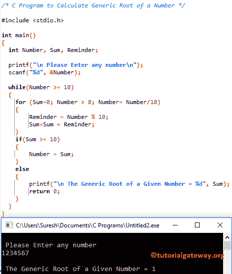

# C 程序：计算一个数的泛根

> 原文：<https://www.tutorialgateway.org/c-program-to-calculate-generic-root-of-a-number/>

如何用例子编写 C 程序计算一个数的泛根？。计算泛型根的数学公式只不过是计算给定数字中所有数字的总和，直到我们得到一位数的输出(小于 10)。例如，98765 的泛型根= 9 + 8 + 7 + 6 + 5 = 35 = 8

## 计算一个数的泛根的 c 程序

这个 C 程序允许用户输入一个正整数。然后，它会计算给定数字 的泛根

```c
/* C Program to Calculate Generic Root of a Number */

#include <stdio.h>

int main()
{
  int Number, Sum, Reminder;

  printf("\n Please Enter any number\n");
  scanf("%d", &Number);

  while(Number >= 10)
  {
    for (Sum=0; Number > 0; Number= Number/10)
    {
      Reminder = Number % 10;
      Sum=Sum + Reminder;  
    }
    if(Sum >= 10)
    {
      Number = Sum;
    }
    else
    {
      printf("\n The Generic Root of a Given Number = %d", Sum);
      return 0;
    }
  } 
}
```



## 用函数计算一个数的泛根的 c 程序

和我们在第一个例子中使用的[程序](https://www.tutorialgateway.org/c-programming-examples/)是一样的，但是这次我们使用[函数](https://www.tutorialgateway.org/functions-in-c/)分离逻辑。

```c
/* C Program to Calculate Generic Root of a Number */

#include <stdio.h>

int Sum_Of_Digits (int); 

int main()
{
  int Number, Sum, Root;

  printf("\n Please Enter any number\n");
  scanf("%d", &Number);

  while(Number >= 10)
  {
    Sum = Sum_Of_Digits (Number);
    if(Sum >= 10)
    {
      Number = Sum;
    }
    else
    {
      printf("\n Generic Root of a Given Number = %d", Sum);
      return 0;
    }
  }	
}

int Sum_Of_Digits (int Number)
{
  int Reminder, Sum;

  for (Sum=0; Number > 0; Number = Number/10)
  {
     Reminder = Number % 10;
     Sum = Sum + Reminder;  
  }     
 return Sum;
}
```

我们使用了一个叫做数字总和的函数来求一个数的所有数字的总和。建议大家参考 [C 编程](https://www.tutorialgateway.org/c-programming/)中【给定数字中的[位数之和](https://www.tutorialgateway.org/c-program-to-find-sum-of-digits-of-a-number/)一文来了解功能。

c 通用根输出

```c
 Please Enter any number
9875625

 Generic Root of a Given Number = 6
```

在这个计算数的一般根的程序中，

*   首先，在 [While 循环](https://www.tutorialgateway.org/while-loop-in-c/)中的条件将确保给定的数字大于或等于 10。如果条件为真，那么它将调用数字之和。
*   接下来，If 语句中的条件将检查 Sum_of_Digits 函数输出(即 Sum)是否大于或等于 10。
    *   如果条件为真，我们将“和”赋给“数”。这意味着，它将再次调用更新后的数字总和(即总和)。
    *   如果条件为假，打印输出。