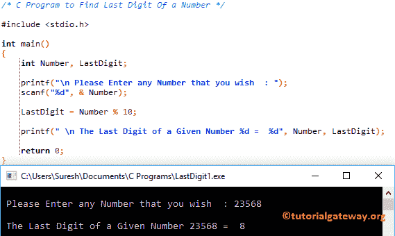

# C 程序：寻找数字最后一位

> 原文：<https://www.tutorialgateway.org/c-program-find-last-digit-number/>

如何用例子写一个求数字最后一位的 C 程序？。

## 寻找数字最后一位的程序

这个程序将允许用户输入任何数字。然后，它将找到用户输入值的最后一位数字。

```c
/* C Program to Find Last Digit Of a Number */

#include <stdio.h>

int main()
{
  	int Number, LastDigit;

  	printf("\n Please Enter any Number that you wish  : ");
  	scanf("%d", & Number);

  	LastDigit = Number % 10;

  	printf(" \n The Last Digit of a Given Number %d =  %d", Number, LastDigit);

  	return 0;
}
```



## 用函数求数字最后一位的 c 程序

这个 [C 程序](https://www.tutorialgateway.org/c-programming-examples/)对于一个数字中的最后一位数字是和上面一样的。但是这次我们使用了 [C 编程](https://www.tutorialgateway.org/c-programming/)中的[函数](https://www.tutorialgateway.org/functions-in-c/)概念来划分代码。

```c
/* C Program to Find Last Digit Of a Number using Function */

#include <stdio.h>

int Last_Digit(int num); 

int main()
{
  	int Number, LastDigit;

  	printf("\n Please Enter any Number that you wish  : ");
  	scanf("%d", & Number);

  	LastDigit = Last_Digit(Number);

  	printf(" \n The Last Digit of a Given Number %d =  %d", Number, LastDigit);

  	return 0;
}

int Last_Digit(int num)
{
	return num % 10;
}
```

```c
 Please Enter any Number that you wish  : 12457325

 The Last Digit of a Given Number 12457325 =  5
```