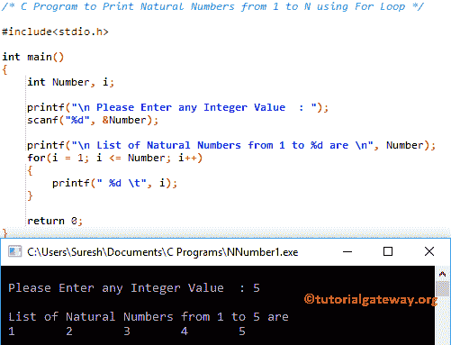

# C 程序：打印从 1 到 N 的自然数

> 原文：<https://www.tutorialgateway.org/c-program-to-print-natural-numbers-from-1-to-n/>

如何用 For 循环和 While 循环编写 C 程序打印从 1 到 N 的自然数？。

## 用 For 循环打印从 1 到 N 的自然数的 c 程序

该程序允许用户输入任何整数值。使用 For 循环，我们将打印从 1 到用户输入值的自然数列表。

```c
/* C Program to Print Natural Numbers from 1 to N using For Loop */

#include<stdio.h>

int main()
{
  	int Number, i;

  	printf("\n Please Enter any Integer Value  : ");
  	scanf("%d", &Number);

  	printf("\n List of Natural Numbers from 1 to %d are \n", Number);  	
	for(i = 1; i <= Number; i++)
  	{
    	printf(" %d \t", i);
  	}

  	return 0;
}
```



在这个显示从 1 到 N 的自然数的 C 程序中，

*   第一个 printf 语句会要求用户输入一个整数值，而 scanf 语句会将用户输入的值赋给一个 Number 变量。
*   接下来，我们使用 For 循环在 1 和用户输入的值之间迭代。如果你不知道 For 循环，那么请参考[C 编程中的 For 循环](https://www.tutorialgateway.org/for-loop-in-c-programming/)一文，以获得进一步的参考。
*   在 For 循环中，我们打印 I 值
*   在上面的 [C 编程](https://www.tutorialgateway.org/c-programming/)例子中，用户输入的值是 5，意思是 1 2 3 4 5

## 使用 While 循环打印从 1 到 100 的自然数的 c 程序

本[程序](https://www.tutorialgateway.org/c-programming-examples/)同上。我们刚刚将 For 循环替换为 [While 循环](https://www.tutorialgateway.org/while-loop-in-c/)。

```c
/* C Program to Print Natural Numbers from 1 to N using While Loop */

#include<stdio.h>

int main()
{
  	int Number, i = 1;

  	printf("\n Please Enter any Integer Value  : ");
  	scanf("%d", &Number);

  	printf("\n List of Natural Numbers from 1 to %d are \n", Number);  	
	while(i <= Number)
  	{
    	printf(" %d \t", i);
    	i++;
  	}

  	return 0;
}
```

```c
Please Enter any Integer Value  : 15

 List of Natural Numbers from 1 to 15 are 
 1 	 2 	 3 	 4 	 5 	 6 	 7 	 8 	 9 	 10 	 11 	 12 	 13 	 14 	 15
```

## 打印一定范围内的自然数的程序

该程序允许用户输入最小值和最大值，而不是打印从 1 到 n 的自然数。接下来，这个 C 程序打印从最小值到最大值的自然数。

```c
/* C Program to Print Natural Numbers within a Range */

#include<stdio.h>

int main()
{
  	int i, Starting_Value, End_Value;

  	printf("\n Please Enter the Starting Value  : ");
  	scanf("%d", &Starting_Value);

  	printf("\n Please Enter the End Value  : ");
  	scanf("%d", &End_Value);  	

  	printf("\n List of Natural Numbers from %d to %d are \n", Starting_Value, End_Value);  	
	for(i = Starting_Value; i <= End_Value; i++)
  	{
    	printf(" %d \t", i);
  	}

  	return 0;
}
```

```c
Please Enter the Starting Value  : 5

 Please Enter the End Value  : 45

 List of Natural Numbers from 5 to 45 are 
 5 	 6 	 7 	 8 	 9 	 10 	 11 	 12 	 13 	 14 	 15 	 16 	 17 	 18 	 19 	 20 	 21 	 22 	 23 	 24 	 25 	 26 	 27 	 28 	 29 	 30 	 31 	 32 	 33 	 34 	 35 	 36 	 37 	 38 	 39 	 40 	 41 	 42 	 43 	 44 	 45 
```