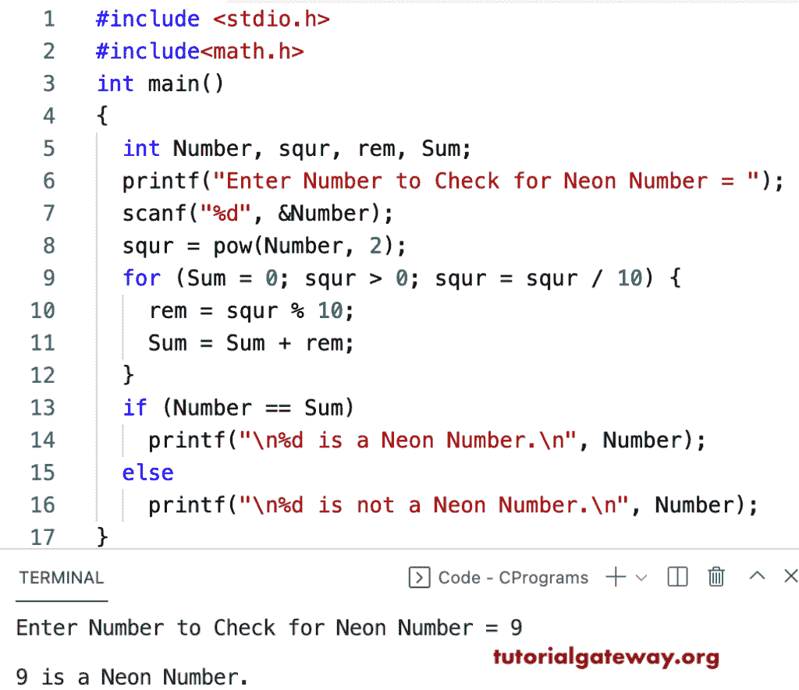

# C 程序：检查一个数字是不是霓虹数字

> 原文：<https://www.tutorialgateway.org/c-program-to-check-a-number-is-a-neon-number/>

编写一个 c 程序来检查一个数字是不是 neon 数字，或者是否使用 for 循环。如果这个数等于一个数的平方的位数之和，它就是一个霓虹数。

1.  我们用数学幂函数来求一个数的平方。
2.  将输出分成单个数字，并计算其总和。
3.  if else 用于检查一个正方形中的数字总和是否等于实际数字。如果是真的，那就是一个霓虹数字。

```c
#include <stdio.h>
#include<math.h>

int main()
{
  int Number, squr, rem, Sum;

  printf("Enter Number to Check for Neon Number = ");
  scanf("%d", &Number);

  squr = pow(Number, 2);

  for (Sum = 0; squr > 0; squr = squr / 10)
  {
    rem = squr % 10;
    Sum = Sum + rem;
  }

  if (Number == Sum)
    printf("\n%d is a Neon Number.\n", Number);
  else
    printf("\n%d is not a Neon Number.\n", Number);
}

```



这个 C 程序使用 while 循环检查给定的数字是否是霓虹数字。

```c
#include <stdio.h>
#include<math.h>

int main()
{
  int Number, squr, rem, Sum = 0;

  printf("Enter Number to Check for Neon Number = ");
  scanf("%d", &Number);

  squr = pow(Number, 2);
  printf("The Square of a Number %d = %d\n", Number, squr);

  while(squr > 0)
  {
    rem = squr % 10;
    Sum = Sum + rem;
    squr = squr / 10;
  }
  printf("The Sum of Digits in a Square = %d\n", Sum);
  if (Number == Sum)
    printf("\n%d is a Neon Number.\n", Number);
  else
    printf("\n%d is not a Neon Number.\n", Number);
}

```

```c
Enter Number to Check for Neon Number = 9
The Square of a Number 9 = 81
The Sum of Digits in a Square = 9

9 is a Neon Number.
```

在这个 C 查霓虹数[例子](https://www.tutorialgateway.org/c-programming-examples/)中，squareDigitsSum 递归函数通过递归调用来除和求和。

```c
#include <stdio.h>
#include<math.h>

int squareDigitsSum(int num)
{
  static int rem, sum = 0;

  if(num > 0)
  {
    rem = num % 10;
    sum = sum + rem;
    squareDigitsSum(num / 10);
  }
  return sum;
}

int main()
{
  int Number;

  printf("Enter Number to Check for Neon Number = ");
  scanf("%d", &Number);

  int squr = pow(Number, 2);

  int Sum = squareDigitsSum(squr);

  printf("The Square of %d Number = %d\n", Number, squr);

  printf("The Sum of Digits in %d = %d\n", squr, Sum);

  if (Number == Sum)
    printf("\n%d is a Neon Number.\n", Number);
  else
    printf("\n%d is not a Neon Number.\n", Number);
}

```

```c
Enter Number to Check for Neon Number = 5
The Square of 5 Number = 25
The Sum of Digits in 25 = 7

5 is not a Neon Number.
```