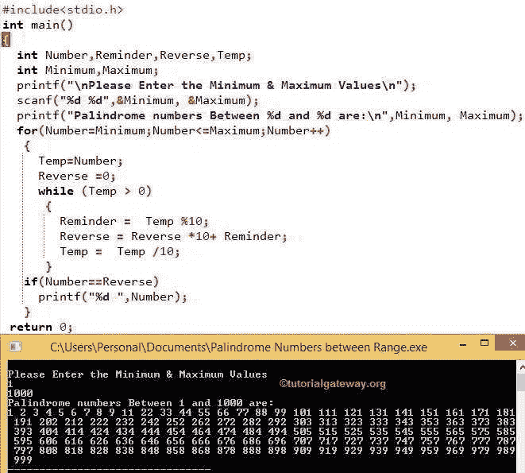

# C 程序：回文

> 原文：<https://www.tutorialgateway.org/palindrome-program-in-c/>

用 C 编程写一个程序检查数字是否回文。对于 C 程序中的回文，我们使用 while 循环、For 循环、函数和递归。我们还向您展示了如何为从 1 到 1000 的回文数字编写一个 C 程序。

任何数字都可以是 C 中的回文，只要我们反转时它保持不变。例如，191 是一个回文数字，因为这个数字在反转后保持不变。

以下步骤是在 C 程序设计中检查回文数的标准步骤。

1.  请输入任何数字来检查 c 中的回文
2.  反转给定的数字
3.  将原始给定值与反向值进行比较。
4.  如果它们匹配正确，那么它就是 c 编程中的回文数。否则就不是了。

## 使用 While 循环的 C 语言回文

这个回文的 C 程序允许用户输入任意正整数和。接下来，这个 C 程序使用 While 循环检查给定的数字是否是回文数字

```c
#include <stdio.h>

int main()
{
   int Number, Temp, Reminder, Reverse = 0;

   printf("\nPlease Enter any value \n");
   scanf("%d", &Number);

   //Helps to prevent altering the original value
   Temp = Number;

   while ( Temp > 0)
   {
      Reminder = Temp %10;
      Reverse = Reverse *10+ Reminder;
       Temp = Temp /10;
   }

   printf("Reverse of entered = %d\n", Reverse);

   if ( Number == Reverse )
      printf("\n%d is Palindrome.\n", Number);

   else
      printf("%d is not the Palindrome.\n", Number);

   return 0;
}
```

```c
Please Enter any value
1331

Reverse of entered = 1331
1331 is Palindrome.
```

在这个 C 回文程序中，我们给 Temp 变量赋值。它有助于保护我们的原始值，并对临时变量执行操作。

接下来， [While Loop](https://www.tutorialgateway.org/while-loop-in-c/) 条件将确保给定的数值大于 0

用户在此回文数字程序中输入的值:数字= 1331，反向= 0

温度=数字

意思是，温度= 1331

第一次迭代

提醒=温度%10
提醒= 1331%10 = 1

反向=反向*10 +提醒
反向= 0 * 10 + 1 = 0 + 1 = > 1

温度=温度/10 => 1331 /10
温度= 133

第二次迭代

从 c 语言回文程序的第一次迭代开始，Temp 和 Reverse 的值都变成了 Temp = 133 和 Reverse = 1

提醒=临时% 10 = 133 % 10 = 3

反向= 1 * 10+3 = 10+3 = > 13

温度= 133 /10 => 13

第三次迭代:温度= 13，反向= 13

提醒= 13%10 = 3

反向= 13 * 10 + 3 => 130 + 3 = 133

温度= 13/10 = 1

第四次迭代:Temp = 1，Reverse = 133

提醒= 1 %10 = 1

反向= 133 * 10 + 1 => 1330 + 1 = 1331

Temp = 1/10 = 0

这里，温度= 0。这意味着，while 循环失败

if(Number = = Reverse)–条件将检查用户输入的整数是否正好等于 Reverse 数。如果条件为真，则为回文。否则就不是了。

if (Number==Reverse)表示 if(1331 = = 1331)–TRUE

## 使用 For 循环的回文

这个 c 语言回文程序使用 for 循环检查给定的是不是回文数

```c
#include <stdio.h>

int main()
{
  int Num, Temp, Reminder, Rev = 0;

  printf("\nPlease Enter any num\n");
  scanf("%d", &Number);

  for(Temp=Num; Temp > 0; Temp=  Temp/10 )
  {
     Reminder = Temp %10;
     Rev= Rev *10+ Reminder;
  }

  printf("Rev of entered is = %d\n", Rev);

  if ( Num==Rev )
     printf("\n%d is Palindrome.\n", Num);

  else
     printf("%d is not the Palindrome.\n", Num);

  return 0;
}
```

```c
Please Enter any num
191
Rev of entered is = 191

191 is Palindrome.
```

我们将第一个示例的 While 循环替换为 [For Loop](https://www.tutorialgateway.org/for-loop-in-c-programming/) 。

## 使用函数的回文数

这个程序用[函数](https://www.tutorialgateway.org/functions-in-c/)概念来检查一个数字是回文还是非回文。

```c
#include <stdio.h>

int Reverse_Integer (int)

int main()
{
  int Num, Rev = 0;

  printf("\nPlease Enter any \n");
  scanf("%d", & Num);

  Rev = Reverse_Integer (Num)

  printf("Reverse of entered = %d\n", Rev);

  if ( Num == Rev )
     printf("\n%d is Palindrome.\n", Num);
  else
     printf("%d is not the Palindrome.\n", Num);

  return 0;
}

int Reverse_Integer (int Num)
{
  int Rem, Rev = 0;

  for(; Num > 0; Num =  Num /10 )
   {
     Rem = Num %10;
     Rev = Rev * 10 + Rem;
   }

  return Rev;
}
```

```c
Please Enter any
4554
Reverse of entered = 4554

4554 is Palindrome.
```

当 C 编译器到达主()程序中的 Reverse_Integer(数字)行时，C 编译器跳转到下面的函数:

```c
int Reverse_Integer (int Num)
```

最后一行以 return Reverse 语句结束。

## 使用递归的回文程序

这个 C 程序使用 [C 程序](https://www.tutorialgateway.org/c-programming/)中的[递归函数](https://www.tutorialgateway.org/recursion-in-c/)概念来检查数字是回文。

```c
#include <stdio.h>

int Reverse_Integer (int)

int main()
{
  int Num, Reverse = 0;

  printf("\nPlease Enter any value\n");
  scanf("%d", & Num);

  Reverse = Reverse_Integer (Num)

  printf("Reverse of entered is = %d\n", Reverse);

  if ( Num == Reverse )
     printf("\n%d is Palindrome.\n", Num);
  else
     printf("%d is not the Palindrome.\n", Num);

  return 0;
}

int Reverse_Integer (int Num)
{
  static Reminder, Reverse = 0;

  if (Num > 0)
   {
     Reminder = Num %10;
     Reverse = Reverse*10+ Reminder;
     Reverse_Integer (Num /10);
     return Reverse;
   }
  else
     return 0;
}
```

```c
Please Enter any value
9889
Reverse of entered is = 9889

9889 is Palindrome.
```

在 c 程序的这个回文中，当编译器到达 main()程序中的 Reverse_Integer (Num)行时，编译器将立即跳转到该函数:

在这个函数中，Reverse_Integer (Num/10)语句将有助于用更新后的值递归调用该函数。如果您在本程序中错过此语句，在完成第一行后，它将终止。例如，Num = 1331，那么输出将是 1

让我们看看这个 [C 程序](https://www.tutorialgateway.org/c-programming-examples/) 中的 If 条件

如果(Num > 0)-检查该值是否大于 0。对于递归函数，在递归使用函数之前放置一个条件是很重要的。否则，程序将以无限执行结束(类似无限循环)。

## 1 到 1000 之间回文数字的程序

该[程序](https://www.tutorialgateway.org/c-programming-examples/)允许您输入最小值和最大值。这个程序找到最小值和最大值之间的回文数。

```c
#include<stdio.h>

int main()
{
  int Number,Reminder,Reverse,Temp;
  int Minimum,Maximum;

  printf("\nPlease Enter the Minimum & Maximum Values\n");
  scanf("%d %d",&Minimum, &Maximum);

  printf("Palindrome numbers Between %d and %d are:\n",Minimum, Maximum);

  for(Number=Minimum;Number<=Maximum;Number++)
   {
     Temp=Number;
     Reverse =0;
     while (Temp > 0)
      {
        Reminder =  Temp %10;
        Reverse= Reverse*10+ Reminder;
        Temp =  Temp /10;
      }
   if(Number==Reverse)
      printf("%d ",Number);
   }
 return 0;
}
```



这个 For 循环限制编译器在最小和最大变量之间重复。我的意思是，迭代从最小值开始，到最大值变量结束。

```c
for (Number=Minimum; Number<=Maximum; Number++)
```

if(Number = = Reverse)-–条件将检查迭代次数是否准确地等于 Reverse 数。如果是真的，它是回文，否则给定值不是。