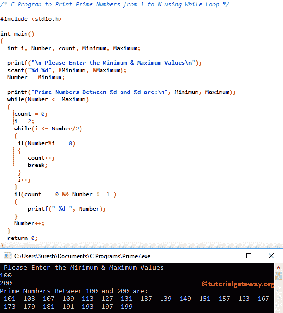

# C 程序：打印从 1 到 100 的质数

> 原文：<https://www.tutorialgateway.org/c-program-to-print-prime-numbers-from-1-to-100/>

如何编写 C 程序打印从 1 到 100 或从最小值到最大值的素数并计算总和。或者使用 For 循环和 While 循环打印某个范围内的质数。

## 使用 While 循环打印从 1 到 100 的质数的 c 程序

在这个从 1 到 100 返回质数的 C 程序中，我们使用了嵌套的 while 循环和多个 if 语句来获得输出。如果不理解 While Loop，请参考[While Loop](https://www.tutorialgateway.org/while-loop-in-c/ "C While Loop")

```c
#include <stdio.h>

int main()
{
  int i, a = 1, count; 

  while(a <= 100)
  {
    count = 0;
    i = 2;
    while(i <= a/2)
    {
      if(a%i == 0)
      {
        count++;
	break;
      }
      i++;	
    }	
    if(count == 0 && a != 1 )
    {
	printf(" %d ", a);
    }
    a++; 
  }
  return 0;
}
```

```c
2  3  5  7  11  13  17  19  23  29  31  37  41  43  47  53  59  61  67  71  73  79  83  89  97
```

它与上面的相同，但是我们允许用户选择最小和最大值来在它们之间打印。

 ```c
#include <stdio.h>

int main()
{
  int i, Number, count, Minimum, Maximum; 

  printf("\n Please Enter the Minimum & Maximum Values\n");
  scanf("%d %d", &Minimum, &Maximum);
  Number = Minimum; 

  printf("Prime Numbers Between %d and %d are:\n", Minimum, Maximum);    
  while(Number <= Maximum)
  {
    count = 0;
    i = 2;
    while(i <= Number/2)
    {
      if(Number%i == 0)
      {
        count++;
	break;
      }
      i++;	
    }	
    if(count == 0 && Number != 1 )
    {
       printf(" %d ", Number);
    }
    Number++; 
  }
  return 0;
}
```



## 用 For 循环打印从 1 到 100 的质数的 c 程序

在这个程序中，第一个 For 循环将确保值在它们之间。

 ```c
#include <stdio.h>

int main()
{
  int i, N, count; 

  for(N = 1; N <= 100; N++)
  {
    count = 0;
    for (i = 2; i <= N/2; i++)
    {
  	if(N%i == 0)
  	{
     	  count++;
  	  break;
	}
    }
    if(count == 0 && N != 1 )
    {
	printf(" %d ", N);
    }  
  }
  return 0;
}
```

```c
 2  3  5  7  11  13  17  19  23  29  31  37  41  43  47  53  59  61  67  71  73  79  83  89  97
```

提示:我们已经在 [C 编程](https://www.tutorialgateway.org/c-programming/)中的 [C 程序寻找素数](https://www.tutorialgateway.org/c-program-to-find-prime-number/)一文中解释了检查给定的是否是素数的逻辑。

您可以允许用户决定最小值和最大值，而不是打印固定值。这个[程序](https://www.tutorialgateway.org/c-programming-examples/)允许用户输入最小值和最大值——接下来，这个 C 程序使用[为循环](https://www.tutorialgateway.org/for-loop-in-c-programming/)打印最小值和最大值之间的质数。

```c
#include <stdio.h>

int main()
{
  int i, val, count, Minimum, Maximum; 

  printf("\n Please Enter the Minimum & Maximum Values\n");
  scanf("%d %d", &Minimum, &Maximum);

  printf("Between %d and %d are:\n", Minimum, Maximum);  
  for(val = Minimum; val <= Maximum; val++)
  {
    count = 0;
    for (i = 2; i <= val/2; i++)
    {
      if(val%i == 0)
      {
  	count++;
  	break;
      }
    }
    if(count == 0 && val != 1 )
    {
       printf(" %d ", val);
    }  
  }
  return 0;
}
```

```c
 Please Enter the Minimum & Maximum Values
20
150
Between 20 and 150 are:
 23  29  31  37  41  43  47  53  59  61  67  71  73  79  83  89  97  101  103  107  109  113  127  131  137  139  149
```

## 计算从 1 到 100 的素数之和的程序

这个程序从 1 和 100 中找出质数，并将它们相加来计算总和。

 ```c
#include <stdio.h>

int main()
{
  int i, Num, count, Sum = 0; 

  for(Num = 1; Num <= 100; Num++)
  {
    count = 0;
    for (i = 2; i <= Num/2; i++)
    {
  	if(Num%i == 0)
  	{
  	   count++;
  	   break;
	}
    }
    if(count == 0 && Num != 1 )
    {
	Sum = Sum + Num;
    }  
  }
  printf(" Sum between 1 to 100 =  %d", Sum); 
  return 0;
}
```

```c
 Sum between 1 to 100 =  1060
```

您可以允许用户决定最小值和最大值，而不是先将 1 加到 100。该[程序](https://www.tutorialgateway.org/c-programming-examples/)允许用户输入最小值和最大值。接下来，这个 C 程序使用[求循环](https://www.tutorialgateway.org/for-loop-in-c-programming/)找到最小值和最大值之间的素数之和。

```c
#include <stdio.h>

int main()
{
  int i, Num, count, Sum = 0, Minimum, Maximum; 

  printf("\n Please Enter the Minimum & Maximum Values\n");
  scanf("%d %d", &Minimum, &Maximum);

  for(Num = Minimum; Num <= Maximum; Num++)
  {
    count = 0;
    for (i = 2; i <= Num/2; i++)
    {
  	if(Num%i == 0)
  	{
     	  count++;
  	  break;
	}
    }
    if(count == 0 && Num != 1 )
    {
       Sum = Sum + Num;
    }  
  }
  printf(" Sum between %d and %d =  %d", Minimum, Maximum, Sum); 
  return 0;
}
```

```c
 Please Enter the Minimum & Maximum Values
100
200
 Sum between 100 and 200 =  3167
```