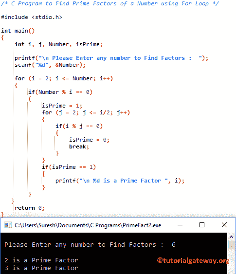

# C 程序：求一个数的质因数

> 原文：<https://www.tutorialgateway.org/c-program-to-find-prime-factors-of-a-number/>

如何用 For 循环、While 循环和函数编写 C 程序求一个数的质因数？

## 用 For 循环求一个数的质因数的 c 程序

该程序允许用户输入任何整数值。接下来，这个程序使用 For 循环找到一个数的质因数。

在我们之前的文章中，我们已经解释过了，如何编写一个[程序来寻找一个数的因数](https://www.tutorialgateway.org/c-program-to-find-factors-of-a-number/)和[寻找素数](https://www.tutorialgateway.org/c-program-to-find-prime-number/)。

```c
/* C Program to Find Prime Factors of a Number using For Loop */

#include <stdio.h>

int main()
{
  	int i, j, Number, isPrime; 

  	printf("\n Please Enter any number to Find Factors :  ");
  	scanf("%d", &Number);

  	for (i = 2; i <= Number; i++)
   	{
     	if(Number % i == 0)
        {
   			isPrime = 1;
			for (j = 2; j <= i/2; j++)
			{
				if(i % j == 0)
				{
					isPrime = 0;
					break;
				}
			} 
			if(isPrime == 1)
			{
				printf("\n %d is a Prime Factor ", i);
			}	          	
		}
   }
  	return 0;
}
```



## 用 While 循环计算一个数的质因数的 c 程序

该 [C 程序](https://www.tutorialgateway.org/c-programming/)允许用户输入任意整数值。使用这个值，这个程序将使用[同时循环](https://www.tutorialgateway.org/while-loop-in-c/)找到一个数的质因数。

```c
/* C Program to Find Prime factors of a Number using While Loop */

#include <stdio.h>

int main()
{
  	int Number, i = 1, j, Count; 

  	printf("\n Please Enter number to Find Factors  :  ");
  	scanf("%d", &Number);

 	while (i <= Number)
   	{
   		Count = 0;
    	if(Number % i == 0)
      	{
      		j = 1;
      		while(j <= i)
      		{
      			if(i % j == 0)
      			{
      				Count++;
				}
				j++;
			}
			if(Count == 2)
			{
				printf("\n %d is a Prime Factor ", i);
			} 
      	}
    	i++;
   	}

  	return 0;
}
```

我们刚刚用 While 循环替换了上面寻找一个数的质因数的程序中的 [For 循环](https://www.tutorialgateway.org/for-loop-in-c-programming/)。如果你不理解 [WHILE LOOP](https://www.tutorialgateway.org/while-loop-in-c/) 。

```c
 Please Enter number to Find Factors  :  2550

 2 is a Prime Factor 
 3 is a Prime Factor 
 5 is a Prime Factor 
 17 is a Prime Factor 
```

## 用函数计算数的质因数的 c 程序

该程序允许用户输入任何整数值。用户输入的值将被传递给我们创建的函数。find_factors 功能会找到一个数字的[因数，Find_Prime 会检查该因数是否为](https://www.tutorialgateway.org/c-program-to-find-factors-of-a-number/) [prime](https://www.tutorialgateway.org/c-program-to-find-prime-number/) 。

```c
#include <stdio.h>

void Find_Prime(int Number)
{ 
  	int i, Count = 0; 

  	for (i = 2; i <= Number/2; i++)
   	{
    	if(Number%i == 0)
     	{
       		Count++;
     	} 
   	}
   	if(Count == 0 && Number != 1 )
   	{
   		printf("\n %d is a Prime Number", Number);
   	}
}
void Find_Factors(int Number)
{ 
  	int i; 

  	for (i = 1; i <= Number; i++)
   	{
    	if(Number % i == 0)
     	{
     		// Calling Find_Prime Function for every factor
       		Find_Prime(i);
     	} 
   	}
}
int main()
{
  	int i, j, Number, count; 

  	printf("\n Please Enter any number to Find it's Prime Factors :  ");
  	scanf("%d", &Number);

  	printf("\n Prime Factors of a Given Number are : \n");
	Find_Factors(Number);

  	return 0;
}
```

```c
 Please Enter any number to Find it's Prime Factors :  10750

 Prime Factors of a Given Number are : 

 2 is a Prime Number
 5 is a Prime Number
 43 is a Prime Number
```