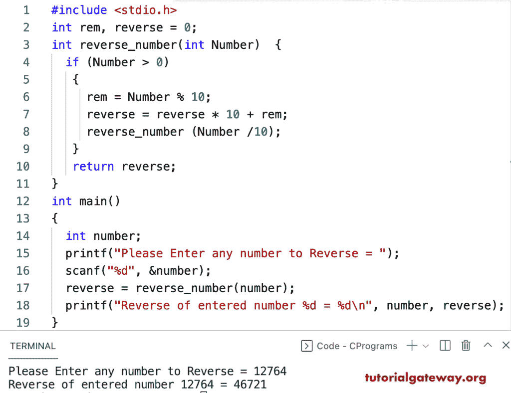

# C 程序：用递归函数反转数字

> 原文：<https://www.tutorialgateway.org/c-program-to-reverse-a-number-using-recursive-function/>

写一个 C 程序，用递归函数来反转一个数。在这个 c 示例中，reverse_number 函数接受整数，并递归迭代该数字以反转给定的数字。在每次迭代中，反向变量将收集数字的最后一位。

```c
#include <stdio.h>

int rem, reverse = 0;

int reverse_number(int Number)
{
  if (Number > 0)
   {
     rem = Number % 10;
     reverse = reverse * 10 + rem;
     reverse_number (Number /10);
   }
   return reverse;
}
int main()
{
  int number;

  printf("Please Enter any number to Reverse = ");
  scanf("%d", &number);

  reverse = reverse_number(number);

  printf("Reverse of entered number %d = %d\n", number, reverse);
}

```

