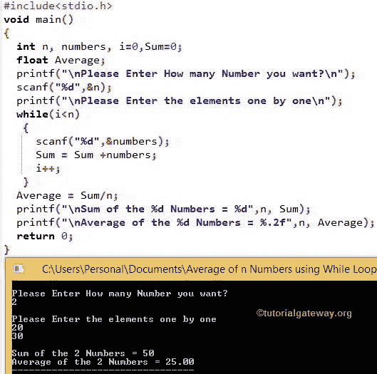

# C 程序：计算`N`个数的和与均值

> 原文：<https://www.tutorialgateway.org/c-program-to-calculate-the-sum-and-average-of-n-number/>

如何用 For 循环、While 循环和 Do While 循环编写 C 程序计算 N 个数的和与平均值？

## 用 For 循环求 n 个数的和与平均值的 c 程序

这个 C 程序允许用户输入他希望计算平均值和总和的数字(n)。接下来，它将要求用户输入单个项目，直到一个声明的数字。

使用 C 编程中的 For 循环，这个程序将计算总和，稍后这个 C 程序将计算平均值。

```c
#include<stdio.h>

int main()
{
  int i,n,Sum=0,numbers;
  float Average;

  printf("\nPlease Enter How many Number you want?\n");
  scanf("%d",&n);

  printf("\nPlease Enter the elements one by one\n");
  for(i=0;i<n;++i)
   {
     scanf("%d",&numbers);
     Sum = Sum +numbers;
   }

  Average = Sum/n;

  printf("\nSum of the %d Numbers = %d",n, Sum);
  printf("\nAverage of the %d Numbers = %.2f",n, Average);

  return 0;
}
```

```c
Please Enter How many Number you want?
2

Please Enter the elements one by one
10
20

Sum of the 2 Numbers = 30
Average of the 2 Numbers = 15.00
```

这背后的代码分析 [C 程序](https://www.tutorialgateway.org/c-programming-examples/)找到 n 数的平均值

*   第一个 printf 语句将要求用户输入 n 个值。例如，如果用户输入 2，那么第二个 printf 语句将要求用户一个接一个地输入这两个值。
*   For 循环将阻止用户使用条件 i
*   在下一行中，我们将输入的值添加到 sum 中。
*   完成此操作后，它将开始第二次迭代。对于第三次迭代，条件(i <n will="" fail="" so="" it="" exit="" from="" the="" href="https://www.tutorialgateway.org/for-loop-in-c-programming/">为循环。</n>
*   在循环之外，我们使用公式 sum/n 计算平均值。在我们的 [C 编程](https://www.tutorialgateway.org/c-programming/)示例中，它是 30/2 = 15

## 用 While 循环求 n 个数的和与平均值的 c 程序

该程序允许用户输入他希望计算平均值和总和的数字(n)。接下来，它将要求用户输入单个项目，直到一个声明的数字。使用 [While Loop](https://www.tutorialgateway.org/while-loop-in-c/) ，它将计算总和，稍后它将计算平均值。

```c
#include<stdio.h>

void main()
{
  int n, numbers, i=0,Sum=0;
  float Average;

  printf("\nPlease Enter How many Number you want?\n");
  scanf("%d",&n);

  printf("\nPlease Enter the elements one by one\n");
  while(i<n)
   {
     scanf("%d",&numbers);
     Sum = Sum +numbers;
     i++;
   }

  Average = Sum/n;

  printf("\nSum of the %d Numbers = %d",n, Sum);
  printf("\nAverage of the %d Numbers = %.2f",n, Average);

  return 0;
}

```



在这个计算 n 个数的和与平均值的 C 程序中，第一个 printf 语句将要求用户输入 n 个值。例如，如果用户输入 5，那么第二个 printf 语句将要求用户一个接一个地输入这 5 个值。

while 循环将阻止用户使用条件 i

在下一行中，我们将输入的值添加到总和中。完成此操作后，I 的值由递增运算符递增。

接下来，它将开始第二次迭代。对于第三次迭代，条件(i

## 用边循环边做求 n 个数的和与平均值的 c 程序

该程序允许用户输入他希望计算平均值和总和的数字(n)。接下来，它将要求用户输入单个项目，直到一个声明的数字。使用[边做边循环](https://www.tutorialgateway.org/do-while-loop-in-c/)，它将计算总和，然后计算平均值。

```c
#include<stdio.h>

int main()
{
  int n, numbers, i=0,Sum=0;
  float Average;

  printf("\nPlease Enter How many Number you want?\n");
  scanf("%d",&n);

  printf("\nPlease Enter the elements one by one\n");
  do
   {
     scanf("%d",&numbers);
     Sum = Sum +numbers;
     i++;
   }while(i<n);

  Average = Sum/n;

  printf("\nSum of the %d Numbers = %d",n, Sum);
  printf("\nAverage of the %d Numbers = %.2f",n, Average);

  return 0;
}
```

```c
Please Enter How many Number you want?
3

Please Enter the elements one by one
20
30
50

Sum of the 3 Numbers = 100
Average of the 3 Numbers = 33.00
```

我们刚刚将 While 循环替换为 Do While 循环。请不要忘记在 while 条件后错过分号。