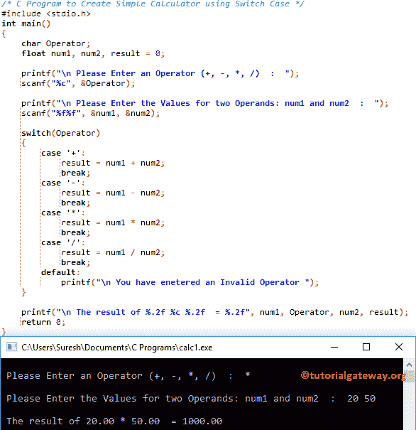

# C 程序：创建简单计算器

> 原文：<https://www.tutorialgateway.org/c-program-to-create-simple-calculator/>

如何用 Switch case、Functions 和 Else If 语句编写创建简单计算器的 C 程序？

## 创建简单计算器的 c 程序示例 1

这个 C 语言的计算器程序帮助用户输入运算符(+、-、*、或/)和两个值。使用这两个值和操作数，它将执行算术运算。

对于这个 C 计算器程序示例，我们使用 Switch 案例来检查用户插入了哪个操作数。接下来，将显示基于操作数的结果。

```c
/* C Program to Create Simple Calculator using Switch Case */

#include <stdio.h>

int main()
{
	char Operator;
	float num1, num2, result = 0;

	printf("\n Please Enter an Operator (+, -, *, /)  :  ");
  	scanf("%c", &Operator);

	printf("\n Please Enter the Values for two Operands: num1 and num2  :  ");
  	scanf("%f%f", &num1, &num2);

  	switch(Operator)
  	{
  		case '+':
  			result = num1 + num2;
  			break;
  		case '-':
  			result = num1 - num2;
  			break;  			
  		case '*':
  			result = num1 * num2;
  			break;
  		case '/':
  			result = num1 / num2;
  			break;
		default:
			printf("\n You have enetered an Invalid Operator ");				    			
	}

	printf("\n The result of %.2f %c %.2f  = %.2f", num1, Operator, num2, result);

  	return 0;
}
```



## 创建简单计算器的 c 程序示例 2

和我们在第一个例子中使用的 [C 程序](https://www.tutorialgateway.org/c-programming-examples/)是一样的。但是这一次，我们是在[开关盒](https://www.tutorialgateway.org/switch-case-in-c/)模块内直接执行[算术运算](https://www.tutorialgateway.org/arithmetic-operators-in-c/)。

 ```c
#include <stdio.h>

int main()
{
	char Operator;
	float num1, num2, result = 0;

	printf("\n Please Enter an Operator (+, -, *, /)  :  ");
  	scanf("%c", &Operator);

	printf("\n Please Enter the Values for two Operands: num1 and num2  :  ");
  	scanf("%f%f", &num1, &num2);

  	switch(Operator)
  	{
  		case '+':
  			printf("\n The result of %.2f + %.2f  = %.2f", num1, num2, num1 + num2);
  			break;
  		case '-':
  			printf("\n The result of %.2f - %.2f  = %.2f", num1, num2, num1 - num2);
  			break;  			
  		case '*':
  			printf("\n The result of %.2f * %.2f  = %.2f", num1, num2, num1 * num2);
  			break;
  		case '/':
  			printf("\n The result of %.2f / %.2f  = %.2f", num1, num2, num1 / num2);
  			break;
		default:
			printf("\n You have enetered an Invalid Operator ");				    			
	}

  	return 0;
}
```

```c
 Please Enter an Operator (+, -, *, /)  :  +

 Please Enter the Values for two Operands: num1 and num2  :  125 179

 The result of 125.00 + 179.00  = 304.00P
```

## 创建简单计算器的程序示例 3

在这个例子中，我们使用 [Else If 语句](https://www.tutorialgateway.org/else-if-statement-in-c/)在 c. 中创建一个简单的计算器

```c
#include <stdio.h>

int main()
{
	char Operator;
	float num1, num2, result = 0;

	printf("\n Please Enter an Operator (+, -, *, /)  :  ");
  	scanf("%c", &Operator);

	printf("\n Please Enter the Values for two Operands: num1 and num2  :  ");
  	scanf("%f%f", &num1, &num2);

  	if(Operator == '+')
  	{
  		printf("\n The result of %.2f + %.2f  = %.2f", num1, num2, num1 + num2);
  	}
  	else if(Operator == '-')
  	{
  		printf("\n The result of %.2f - %.2f  = %.2f", num1, num2, num1 - num2);
  	}
  	else if(Operator == '*')
  	{
  		printf("\n The result of %.2f * %.2f  = %.2f", num1, num2, num1 * num2);
  	}
  	else if(Operator == '/')
  	{
  		printf("\n The result of %.2f / %.2f  = %.2f", num1, num2, num1 / num2);
  	}
  	else
  	{
  		printf("\n You have enetered an Invalid Operator ");
	}

  	return 0;
}
```

```c
 Please Enter an Operator (+, -, *, /)  :  /

 Please Enter the Values for two Operands: num1 and num2  :  1465 32

 The result of 1465.00 / 32.00  = 45.78
```

## 创建简单计算器的程序示例 4

它与我们在第一个示例中使用的计算器程序相同。但是，我们使用[函数](https://www.tutorialgateway.org/functions-in-c/)分离了 [C 编程](https://www.tutorialgateway.org/c-programming/)算术运算逻辑。

 ```c
#include <stdio.h>
float add(float a, float b);
float sub(float a, float b);
float multi(float a, float b);
float divi(float a, float b);

int main()
{
	char Operator;
	float num1, num2, result = 0;

	printf("\n Please Enter an Operator (+, -, *, /)  :  ");
  	scanf("%c", &Operator);

	printf("\n Please Enter the Values for two Operands: num1 and num2  :  ");
  	scanf("%f%f", &num1, &num2);

  	switch(Operator)
  	{
  		case '+':
  			result = add(num1, num2);
  			break;
  		case '-':
  			result = sub(num1, num2);
  			break;  			
  		case '*':
  			result = multi(num1, num2);
  			break;
  		case '/':
  			result = divi(num1, num2);
  			break;
		default:
			printf("\n You have enetered an Invalid Operator ");				    			
	}

	printf("\n The result of %.2f %c %.2f  = %.2f", num1, Operator, num2, result);

  	return 0;
}

float add(float a, float b)
{
	return a + b;
}

float sub(float a, float b)
{
	return a - b;
}

float multi(float a, float b)
{
	return a * b;
}

float divi(float a, float b)
{
	return a / b;
}
```

```c
 Please Enter an Operator (+, -, *, /)  :  -

 Please Enter the Values for two Operands: num1 and num2  :  1462 2932.85

 The result of 1462.00 - 2932.85  = -1470.85
```