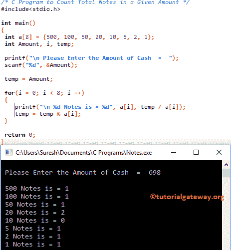

# C 程序：计算给定金额的纸币总数

> 原文：<https://www.tutorialgateway.org/c-program-to-count-total-notes-in-a-given-amount/>

如何用循环、函数和 If 语句编写 C 程序计算给定金额的纸币总数？

## 计算给定金额中纸币总数的程序示例 1

这个程序帮助用户输入现金的数量，然后使用 来查找分母的总数

```c
/* C Program to Count Total Notes in a Given Amount */
#include<stdio.h>

int main()
{
 int a[8] = {500, 100, 50, 20, 10, 5, 2, 1};
 int Amount, i, temp;

 printf("\n Please Enter the Amount of Cash  =  ");
 scanf("%d", &Amount);

 temp = Amount;

 for(i = 0; i < 8; i++)
 {
 	printf("\n %d Notes is = %d", a[i], temp / a[i]);
 	temp = temp % a[i];
 }

 return 0;
}
```



[For 循环](https://www.tutorialgateway.org/for-loop-in-c-programming/)第一次迭代:For(I = 0；0<8；0++)
a[i] = a[0] = 500
温度/ a[i] = 698 / 500 = 1
接下来，温度= 698 % 500 = 198

现在 temp = 198，I 值将增加到 1

对于循环二次迭代:对于(I = 1；1 < 8; 1++)
a[i] = a[1] = 100
温度/ a[i] = 198 / 100 = 1
接下来，温度= 198 % 100 = 98

现在 temp = 98，I 值将增加到 1

第三次迭代:for(I = 2；2 < 8; 2++)
a[i] = a[2] = 50
温度/ a[i] = 98 / 50 = 1
接下来，温度= 98 % 50 = 48

现在 temp = 48，而我的值将是 3

第四次迭代:for(I = 3；3 < 8; 3++)
a[i] = a[3] = 20
温度/ a[i] = 48 / 20 = 2
接下来，温度= 48 % 20 = 8

现在温度= 8，I 值将为 4

第五次迭代:for(I = 4；4 < 8; 4++)
a[i] = a[4] = 10
温度/ a[i] = 8 / 10 = 0
接下来，温度= 8 % 10 = 8

现在温度= 8，I 值将为 5

对剩余的 [C 编程](https://www.tutorialgateway.org/c-programming/)迭代进行同样的操作

## 计算给定金额中纸币总数的程序示例 2

和我们在第一个例子中使用的[程序](https://www.tutorialgateway.org/c-programming-examples/)是一样的，但是这次我们使用[函数](https://www.tutorialgateway.org/functions-in-c/)分离逻辑。

```c
/* C Program to Count Total Notes in a Given Amount */
#include<stdio.h>

void Total_Notes(int Amount);

int main()
{
 	int Amount;

 	printf("\n Please Enter the Amount of Cash  =  ");
 	scanf("%d", &Amount);

	Total_Notes(Amount);

 	return 0;
}

void Total_Notes(int Amount)
{
	int a[8] = {500, 100, 50, 20, 10, 5, 2, 1};
	int i, temp;

	temp = Amount;

 	for(i = 0; i < 8; i ++)
 	{
 		printf("\n %d Notes is = %d", a[i], temp / a[i]);
 		temp = temp % a[i];
 	}
}
```

```c
 Please Enter the Amount of Cash  =  1568

 500 Notes is = 3
 100 Notes is = 0
 50 Notes is = 1
 20 Notes is = 0
 10 Notes is = 1
 5 Notes is = 1
 2 Notes is = 1
 1 Notes is = 1
```

## 计算给定金额中纸币总数的程序示例 3

我知道这是一个可怕的想法，但是知道你可以使用 [If 语句](https://www.tutorialgateway.org/if-statement-in-c/)来实现这一点是很好的。在这里，对于每个 If 语句，金额都将减少。

```c
/* C Program to Count Total Notes in a Given Amount */

#include <stdio.h>

int main()
{
	int Amount;
	int Note500, Note100, Note50, Note20, Note10, Note5, Note2, Coin1;
	Note500 = Note100 = Note50 = Note20 = Note10 = Note5 = Note2 = Coin1 = 0;

	printf("\n Please Enter the Amount of Cash  = ");
  	scanf("%d", &Amount);

  	if (Amount > 500)
  	{
  		Note500 = Amount / 500;
  		Amount = Amount - (Note500 * 500);	
  	} 
  	if (Amount >= 100)
  	{
  		Note100 = Amount / 100;
  		Amount = Amount - (Note100 * 100);	
  	}
  	if (Amount >= 50)
  	{
  		Note50 = Amount / 50;
  		Amount = Amount - (Note50 * 50);	
  	}
  	if (Amount >= 20)
  	{
  		Note20 = Amount / 20;
  		Amount = Amount - (Note20 * 20); 	
  	}
	if (Amount >= 10)
  	{
  		Note10 = Amount / 10;
  		Amount = Amount - (Note10 * 10); 	
  	} 
  	if (Amount >= 5)
  	{
  		Note5 = Amount / 5;
  		Amount = Amount - (Note5 * 5); 	
  	}
   	if (Amount >= 2)
  	{
  		Note2 = Amount / 2;
  		Amount = Amount - (Note2 * 2); 	
  	} 	 	      	
  	if (Amount >= 1)
  	{
	   	Coin1 = Amount;
	}
	printf("\n Total Number of Notes presenet in the Cash that you entered are \n");
	printf("\n 500 Notes  =  %d", Note500); 
	printf("\n 100 Notes  =  %d", Note100); 
	printf("\n 50 Notes  =  %d", Note50); 
	printf("\n 20 Notes  =  %d", Note20); 
	printf("\n 10 Notes  =  %d", Note10); 
	printf("\n 5 Notes  =  %d", Note5); 
	printf("\n 2 Notes  =  %d", Note2); 
	printf("\n 1 Coin  =  %d", Coin1); 

  	return 0;
}
```

```c
 Please Enter the Amount of Cash  = 259876

 Total Number of Notes presenet in the Cash that you entered are 

 500 Notes  =  519
 100 Notes  =  3
 50 Notes  =  1
 20 Notes  =  1
 10 Notes  =  0
 5 Notes  =  1
 2 Notes  =  0
 1 Coin  =  1
```