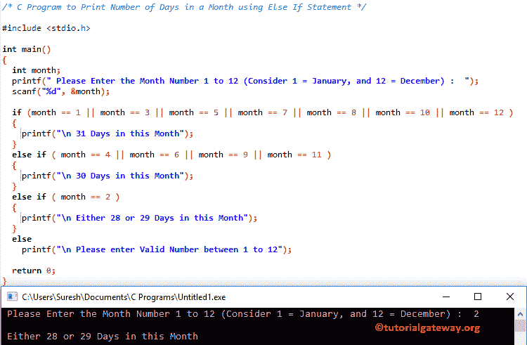

# c 程序打印一个月的天数

> 原文：<https://www.tutorialgateway.org/c-program-to-print-number-of-days-in-a-month/>

如何用 Else If 语句和 Switch Condition 编写 C 程序打印一个月的天数，并举例说明？。众所周知，总天数在:

*   1 月、3 月、5 月、8 月、10 月和 12 月= 31 天
*   四月、六月、九月和十一月= 30 天
*   2 月= 28 或 29 天

## c 程序使用 Else If 打印一个月中的天数

这个 C 程序将要求用户输入 1 到 12 之间的任何数字，其中 1 是 1 月，2 = 2 月，3 = 3 月，…。，而 12 = 12 月。

根据用户输入的整数值，该程序将打印一个月中的天数。为了实现这个目标，我们使用[否则 If 语句](https://www.tutorialgateway.org/else-if-statement-in-c/)。

```c
/* C Program to Print Number of Days in a Month using Else If Statement */

#include <stdio.h>

int main()
{
  int month;
  printf(" Please Enter the Month Number 1 to 12 (Consider 1 = January, and 12 = December) :  ");
  scanf("%d", &month);

  if (month == 1 || month == 3 || month == 5 || month == 7 || month == 8 || month == 10 || month == 12 )
  {
  	printf("\n 31 Days in this Month");  	
  }
  else if ( month == 4 || month == 6 || month == 9 || month == 11 )
  {
  	printf("\n 30 Days in this Month");  	
  }  
  else if ( month == 2 )
  {
  	printf("\n Either 28 or 29 Days in this Month");  	
  } 
  else
    printf("\n Please enter Valid Number between 1 to 12");

  return 0;
}
```



让我输入月份号 5

```c
 Please Enter the Month Number 1 to 12 (Consider 1 = January, and 12 = December) :  5

 31 Days in this Month
```

让我输入月号为 9

```c
 Please Enter the Month Number 1 to 12 (Consider 1 = January, and 12 = December) :  9

 30 Days in this Month
```

这次，我们将输入错误的值:15

```c
 Please Enter the Month Number 1 to 12 (Consider 1 = January, and 12 = December) :  15

 Please enter Valid Number between 1 to 12
```

## 使用开关条件返回一个月中天数的程序

处理多个 [C 编程](https://www.tutorialgateway.org/c-programming/)条件是一种理想的方法。在这个[程序](https://www.tutorialgateway.org/c-programming-examples/)中，我们使用[切换案例](https://www.tutorialgateway.org/switch-case-in-c/)的方法来打印一个月的天数。

```c
#include <stdio.h>

int main()
{
  int month;
  printf(" Please Enter the Month Number 1 to 12 (Consider 1 = January, and 12 = December) :  ");
  scanf("%d", &month);

  switch(month )
  {
  	case 1:
  	case 3:
	case 5: 	
	case 7:
	case 8:
	case 10:
	case 12:			  	
	  	printf("\n 31 Days in this Month");
	  	break;

	case 4:	
	case 6:
	case 9:
	case 11:			    	
	  	printf("\n 30 Days in this Month");  
		break;

	case 2:
	  	printf("\n Either 28 or 29 Days in this Month");  

	default:		  	
	    printf("\n Please enter Valid Number between 1 to 12");
  }
  return 0;
}
```

```c
 Please Enter the Month Number 1 to 12 (Consider 1 = January, and 12 = December) :  12

 31 Days in this Month
```

让我试试不同的数值

```c
 Please Enter the Month Number 1 to 12 (Consider 1 = January, and 12 = December) :  6

 30 Days in this Month
```