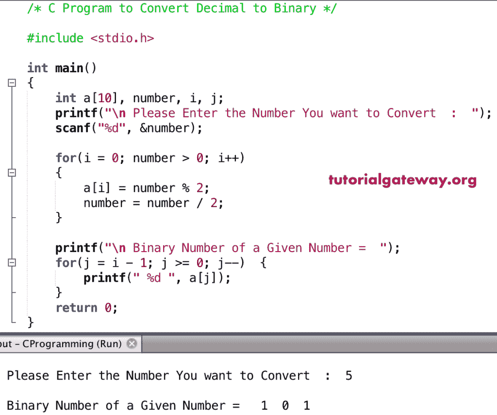

# C 程序：将十进制转换为二进制

> 原文：<https://www.tutorialgateway.org/c-program-to-convert-decimal-to-binary/>

如何用实例编写一个 C 程序将十进制数转换成二进制数？。要在 C 语言中将十进制数转换为二进制数，首先用 2 除原始值。接下来，将商除以 2。重复相同的步骤，直到给定的数字为零。

## 将十进制转换为二进制的 c 程序示例

本程序将十进制转换为二进制使用 For 循环将用户给定的十进制值转换为二进制值

```c
/* C Program to Convert Decimal to Binary */

#include <stdio.h>
int main() 
{
    int a[10], number, i, j;
    printf("\n Please Enter the Number You want to Convert  :  ");
    scanf("%d", &number);

    for(i = 0; number > 0; i++)
    {
        a[i] = number % 2;
        number = number / 2;
    }

    printf("\n Binary Number of a Given Number =  ");
    for(j = i - 1; j >= 0; j--)  {
        printf(" %d ", a[j]);
    }
    printf("\n");
    return 0;
}
```



在这个将十进制转换为二进制的程序中，首先，我们使用[进行循环](https://www.tutorialgateway.org/for-loop-in-c-programming/)。这里，数字= 5

循环第一次迭代:对于(I = 0；数字> 0；i++)
为(I = 0；5>0；0++)–条件真
a[0] =数字% 2 = > 5 % 2 = 1
数字=数字/ 2 = 2.5

第二次迭代:对于(I = 1；2 > 0;1++)
a[1] = 2.5 % 2 = 0
个数= 2.5 / 2 = 1.25

第三次迭代:for(I = 2；1 > 0;2++)
a[2] = 1.25 % 2 = 1
数= 0

接下来，我们使用 [C 编程](https://www.tutorialgateway.org/c-programming/)进行循环到[打印数组](https://www.tutorialgateway.org/c-program-to-print-elements-in-an-array/)元素。

### 使用 While 循环将十进制转换为二进制

这是另一个将十进制值转换成二进制数的 C 例子，为此，我们使用 while 循环。

```c
/* C Program to Convert Decimal to Binary */

#include <stdio.h>

int main() 
{
    int a[10], number, i = 1, j;
    printf("\n Please Enter the Number You want to Convert  :  ");
    scanf("%d", &number);

    while(number  != 0)
    {
        a[i++] = number % 2;
        number = number / 2;
    }

    printf("\n Binary Number of a Given Number =  ");
    for(j = i - 1; j > 0; j--)  {
        printf(" %d ", a[j]);
    }
    return 0;
}
```

十进制到二进制输出

```c
 Please Enter the Number You want to Convert  :  25

 Binary Number of a Given Number =   1  1  0  0  1 
```

### 用函数将十进制转换成二进制的 c 程序

在这个[程序](https://www.tutorialgateway.org/c-programming-examples/)中，我们使用了[函数](https://www.tutorialgateway.org/functions-in-c/)和[按位与运算符](https://www.tutorialgateway.org/bitwise-operators-in-c/)将十进制值转换为二进制值。

```c
/* C Program to Convert Decimal to Binary */

#include <stdio.h>

void Decimal_to_Binary(int number)
{
    int j;
    for(int i = 31; i >= 0; i--)
    {
        j = number >> i;

        if(j & 1)
            printf("1");
        else
            printf("0");
    }
}
int main() 
{
    int number;

    printf("\n Please Enter the Number You want to Convert  :  ");
    scanf("%d", &number);

    Decimal_to_Binary(number); 

    return 0;
}
```

十进制到二进制输出

```c
 Please Enter the Number You want to Convert  :  32
00000000000000000000000000100000
```