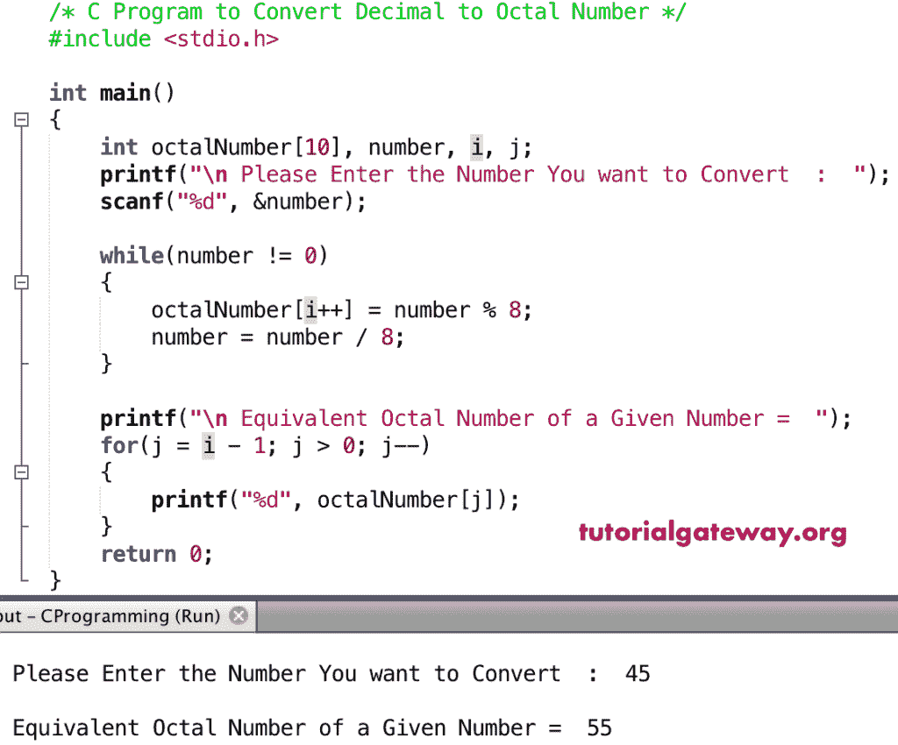

# C 程序：将十进制数转换为八进制数

> 原文：<https://www.tutorialgateway.org/c-program-to-convert-decimal-to-octal-number/>

如何用实例编写一个 C 程序将十进制数转换成八进制数？。在 [C](https://www.tutorialgateway.org/c-programming/) 将十进制数转换为八进制数之前，众所周知，

*   十进制值是以 10 为基数的数字系统，它们使用 0 到 9 之间的数字
*   八进制数是以 8 为基数的数，它们使用 0 到 7 之间的数

要将 C 语言中的十进制数转换为八进制数，首先用 8 除原始值。接下来，将商除以 8。重复相同的过程，直到给定的数字为零。

## 将十进制数转换为八进制数的 c 程序示例 1

将十进制数转换成八进制数是最直接和更好的方法

```c
/* C Program to Convert Decimal to Octal Number */

#include <stdio.h>
int main() 
{
    int number;
    printf("\n Please Enter the Number You want to Convert  :  ");
    scanf("%d", &number);

    printf("\n Octal Number of a Given Number =  %o", number);

    return 0;
}
```

十进制到八进制输出

```c
 Please Enter the Number You want to Convert  :  50

 Octal Number of a Given Number =  62
```

## 将十进制数转换为八进制数示例 2

这个用 C 语言将十进制转换为八进制的程序使用 for 循环将用户给定的十进制值转换为八进制值。最后，我们使用另一个 For 循环来打印数组元素。建议大家参考[印阵](https://www.tutorialgateway.org/c-program-to-print-elements-in-an-array/)篇

```c
/* C Program to Convert Decimal to Octal Number */

#include <stdio.h>
int main() 
{
    int octalNumber[10], number, i, j;
    printf("\n Please Enter the Number You want to Convert  :  ");
    scanf("%d", &number);

    for(i = 0; number > 0; i++)
    {
        octalNumber[i] = number % 8;
        number = number / 8;
    }

    printf("\n Equivalent Octal Number of a Given Number =  ");
    for(j = i - 1; j >= 0; j--)  
    {
        printf("%d", octalNumber[j]);
    }
    return 0;
}
```

```c
 Please Enter the Number You want to Convert  :  25

 Equivalent Octal Number of a Given Number =  31
```

## 将十进制数转换为八进制数示例 3

本[程序](https://www.tutorialgateway.org/c-programming-examples/)同上。这里，将 For Lop 替换为 [While Loop](https://www.tutorialgateway.org/while-loop-in-c/) 。

```c
/* C Program to Convert Decimal to Octal Number */

#include <stdio.h>

int main() 
{
    int octalNumber[10], number, i, j;
    printf("\n Please Enter the Number You want to Convert  :  ");
    scanf("%d", &number);

    while(number != 0)
    {
        octalNumber[i++] = number % 8;
        number = number / 8;
    }

    printf("\n Equivalent Octal Number of a Given Number =  ");
    for(j = i - 1; j > 0; j--)  
    {
        printf("%d", octalNumber[j]);
    }
    return 0;
}

```



## 使用函数将十进制数转换为八进制数

在这个程序中，我们使用[函数](https://www.tutorialgateway.org/functions-in-c/)来分离逻辑。

```c
/* C Program to Convert Decimal to Octal Number */

#include <stdio.h>

long Decimal_to_Octal(int number)
{
    long octalNumber = 0, i = 1;
    int remainder;
    while(number != 0)
    {
        remainder = number % 8;
        number = number / 8;
        octalNumber = octalNumber + (remainder * i);
        i = i * 10;
    }
    return octalNumber;
}

int main() 
{
    int number;
    printf("\n Please Enter the Number You want to Convert  :  ");
    scanf("%d", &number);

    long oct  = Decimal_to_Octal(number);
    printf("\n Equivalent Octal Number of %d =  %ld", number, oct);

    return 0;
}
```

```c
 Please Enter the Number You want to Convert  :  22

 Equivalent Octal Number of 22 =  26
```

## 将十进制数转换为八进制数示例 5

这是另一个将十进制值转换成八进制数的 C 编程例子。

```c
/* C Program to Convert Decimal to Octal Number */

#include <stdio.h>
#include<math.h>

long Decimal_to_Octal(int number)
{
    long octalNumber = 0;
    int remainder, count = 0;
    while(number != 0)
    {
        remainder = number % 8;
        number = number / 8;
        octalNumber = octalNumber + remainder * pow(10, count);
        count++;
    }
    return octalNumber;
}

int main() 
{
    int number;
    printf("\n Please Enter the Number You want to Convert  :  ");
    scanf("%d", &number);

    long oct  = Decimal_to_Octal(number);
    printf("\n Equivalent Octal Number of %d =  %ld", number, oct);

    return 0;
}
```

```c
 Please Enter the Number You want to Convert  :  70

 Equivalent Octal Number of 70 =  106
```