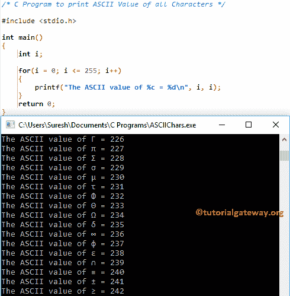

# C 程序：打印所有字符的 ASCII 值

> 原文：<https://www.tutorialgateway.org/c-program-print-ascii-value-characters/>

如何用例子编写 C 程序打印所有字符的 ASCII 值？。在 C 语言中，每个字符都有自己的 ASCII 值。每当我们存储一个字符时，不是存储字符本身，而是存储它的 ASCII 值。例如，A 的 ASCII 值是 65。

## 打印所有字符的 ASCII 值的程序

该程序将打印当前所有字符的 ASCII 值。

```c
#include <stdio.h>

int main()
{
  	int i;

  	for(i = 0; i <= 255; i++)
   	{
    	printf("The ASCII value of %c = %d\n", i, i);
   	}
  	return 0;
}
```

建议大家参考 [ASCII 表](https://www.tutorialgateway.org/ascii-table/)文章，了解 [C 编程](https://www.tutorialgateway.org/c-programming/)中的代码及其字符列表。如您所知，所有字符的 ASCII 值将在 0 到 255 之间。这就是为什么我们使用[进行循环](https://www.tutorialgateway.org/for-loop-in-c-programming/)从 0 开始并迭代[程序](https://www.tutorialgateway.org/c-programming-examples/)循环到 255。

