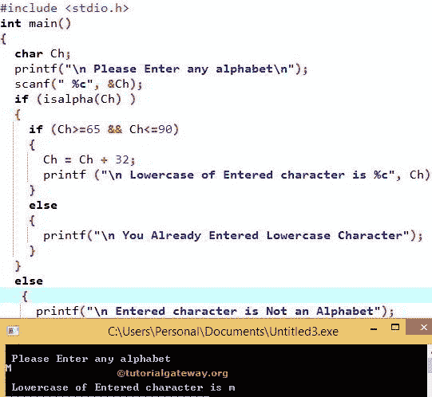

# C 程序：将字符转换成小写

> 原文：<https://www.tutorialgateway.org/c-program-to-convert-character-to-lowercase/>

如何在 C 语言中使用 tolower 内置函数将给定字符转换成小写，以及不使用 tolower 函数。C 编程 tolower 是头文件中的内置函数，用于将字符转换为大写。函数的语法是

```c
tolower (<Character>);
```

## 用函数将字符转换成小写的 c 程序

这个 C 程序允许用户输入任何字符，并使用名为 tolower 的内置 ctype 函数将字符转换为小写。

```c
#include <stdio.h>  
#include <ctype.h> 

int main()
{
  char Ch;

  printf("\n Please Enter any alphabet\n");
  scanf(" %c", &Ch);

  if (isalpha(Ch) )
   {  
     Ch = tolower(Ch); 
     printf ("\n Lowercase of Entered character is %c", Ch);
   }
  else
   {
     printf("\n Please Enter Valid Alphabet");
   }  
}
```

c 输出中大写到小写

```c
 Please Enter any alphabet
K

 Lowercase of Entered character is k
```

在这个将字符转换成小写的 C 程序中，我们使用了 [If 语句](https://www.tutorialgateway.org/if-statement-in-c/)，

```c
if (isalpha(Ch) )
```

如果上述条件为真，那么给定的字符是字母。现在，我们可以使用下面的语句 将给定的字符转换为小写

```c
Ch = tolower(Ch);
```

在下一行，我们有 [C 编程](https://www.tutorialgateway.org/c-programming/) printf 语句来打印转换后的小写字母。

```c
printf ("\n Lowercase of Entered character is %c", Ch);
```

如果上述条件为假，那么给定的字符不是字母。所以，它会打印下面的语句。

```c
printf("\n Please Enter Valid Alphabet");
```

## 不使用函数 tolower 将字符转换成小写的 c 程序

这个 [C 程序](https://www.tutorialgateway.org/c-programming-examples/)允许用户输入任何字符，并将字符改为小写，而无需使用内置的 ctype 函数来降低。

在本例中，我们使用 ASCII 代码将大写字符转换为小写字符。请参考[字符的 ASCII 值](https://www.tutorialgateway.org/c-program-to-find-ascii-value-of-a-character/)一文，了解每个字符的 ASCII 值。

```c
#include <stdio.h>  
#include<ctype.h>

int main()
{
  char Ch;

  printf("\n Please Enter any alphabet\n");
  scanf(" %c", &Ch);

  if (isalpha(Ch) )
  {
    if (Ch>=65 && Ch<=90)
     {  
       Ch = Ch + 32; 
       printf ("\n Lowercase of Entered character is %c", Ch);
     }
    else
     {
       printf("\n You Already Entered Lowercase Character");
     }  
   }
  else
   {
     printf("\n Entered character is Not an Alphabet");
   }  
}
```



让我们看看当我们输入小写字母 Ch 时会发生什么

```c
 Please Enter any alphabet
m

 You Already Entered Lowercase Character
```

现在，让我们看看当我们输入数字为 Ch 时会发生什么

```c
 Please Enter any alphabet
9

 Entered character is Not an Alphabet
```

在这个将字符转换成小写的 C 程序中，如果你看一下[嵌套的 If 语句](https://www.tutorialgateway.org/nested-if-in-c/)

```c
if (Ch>=65 && Ch<=90)

//or We can Simply Say
if (Ch >= 'A' && Ch <= 'Z')
```

众所周知，所有大写字符都在 A 和 Z 之间，它们的 ASCII 码是 65 到 90。所以，上面的 if 条件会检查给定的字符是否在 A 和 z 之间。

如果上述条件为真，那么我们必须将给定的字符转换为小写。如果你观察大小写字母的 ASCII 码，它们之间的差别是 32。例如，a = 97 & A = 65 的 ASCII 码(差值为 32)。这就是为什么我们在字符 ASCII 值上增加了 32。

```c
Ch = Ch + 32;
```

在下一行中，我们有 printf 语句来打印转换后的小写字母

```c
printf ("\n Lowercase of Entered character is %c", Ch);
```

如果上面的条件为假，那么给定的字符已经是小写了，所以它将打印下面的语句。

```c
printf("\n You Already Entered Lowercase Character");
```