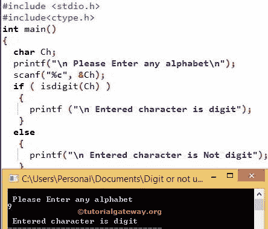

# C 程序设计中的数字

> 原文：<https://www.tutorialgateway.org/isdigit-in-c-programming/>

如何在 C 语言中使用内置函数 IsDigit 和不使用 isdigit 函数检查给定字符是否为数字。C Programming isdigit 是头文件中存在的一个内置函数，它有助于检查字符是否是数字。函数的语法是

```c
isdigit (<Character>);
```

C isdigit 函数将返回一个整数值作为输出。

*   如果 isdigit 函数中的字符是一个数字，那么它将返回非零值
*   如果 isdigit 函数中的字符不是数字，它将返回 0。

## C 程序设计中用数字检验数字的程序

C 程序中的 isdigit 允许您输入任何字符，并使用 ctype.h 头文件中可用的 isdigit 函数检查该字符是否为数字。

```c
/* C Program to check whether the character is Digit or not */

#include <stdio.h> 
#include <ctype.h>

int main()
{
  char Ch;

  printf("\n Please Enter any alphabet\n");
  scanf("%c", &Ch);

  if ( isdigit(Ch) )
   {  
     printf ("\n Entered character is digit");
   }
  else
   {
     printf("\n Entered character is Not digit");
   }  
}
```



在 c 程序中，我们声明了一个字符变量 Ch。下面的 printf 语句将要求输入他喜欢的任何数字。

```c
printf("\n Please Enter any character \n");
```

下面的 scanf 语句将把用户输入的字符分配给 Ch 变量

```c
scanf("%c", &Ch);
```

在下一行，我们使用了 [C 语言](https://www.tutorialgateway.org/c-programming/) If 语句。请参考[If 语句](https://www.tutorialgateway.org/if-statement-in-c/)一文了解 If 条件功能。其中，我们使用了 C 是数字函数

```c
if (isdigit(Ch))
```

如果上述条件为真，则给定的条件为数字。所以，这个 [C 程序](https://www.tutorialgateway.org/c-programming-examples/)会打印下面的语句

```c
printf ("\n Entered character is digit");
```

如果上述 isDigit 条件为 FALSE，则不是数字。所以，它会打印这个声明。

```c
printf ("\n Entered character is Not digit");
```

### C 语言中不用数字检查字符是否是数字的程序

这个 C 程序允许用户输入任何字符，并检查它是否是一个数字，而无需使用 isdigit

```c
#include <stdio.h> 

int main()
{
  char Ch;

  printf("\n Please Enter any alphabet\n");
  scanf("%c", &Ch);

  if (Ch >= '0' && Ch <= '9')
   {  
     printf ( "\n Entered character is digit") ;
   }
  else
   {
     printf("\n Entered character is Not digit");
   }  
}
```

```c
 Please Enter any alphabet
7

 Entered character is digit
```

在这个 C 程序中，检查字符是否是数字的例子，如果你看 if 语句

```c
if (Ch >= '0' && Ch <= '0')
```

众所周知，所有的数字都在 0 到 9 之间。所以，上面的 if 条件将检查给定的字符是否在 0 和 9 之间。

如果上述条件(Ch >= '0' && Ch <= '0 ')为真，则给定字符为数字。所以，它将打印以下声明

```c
printf ("\n Entered character is digit");
```

如果上述条件(Ch >= '0' && Ch <= '0 ')为假，则给定字符不是数字。所以，它将打印以下声明

```c
printf ("\n Entered character is Not digit");
```

### 用 ASCII 值检查字符是否为数字的程序

这个 C 程序在不使用 [ASCII](https://www.tutorialgateway.org/c-program-to-find-ascii-value-of-a-character/ "C Program to find ASCII Value of a Character") 值的情况下，检查字符是否为数字。

```c
#include <stdio.h> 

int main()
{
  char Ch;

  printf("\n Please Enter any character\n");
  scanf("%c", &Ch);

  if (Ch >= 48 && Ch <= 57)
   {  
     printf ( "\n Entered character is digit") ;
   }
  else
   {
     printf("\n Entered character is Not digit");
   }  
}
```

```c
 Please Enter any character
0

 Entered character is digit
```

这是 c 程序中的数字，如果你看看 If 语句

```c
if (Ch >= 48 && Ch <= 57)
```

众所周知，所有数字的 ASCII 值都在 48 到 57 之间。因此，上面的 if 条件将检查给定的字符是否在 48 和 57 之间。

若上述条件成立(Ch > = 48 & > Ch<= 57) is TRUE, the given character is a digit, So, it will print below statement

```c
printf ("\n Entered character is digit");
```

如果上述条件 if(Ch > = 48 & > Ch < = 57)为假，则不是数字。所以，它将打印以下声明

```c
printf ("\n Entered character is Not digit");
```