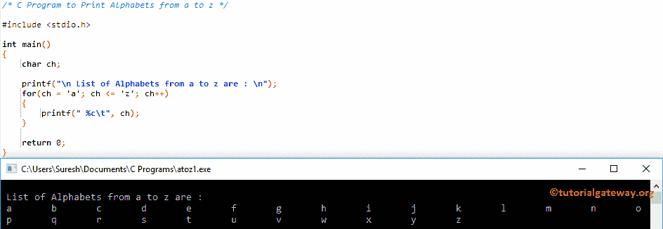

# C 程序：打印`a`到`z`之间的字母

> 原文：<https://www.tutorialgateway.org/c-program-to-print-alphabets-from-a-to-z/>

如何用 For 循环和 While 循环编写 C 程序打印字母。

## 用 For 循环打印字母的 c 程序

这个程序将使用 For 循环打印从 a 到 z 的字母。这里，For Loop 将确保字符(ch)在 a 和 z 之间。

```c
/* C Program to Print Alphabets from a to z */

#include <stdio.h>

int main()
{
  	char ch;

	printf("\n List of Alphabets from a to z are : \n");  
  	for(ch = 'a'; ch <= 'z'; ch++)
  	{
  		printf(" %c\t", ch);	
	}

  	return 0;
}
```



## 用 ASCII 码从 a 到 z 显示字母的程序

在这个[程序](https://www.tutorialgateway.org/c-programming-examples/)中，我们使用 ASCII 码打印从 a 到 z 的字母，建议大家参考 [ASCII 表](https://www.tutorialgateway.org/ascii-table/)了解 [C 编程](https://www.tutorialgateway.org/c-programming/)中每个字符的 ASCII 值。

从下面的代码片段可以看到，a = 97，z = 122

```c
#include <stdio.h>

int main()
{
  	int i;

	printf("\n List of Alphabets from a to z are : \n");  
  	for(i = 97; i <= 122; i++)
  	{
  		printf(" %c\t", i);	
	}

  	return 0;
}
```

```c
 List of Alphabets from a to z are : 
 a	 b	 c	 d	 e	 f	 g	 h	 i	 j	 k	 l	 m	 n	 o	 p	 q	 r	 s	 t	 u	 v	 w	 x	 y	 z
```

## 使用 While 循环打印字母的程序

这个字母表的程序和上面的一样。我们刚刚用[替换了](https://www.tutorialgateway.org/while-loop-in-c/) [For Loop](https://www.tutorialgateway.org/for-loop-in-c-programming/) ，而 Loop 。

```c
#include <stdio.h>

int main()
{
  	char ch = 'a';

	printf("\n List of Alphabets from a to z are : \n");  
  	while(ch <= 'z')
  	{
  		printf(" %c\t", ch);
		  ch++;	
	}

  	return 0;
}
```

```c
 List of Alphabets from a to z are : 
 a	 b	 c	 d	 e	 f	 g	 h	 i	 j	 k	 l	 m	 n	 o	 p	 q	 r	 s	 t	 u	 v	 w	 x	 y	 z 
```

## 显示给定范围内字母的程序

这个程序允许用户输入起始字母。接下来，程序将打印 Starting_Char 和 z 之间的所有字母列表。

```c
#include <stdio.h>

int main()
{
  	char ch, Starting_Char;

  	printf("\n Please Enter the Starting Alphabet : ");
  	scanf("%c", &Starting_Char);

	printf("\n List of Alphabets from %c to z are : \n", Starting_Char);  
  	for(ch = Starting_Char; ch <= 'z'; ch++)
  	{
  		printf(" %c\t", ch);	
	}

  	return 0;
}
```

```c
 Please Enter the Starting Alphabet : g

 List of Alphabets from g to z are : 
 g	 h	 i	 j	 k	 l	 m	 n	 o	 p	 q	 r	 s	 t	 u	 v	 w	 x	 y	 z 
```