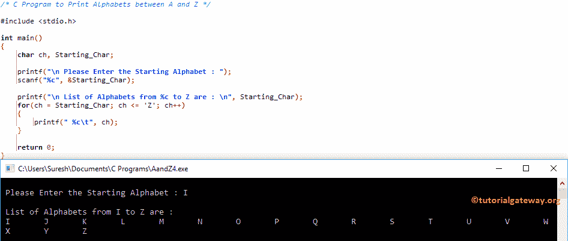

# C 程序：打印`A`和`Z`之间的字母

> 原文：<https://www.tutorialgateway.org/c-program-print-alphabets-z/>

如何用 For 循环和 While 循环编写 C 程序打印 A 和 Z 之间的字母？。

## 用 For 循环打印字母的 c 程序

这个 C 程序将使用 For 循环显示 A 和 Z 之间的字母。在本例中，For Loop 将确保字符(ch)在 A 和 z 之间。

```c
#include <stdio.h>

int main()
{
  	char ch;

  	for(ch = 'A'; ch <= 'Z'; ch++)
  	{
  		printf(" %c\t", ch);	
	}

  	return 0;
}
```

```c
 A	 B	 C	 D	 E	 F	 G	 H	 I	 J	 K	 L	 M	 N	 O	 P	 Q	 R	 S	 T	 U	 V	 W	 X	 Y	 Z 
```

## 使用 ASCII 码打印字母的程序

在这个[程序](https://www.tutorialgateway.org/c-programming-examples/)中，我们使用 ASCII 码打印字母，而不是硬编码 A 和 Z。建议大家参考 [ASCII 表](https://www.tutorialgateway.org/ascii-table/)了解 [C 编程](https://www.tutorialgateway.org/c-programming/)中每个字符的 ASCII 值。

从下面的代码片段可以看到，A = 65，Z = 90

```c
#include <stdio.h>

int main()
{
  	int i;

  	for(i = 65; i <= 90; i++)
  	{
  		printf(" %c\t", i);	
	}

  	return 0;
}
```

```c
 A	 B	 C	 D	 E	 F	 G	 H	 I	 J	 K	 L	 M	 N	 O	 P	 Q	 R	 S	 T	 U	 V	 W	 X	 Y	 Z 
```

这个程序打印字母 A 和 Z 之间的例子与上面相同。我们刚刚用[替换了](https://www.tutorialgateway.org/while-loop-in-c/) [For Loop](https://www.tutorialgateway.org/for-loop-in-c-programming/) ，而 Loop 。

```c
#include <stdio.h>

int main()
{
  	char ch = 'A';

  	while(ch <= 'Z')
  	{
  		printf(" %c\t", ch);
		ch++;	
	}

  	return 0;
}
```

```c
 A	 B	 C	 D	 E	 F	 G	 H	 I	 J	 K	 L	 M	 N	 O	 P	 Q	 R	 S	 T	 U	 V	 W	 X	 Y	 Z 
```

这个 C 程序允许用户输入起始字母(A 到 Z)。接下来，程序将打印 Starting_Char 和 z 之间的所有字母的列表

```c
#include <stdio.h>

int main()
{
  	char ch, Starting_Char;

  	printf("\n Please Enter the Starting Alphabet : ");
  	scanf("%c", &Starting_Char);

	printf("\n List of Alphabets from %c to Z are : \n", Starting_Char);  
  	for(ch = Starting_Char; ch <= 'Z'; ch++)
  	{
  		printf(" %c\t", ch);	
	}

  	return 0;
}
```

