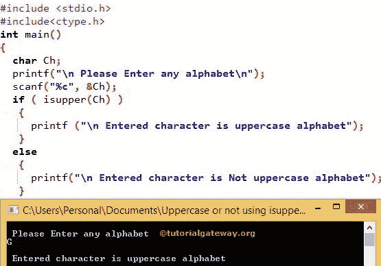

# C 程序：检查字符是否大写

> 原文：<https://www.tutorialgateway.org/c-program-to-check-whether-character-is-uppercase-or-not/>

如何用 I upper 函数和不用 I upper 函数编写 C 程序检查字符是否大写？

## 用函数检查字符是否大写的 c 程序

在 C 程序设计中，isupper 检查字符是否是大写字母。该程序允许用户输入任意字符并检查该字符是否为大写字母

```c
#include <stdio.h>
#include<ctype.h>

int main()
{
  char Ch;

  printf("\n Please Enter any alphabet\n");
  scanf("%c", &Ch);

  if ( isupper(Ch) )
   {  
     printf ("\n Entered character is uppercase alphabet");
   }
  else
   {
     printf("\n Entered character is Not uppercase alphabet");
   }  
}
```



在这个检查字符是否大写的 C 程序中，我们声明了一个字符变量 Ch。printf 语句下面会要求输入他喜欢的任何字符。

```c
printf("\n Please Enter any character \n");
```

下面的 scanf 语句将把用户输入的字符分配给 Ch 变量

```c
scanf("%c", &Ch);
```

在下一行，我们使用了 [If 语句](https://www.tutorialgateway.org/if-statement-in-c/)。请参考 [C 编程](https://www.tutorialgateway.org/c-programming/)中[I upper](https://www.tutorialgateway.org/isupper-in-c-programming/)一文

```c
if (isupper(Ch))
```

如果上述条件为真，那么给定的字符是大写字母，那么它将打印在语句下面

```c
printf ("\n Entered character is uppercase alphabet");
```

如果上述条件为假，那么给定的字符不是大写字母，因此，它将打印以下语句

```c
printf ("\n Entered character is Not uppercase alphabet");
```

### 不使用函数检查字符是否大写的 c 程序

该程序允许用户在不使用 isupper 功能 的情况下输入任意字符并检查该字符是否为大写字母

```c
#include <stdio.h>

int main()
{
  char Ch;

  printf("\n Please Enter any alphabet\n");
  scanf("%c", &Ch);

  if (Ch >= 'A' && Ch <= 'Z')
   {  
     printf ( "\n Entered character is uppercase alphabet") ;
   }
  else
   {
     printf("\n Entered character is Not uppercase alphabet");
   } 
}
```

大写或不输出

```c
 Please Enter any alphabet
A

 Entered character is uppercase alphabet
```

让我们用一个错误的值来检查

```c
 Please Enter any alphabet
z

 Entered character is Not uppercase alphabet
```

在这个 c 程序中检查字符是否大写，如果你看 If 语句

```c
if (Ch >= 'A' && Ch <= 'Z')
```

众所周知，所有大写字符都在 A 和 z 之间。所以，上面的 if 条件将检查给定的字符是否在 A 和 z 之间。

如果上述条件为真，那么给定的字符是大写字母，那么它将打印在语句下面

```c
printf ("\n Entered character is uppercase alphabet");
```

如果上面的条件为假，那么给定的字符不是大写字母所以，它将在下面打印语句

```c
printf ("\n Entered character is Not uppercase alphabet");
```

### 用 ASCII 值检查字符是否大写的程序

这个[程序](https://www.tutorialgateway.org/c-programming-examples/)为大写使用 [ASCII](https://www.tutorialgateway.org/c-program-to-find-ascii-value-of-a-character/) 值来检查字符是否是大写字母。在这个检查字符是否大写的 C 程序中，如果你看 If 语句。

所有大写字符的 ASCII 值都在 65 到 90 之间。因此，上面的 if 条件将检查给定字符是否在 65 和 90 之间。

*   如果上述条件为真，则给定字符是大写字母。
*   如果条件为假，字符不是大写字母 So，它打印 else 语句。

```c
#include <stdio.h>

int main()
{
  char Ch;

  printf("\n Please Enter any character\n");
  scanf("%c", &Ch);

  if (Ch >= 65 && Ch <= 90)
   {  
     printf ( "\n Entered character is uppercase alphabet") ;
   }
  else
   {
     printf("\n Entered character is Not uppercase alphabet");
   }  
}
```

```c
 Please Enter any character
Z

 Entered character is uppercase alphabet
```