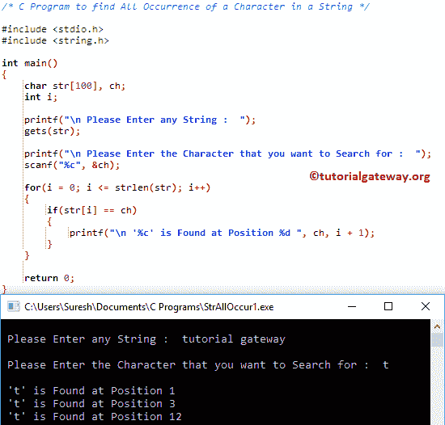

# C 程序：查找字符串中所有出现字符

> 原文：<https://www.tutorialgateway.org/c-program-to-find-all-occurrence-of-a-character-in-a-string/>

写一个 C 程序，用例子找出字符串中的字符的所有出现。

## 查找字符串中所有出现字符的程序示例 1

这个程序允许用户输入一个字符串(或字符数组)和一个字符值。接下来，它将使用 [If Else 语句](https://www.tutorialgateway.org/if-else-statement-in-c/)搜索并查找该字符串中的字符的所有出现。

```c
/* C Program to find All Occurrence of a Character in a String */

#include <stdio.h>
#include <string.h>

int main()
{
  	char str[100], ch;
  	int i;

  	printf("\n Please Enter any String :  ");
  	gets(str);

  	printf("\n Please Enter the Character that you want to Search for :  ");
  	scanf("%c", &ch);

  	for(i = 0; i <= strlen(str); i++)
  	{
  		if(str[i] == ch)  
		{
  			printf("\n '%c' is Found at Position %d ", ch, i + 1);
 		}
	}

  	return 0;
}
```



首先，我们使用 [For Loop](https://www.tutorialgateway.org/for-loop-in-c-programming/) 来迭代一个[字符串](https://www.tutorialgateway.org/c-string/)中的每个字符。

```c
for(i = 0; i <= strlen(str); i++)
{
	if(str[i] == ch)  
	{
		printf("\n '%c' is Found at Position %d ", ch, i + 1);   	
	}
}
```

str[] =教程网关
ch = t

对于循环第一次迭代:对于(I = 0；i <= strlen(str); i++)
条件为真，因为 0 < = 16。

在 [C 编程](https://www.tutorialgateway.org/c-programming/) While 循环中，我们使用 [If 语句](https://www.tutorialgateway.org/if-statement-in-c/)来检查字符串【0】是否等于用户指定的字符

if(str[i] == ch) => if(t == t)

上述条件为真。因此，编译器将在 If 块中执行 printf 语句。

这里，I 是索引位置(从零开始)，i + 1 是实际位置。

第二次迭代:对于(I = 1；1 <= 16;1++)–条件为真，因为 1 <= 16。

if(str[I]= = ch)= > if(t = = l)–条件为假。所以，我会增加。

第三次迭代:for(I = 2；2 <= 16;2++)

if(str[I]= = ch)= > if(t = = t)–条件为真。因此，编译器将在 If 块中执行 printf 语句。

对剩余的迭代做同样的事情。

## 查找字符串中所有出现字符的程序示例 2

这个程序查找一个字符的所有出现与上面相同。这里，我们刚刚将 For 循环替换为 [While 循环](https://www.tutorialgateway.org/while-loop-in-c/)。

```c
/* C Program to find All Occurrence of a Character in a String */

#include <stdio.h>
#include <string.h>

int main()
{
  	char str[100], ch;
  	int i;
	i = 0;

  	printf("\n Please Enter any String :  ");
  	gets(str);

  	printf("\n Please Enter the Character that you want to Search for :  ");
  	scanf("%c", &ch);

  	while(str[i] != '\0')
  	{
  		if(str[i] == ch)  
		{
  			printf("\n '%c' is Found at Position %d ", ch, i + 1);
 		}
 		i++;
	}

  	return 0;
}
```

```c
 Please Enter any String :  Hello World

 Please Enter the Character that you want to Search for :  l

 'l' is Found at Position 3 
 'l' is Found at Position 4 
 'l' is Found at Position 10
```

## 查找字符串中所有出现字符的程序示例 3

这个[程序](https://www.tutorialgateway.org/c-programming-examples/)和第一个例子一样，但是这次我们用了[函数](https://www.tutorialgateway.org/functions-in-c/)的概念来分离逻辑。

```c
/* C Program to find All Occurrence of a Character in a String */

#include <stdio.h>
#include <string.h>

void Find_AllOccurrence(char str[], char ch);

int main()
{
  	char str[100], ch;

  	printf("\n Please Enter any String :  ");
  	gets(str);

  	printf("\n Please Enter the Character that you want to Search for :  ");
  	scanf("%c", &ch);

  	Find_AllOccurrence(str, ch);

  	return 0;
}

void Find_AllOccurrence(char str[], char ch)
{
	int i;

	for(i = 0; str[i] != '\0'; i++)
	{
		if(str[i] == ch)
		{
			printf("\n '%c' is Found at Position %d ", ch, i + 1);
		}  
	}
}
```

```c
 Please Enter any String :  welcome to tutorial gateway

 Please Enter the Character that you want to Search for :  t

 't' is Found at Position 9 
 't' is Found at Position 12 
 't' is Found at Position 14 
 't' is Found at Position 23
```