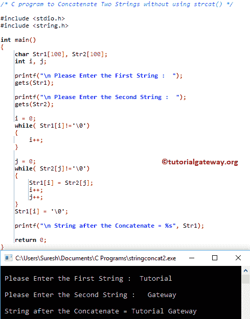

# C 程序：连接两个字符串

> 原文：<https://www.tutorialgateway.org/c-program-to-concatenate-two-strings/>

如何不用 strcat 函数编写 C 程序连接两个字符串？。在 C 编程中，我们可以用多种方式连接两个字符串。但是我们将讨论在 c 语言中使用 for 循环、While 循环、函数和指针进行字符串连接的四种不同方法。

## 不使用 strlcat()连接两个字符串的 c 程序

该程序允许用户输入两个字符串值或两个字符的数组。接下来，它将使用 [For Loop](https://www.tutorialgateway.org/for-loop-in-c-programming/) 来迭代出现在[数组](https://www.tutorialgateway.org/array-in-c/)中的每个字符，并将它们连接起来(或连接起来)。也请参考[功能。](https://www.tutorialgateway.org/strcat-in-c-programming/)

```c
#include <stdio.h>
#include <string.h>

int main()
{
  	char Str1[100], Str2[100];
  	int i, j;

  	printf("\n Please Enter the First String :  ");
  	gets(Str1);

  	printf("\n Please Enter the Second :  ");
  	gets(Str2);

        // To iterate First String from Start to end  
  	for (i = 0; Str1[i]!='\0'; i++);

        // Concatenating Str2 into Str1  	
  	for (j = 0; Str2[j]!='\0'; j++, i++)
  	{
  		Str1[i] = Str2[j];
  	}
  	Str1[i] = '\0';

  	printf("\n After the Concatenate = %s", Str1);

  	return 0;
}
```

```c
 Please Enter the First String :  Hello

 Please Enter the Second :  World

 After the Concatenate = HelloWorld
```

## 使用 While 循环连接两个字符串的 c 程序

这个[串](https://www.tutorialgateway.org/c-string/)串联的程序同上，但是这次我们用的是 [While Loop](https://www.tutorialgateway.org/while-loop-in-c/) (只是用 While Loop 代替[编程](https://www.tutorialgateway.org/c-programming/) For Loop)。

```c
#include <stdio.h>
#include <string.h>

int main()
{
  	char Str1[100], Str2[100];
  	int i, j;

  	printf("\n Please Enter the First String :  ");
  	gets(Str1);

  	printf("\n Please Enter the Second String :  ");
  	gets(Str2);

  	i = 0;
	while( Str1[i]!='\0')
	{
		i++;
	}

  	j = 0;
  	while( Str2[j]!='\0')
  	{
  		Str1[i] = Str2[j];
  		i++;
  		j++;
  	}
  	Str1[i] = '\0';

  	printf("\n String after the Concatenate = %s", Str1);

  	return 0;
}
```



## 使用函数连接

这个 c 语言中字符串连接的函数程序与上面的相同。但是，这次我们使用的是[函数](https://www.tutorialgateway.org/functions-in-c/)概念，将逻辑从主程序中分离出来。

```c
#include <stdio.h>
#include <string.h>

void combine(char [], char []); 

int main()
{
  	char Str1[100], Str2[100];

  	printf("\n Please Enter the First :  ");
  	gets(Str1);

  	printf("\n Please Enter the Second :  ");
  	gets(Str2);

  	combine(Str1, Str2);

  	printf("\n After the Concat = %s", Str1);

  	return 0;
}

void combine(char s1[], char s2[])
{
	int i, j;

	i = 0;
	while( s1[i]!='\0')
	{
		i++;
	}

  	j = 0;
  	while( s2[j]!='\0')
  	{
  		s1[i] = s2[j];
  		i++;
  		j++;
  	}
  	s1[i] = '\0';
}
```

```c
 Please Enter the First : C programming

 Please Enter the Second :  Tutorial

 After the Concat = C programmingTutorial
```

## 使用指针连接两个

c 程序中的这个字符串串联与第二个例子相同，但是这次我们使用的是[指针](https://www.tutorialgateway.org/pointers-in-c/)的概念。

```c
#include <stdio.h>
#include <string.h>

int main()
{
  	char Str1[100], Str2[100];
  	char *s1 = Str1;
	char *s2 = Str2;

  	printf("\n Please Enter the First :  ");
  	gets(Str1);

  	printf("\n Please Enter the Second :  ");
  	gets(Str2);

  	while(* ++s1);

  	while(*(s1++) = (*s2++)); 

  	printf("\n After the Concatenate = %s", Str1);

  	return 0;
}
```

```c
 Please Enter the First :  Write a 

 Please Enter the Second :  C Program

 After the Concatenate = Write a C Program
```

## 使用指针函数连接

c 中字符串串联的[程序](https://www.tutorialgateway.org/c-programming-examples/)同上。但是，这次我们将指针传递给[函数](https://www.tutorialgateway.org/functions-in-c/)，将逻辑与主程序分开。

```c
#include <stdio.h>
#include <string.h>

void concatenate(char *, char *); 

int main()
{
  	char Str1[100], Str2[100];

  	printf("\n Please Enter the First :  ");
  	gets(Str1);

  	printf("\n Please Enter the Second :  ");
  	gets(Str2);

  	concatenate(Str1, Str2);

  	printf("\n After the Concatenate = %s", Str1);

  	return 0;
}

void concatenate(char *Str1, char *Str2)
{
	while(*Str1)
	{
		Str1++;
	}

	while(*Str2)
	{
		*Str1 = *Str2;
		*Str1++;
		*Str2++;
  	}
  	*Str1 = '\0';
}
```

```c
 Please Enter the First :  Good

 Please Enter the Second :  Morning All

 After the Concatenate = GoodMorning All
```