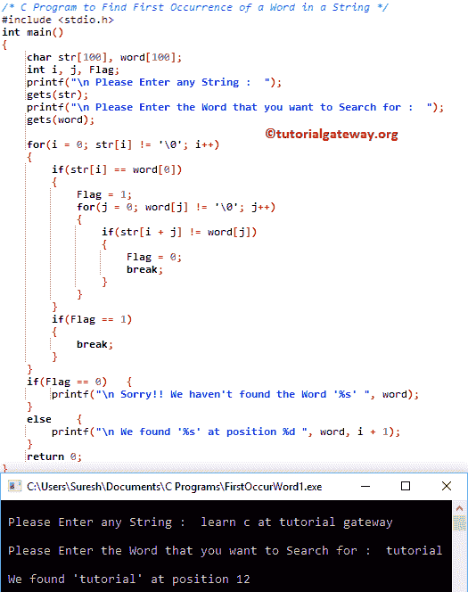

# C 程序：在字符串中查找单词的第一次出现

> 原文：<https://www.tutorialgateway.org/c-program-to-find-first-occurrence-of-a-word-in-a-string/>

用 For 循环和 While 循环编写一个 C 程序来查找字符串中单词的第一次出现，并举例说明。

## 查找字符串中第一个单词的程序示例 1

这个程序允许用户输入任何字符串或字符数组，并将其存储在 str 变量中。接下来，它将要求用户输入任何要搜索的单词。接下来，编译器将搜索整个字符串，并找到单词的第一次出现。

```c
/* C Program to Find First Occurrence of a Word in a String */

#include <stdio.h>

int main()
{
  	char str[100], word[100];
  	int i, j, Flag;

  	printf("\n Please Enter any String :  ");
  	gets(str);

	printf("\n Please Enter the Word that you want to Search for :  ");
  	gets(word);

  	for(i = 0; str[i] != '\0'; i++)
	{
		if(str[i] == word[0])
		{
			Flag = 1;
			for(j = 0; word[j] != '\0'; j++)
			{
				if(str[i + j] != word[j])
				{
					Flag = 0;
					break;
				}
			}	
		}
		if(Flag == 1)
		{
			break;
		} 
	}
	if(Flag == 0)
  	{
  		printf("\n Sorry!! We haven't found the Word '%s' ", word);
	}
	else
	{
		printf("\n We found '%s' at position %d ", word, i + 1);
	}	

  	return 0;
}
```



str =在教程网关学习 c
word =教程

第一次 For 循环–第一次迭代:For(I = 0；str[i]！= '\0';i++)
条件为真，因为 str[0]= l
if(str[I]= = word[0])=>if(l = = t)–条件为假

请这样做，直到我达到 11，因为在索引位置 11 str[i]等于单词[0]

第一次 For 循环–第 12 次迭代:For(I = 11；str[11]！= '\0';i++)
条件为真，因为 str[11]= t
if(str[I]= = word[0])=>if(t = = t)–条件为真
标志= 1

接下来， [C 编程](https://www.tutorialgateway.org/c-programming/)编译器将进入第二个 [For 循环](https://www.tutorialgateway.org/for-loop-in-c-programming/)。这里，秒 For 循环是检查一个单词中的每个字符是否等于字符串中的一个单词。

第二次 For 循环–第一次迭代:For(j = 0；word[j]！= '\0';j++)
条件为 True，因为 word[0] = t
if(str[i + j]！= word[j]) = > if(str[11 + 0]！= word[0])
= > if(t！= t)–条件为假

对剩余的迭代进行同样的操作，直到完成 str[i + j]与 word[j]的比较。如您所知，条件 if(str[i + j]！= word[j])将始终返回 false。如果任何单个字符不匹配，那么 if(str[i + j]！= word[j])将变为 true，Flag 将变为 0。

一旦 j 值变为 8，第二个 for 循环中的条件将失败。接下来，编译器将进入 [If 语句](https://www.tutorialgateway.org/if-statement-in-c/)

如果(标志= = 0)–条件为假。因此，编译器将在 Else 块中打印该语句。记住，I 值是指数位置，i + 1 表示实际位置。

## 查找字符串中第一个单词的程序示例 2

在单词的第一次出现 [C 程序](https://www.tutorialgateway.org/c-programming-examples/)中，我们刚刚用 While 循环替换了 For 循环。我建议你参考 [While Loop](https://www.tutorialgateway.org/while-loop-in-c/) 的文章来理解逻辑。

```c
/* C Program to Find First Occurrence of a Word in a String */

#include <stdio.h>

int main()
{
  	char str[100], word[100];
  	int i, j, Flag;

  	printf("\n Please Enter any String :  ");
  	gets(str);

	printf("\n Please Enter the Word that you want to Search for :  ");
  	gets(word);

	i = 0;

  	while(str[i] != '\0')
	{
		if(str[i] == word[0])
		{
			Flag = 1;
			j = 0;
			while(word[j] != '\0')
			{
				if(str[i + j] != word[j])
				{
					Flag = 0;
					break;
				}
				j++;
			}	
		}
		if(Flag == 1)
		{
			break;
		} 
		i++;
	}
	if(Flag == 0)
  	{
  		printf("\n Sorry!! We haven't found the Word '%s' ", word);
	}
	else
	{
		printf("\n We found '%s' at position %d ", word, i + 1);
	}	

  	return 0;
}
```

```c
 Please Enter any String :  c programming tutorial at tutorial gateway website

 Please Enter the Word that you want to Search for :  tutorial

 We found 'tutorial' at position 15 
```