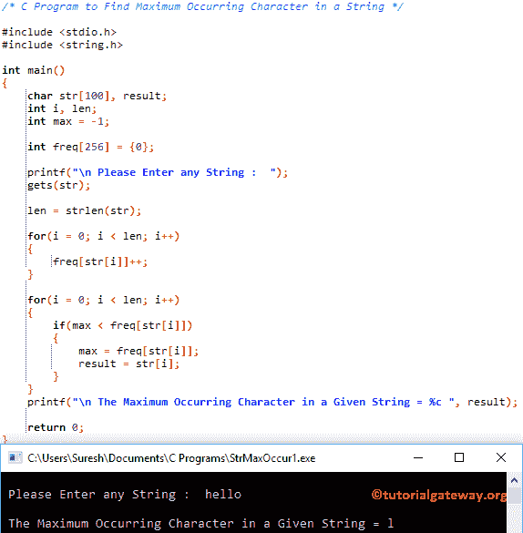

# C 程序：寻找字符串中最大出现字符

> 原文：<https://www.tutorialgateway.org/c-program-to-find-maximum-occurring-character-in-a-string/>

写一个 C 程序，用例子找出字符串中出现最多的字符。

## 寻找字符串中最大出现字符的 c 程序示例 1

这个程序允许用户输入一个字符串(或字符数组)。接下来，它将找到字符串中出现次数最多的字符(重复次数最多的字符)。

```c
/* C Program to Find Maximum Occurring Character in a String */

#include <stdio.h>
#include <string.h>

int main()
{
  	char str[100], result;
  	int i, len;
  	int max = -1;

  	int freq[256] = {0}; 

  	printf("\n Please Enter any String :  ");
  	gets(str);

  	len = strlen(str);

  	for(i = 0; i < len; i++)
  	{
  		freq[str[i]]++;
	}

  	for(i = 0; i < len; i++)
  	{
		if(max < freq[str[i]])
		{
			max = freq[str[i]];
			result = str[i];
		}
	}
	printf("\n The Maximum Occurring Character in a Given String = %c ", result);

  	return 0;
}
```



首先，我们声明了一个大小为 256 的 Freq 数组，它最初将保存 0。接下来，我们使用 [For Loop](https://www.tutorialgateway.org/for-loop-in-c-programming/) 来迭代一个[字符串](https://www.tutorialgateway.org/c-string/)中的每个字符，并找到最大重复字符。

```c
for(i = 0; i < len; i++)
{
	if(max < freq[str[i]])
	{
		max = freq[str[i]];
		result = str[i];
	}
}
```

str[] =你好

第一次 For 循环–第一次迭代:For(I = 0；i < strlen(str) ; i++)
条件为真，因为 0 < 5。
if(max<freq[str[I]])=>if(-1<freq[h])
=>if(-1<1)–条件为真
max = freq[str[i]] = > 1
结果= str[I]= hT8】

第二次迭代:对于(I = 1；1 < 5; 1++)
if(最大<频率[str[1]]) = > if(1 <频率[e])
=>if(1<1)–条件为假

第三次迭代:(I = 2；2< 5; 2++)
if(1<freq[l]])=>if(1<2)–条件为真
max = freq[str[i]] = > 2
结果= str[i] = l

第四次迭代:for(I = 3；3< 5; 3++)
if(max<freq[str[3]])=>if(2<freq[l])
=>if(2<2)–条件为假

第五次迭代:for(I = 4；4 < 5; 4++)
if(最大<频率[str[4]]) = > if(2 <频率[o])
=>if(2<1)–条件为假

最后我们使用 [C 编程](https://www.tutorialgateway.org/c-programming/) printf 语句来打印最后的字符串

```c
printf("\n The Maximum Occurring Character in a Given String = %c ", result);
```

## 寻找最大出现字符串的程序示例 2

这个最大出现字符串 [C 程序](https://www.tutorialgateway.org/c-programming-examples/)同上，但是我们对逻辑做了一些小的改动。

```c
/* C Program to Find Maximum Occurring Character in a String */

#include <stdio.h>
#include <string.h>

int main()
{
  	char str[100], result;
  	int i, len;
  	int max = 0;

  	int freq[256] = {0}; 

  	printf("\n Please Enter any String :  ");
  	gets(str);

  	len = strlen(str);

  	for(i = 0; i < len; i++)
  	{
  		freq[str[i]]++;
	}

  	for(i = 0; i < 256; i++)
  	{
		if(freq[i] > freq[max])
		{
			max = i;
		}
	}
	printf("\n Character '%c' appears Maximum of %d Times in a Given String :  %s ", max, freq[max], str);

  	return 0;
}
```

```c
 Please Enter any String :  tutorialgateway.org

 Character 'a' appears Maximum of 3 Times in a Given String :  tutorialgateway.org 
```

## 查找字符串中最大出现字符的程序示例 3

这个[程序](https://www.tutorialgateway.org/c-programming-examples/)和第二个例子一样，但是这次我们用了[函数](https://www.tutorialgateway.org/functions-in-c/)的概念来分离逻辑。

```c
/* C Program to Find Maximum Occurring Character in a String */

#include <stdio.h>
#include <string.h>

void Max_Occurring(char *str);

int main()
{
  	char str[100];

  	printf("\n Please Enter any String :  ");
  	gets(str);

  	Max_Occurring(str);

  	return 0;
}

void Max_Occurring(char *str)
{
	int i;
  	int max = 0;

  	int freq[256] = {0}; 

  	for(i = 0; str[i] != '\0'; i++)
  	{
  		freq[str[i]] = freq[str[i]] + 1;
	}

  	for(i = 0; i < 256; i++)
  	{
		if(freq[i] > freq[max])
		{
			max = i;
		}
	}
	printf("\n Character '%c' appears Maximum of %d Times in a Given String :  %s ", max, freq[max], str);
}
```

```c
 Please Enter any String :  learn c programming at tutorial gateway

 Character 'a' appears Maximum of 6 Times in a Given String :  learn c programming at tutorial gateway 
```