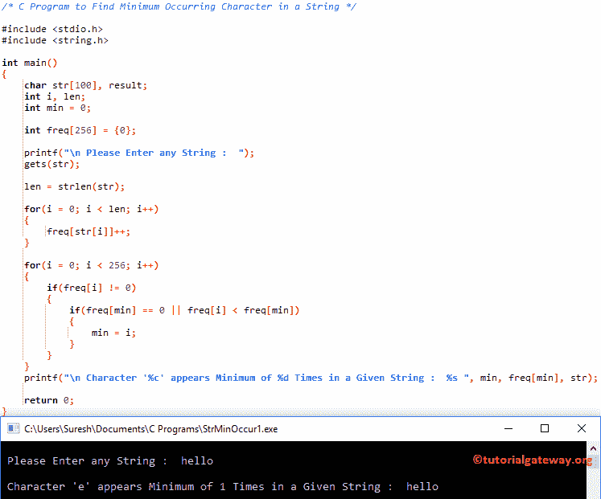

# C 程序：寻找字符串中最小出现字符

> 原文：<https://www.tutorialgateway.org/c-program-to-find-minimum-occurring-character-in-a-string/>

写一个 C 程序，用例子找出字符串中出现最少的字符。

## 寻找字符串中最小出现字符的 c 程序示例 1

这个程序允许用户输入一个字符串(或字符数组)。接下来，它将找到字符串中出现最少的字符(重复最少的字符)。

```c
#include <stdio.h>
#include <string.h>

int main()
{
  	char str[100], result;
  	int i, len;
  	int min = 0;

  	int freq[256] = {0}; 

  	printf("\n Please Enter any String :  ");
  	gets(str);

  	len = strlen(str);

  	for(i = 0; i < len; i++)
  	{
  		freq[str[i]]++;
	}

  	for(i = 0; i < 256; i++)
  	{
		if(freq[i] != 0)
		{
			if(freq[min] == 0 || freq[i] < freq[min])
			{
				min = i;
			}
		}
	}
	printf("\n Character '%c' appears Minimum of %d Times in a Given String :  %s ", min, freq[min], str);

  	return 0;
}
```



## 寻找字符串中最小出现字符的程序示例 2

这个[程序](https://www.tutorialgateway.org/c-programming-examples/)和上面的例子一样，但是这次我们使用了[函数](https://www.tutorialgateway.org/functions-in-c/)的概念来分离 [C 编程](https://www.tutorialgateway.org/c-programming/)的逻辑。

```c
/* C Program to Find the Minimum Occurring Character in a String */

#include <stdio.h>
#include <string.h>

void Min_Occurring(char *str);

int main()
{
  	char str[100];

  	printf("\n Please Enter any String :  ");
  	gets(str);

  	Min_Occurring(str);

  	return 0;
}

void Min_Occurring(char *str)
{
	int i;
  	int min = 0;

  	int freq[256] = {0}; 

  	for(i = 0; str[i] != '\0'; i++)
  	{
  		freq[str[i]]++;
	}

  	for(i = 0; i < 256; i++)
  	{
		if(freq[i] != 0)
		{
			if(freq[min] == 0 || freq[i] < freq[min])
			{
				min = i;
			}
		}
	}
	printf("\n Character '%c' appears Minimum of %d Times in a Given String :  %s ", min, freq[min], str);
}
```

```c
 Please Enter any String :  learn c programming at tutorial gateway

 Character 'c' appears Minimum of 1 Times in a Given String :  learn c programming at tutorial gateway
```