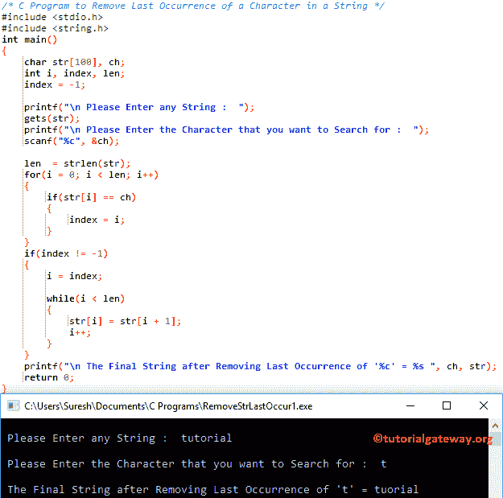

# C 程序：删除字符串中的字符的最后一次出现

> 原文：<https://www.tutorialgateway.org/c-program-to-remove-last-occurrence-of-a-character-in-a-string/>

用例子写一个 C 程序删除字符串中的字符的最后一次出现。

## 删除字符串中的字符的最后一次出现的程序示例 1

这个程序允许用户输入一个字符串(或字符数组)和一个字符值。接下来，这个 C 程序将查找并删除字符串中的字符的最后一次出现。

```c
/* C Program to Remove Last Occurrence of a Character in a String */

#include <stdio.h>
#include <string.h>

int main()
{
  	char str[100], ch;
  	int i, index, len;
  	index = -1;

  	printf("\n Please Enter any String :  ");
  	gets(str);

  	printf("\n Please Enter the Character that you want to Search for :  ");
  	scanf("%c", &ch);

	len  = strlen(str);

  	for(i = 0; i < len; i++)
  	{
  		if(str[i] == ch)  
		{
  			index = i;	
 		}
	}
    if(index != -1)
  	{ 		
  		i = index;

	  	while(i < len)
  		{
  			str[i] = str[i + 1];
			i++;  
		}
	}

	printf("\n The Final String after Removing Last Occurrence of '%c' = %s ", ch, str);	
  	return 0;
}
```



首先，我们使用 [For Loop](https://www.tutorialgateway.org/for-loop-in-c-programming/) 来迭代一个[字符串](https://www.tutorialgateway.org/c-string/)中的每个字符。在循环中，我们检查单个字符是否等于用户指定的字符。如果为真，那么我们给索引变量赋值。

```c
for(i = 0; i < len; i++)
{
	if(str[i] == ch)  
	{
		index = i;  	
	}
}
```

接下来，我们使用 [If 语句](https://www.tutorialgateway.org/if-statement-in-c/)检查索引值是否不等于-1。如果为真，则 [C 编程](https://www.tutorialgateway.org/c-programming/)编译器将转换字符
str[] =教程
ch = t
Index = -1

对于循环第一次迭代:对于(I = 0；i < len; i++)
条件为真，因为 0 < 8。

在 While 循环中，我们使用 [If 语句](https://www.tutorialgateway.org/if-statement-in-c/)来检查字符串[0]是否等于给定的字符

if(str[I]= = ch)= > if(t = = t)–条件为真。所以，
指数= i = 0。

第二次迭代:对于(I = 1；1< 8; 1++)
if(str[1]= = ch)=>if(u = = l)–条件为假。所以，我会增加。

第三次迭代:for(I = 2；2<= 5; 2++)
if(str[I]= = ch)=>if(t = = t)–条件为真。
指数= 1
指数= 2

对剩余的迭代做同样的事情。

接下来，我们使用 [If 语句](https://www.tutorialgateway.org/if-statement-in-c/)检查索引值是否不等于-1。这里，条件为真，所以，我=指数
我= 2

While 循环第一次迭代:while(I< len)
=>while(2<8)–条件为真
str[I]= str[I+1]
str[2]= str[3]
str[2]= o
I 将递增

第二次迭代:当(3< 8)
str[3]= str[4]
str[3]= r
时，我将递增

第三次迭代:当(4< 8)
str[4]= str[5]
str[4]= I
时，我将递增

对剩余的迭代做同样的事情，直到我变成 8。

最后，我们使用 printf 语句来打印最后的字符串

```c
printf("\n The Last Occurrence of the Search Element '%c' is at Position %d ", ch, i + 1);
```

## 删除字符串中的字符的最后一次出现的程序示例 2

这个[程序](https://www.tutorialgateway.org/c-programming-examples/)删除一个字符的最后一次出现和上面一样。这里，我们刚刚将 For 循环替换为 [While 循环](https://www.tutorialgateway.org/while-loop-in-c/)。

```c
/* C Program to Remove Last Occurrence of a Character in a String */

#include <stdio.h>
#include <string.h>

int main()
{
  	char str[100], ch;
  	int i, index, len;
  	index = -1;
  	i = 0;

  	printf("\n Please Enter any String :  ");
  	gets(str);

  	printf("\n Please Enter the Character that you want to Search for :  ");
  	scanf("%c", &ch);

	len  = strlen(str);

  	while(i < len)
  	{
  		if(str[i] == ch)  
		{
  			index = i;	
 		}
 		i++;
	}
    if(index != -1)
  	{ 		
  		i = index;

	  	while(i < len)
  		{
  			str[i] = str[i + 1];
			i++;  
		}
	}

	printf("\n The Final String after Removing Last Occurrence of '%c' = %s ", ch, str);	
  	return 0;
}
```

```c
 Please Enter any String : tutorial gateway

 Please Enter the Character that you want to Search for :  t

 The Final String after Removing Last Occurrence of 't' = tutorial gaeway
```

## 删除字符串中的字符的最后一次出现的程序示例 3

这个[程序](https://www.tutorialgateway.org/c-programming-examples/)删除字符的最后一次出现出现与第一个例子相同。不过，这一次，我们使用了[函数](https://www.tutorialgateway.org/functions-in-c/)概念来分离逻辑。

```c
/* C Program to Remove Last Occurrence of a Character in a String */

#include <stdio.h>
#include <string.h>

void Remove_LastOccurrence(char *str, char ch);

int main()
{
  	char str[100], ch;

  	printf("\n Please Enter any String :  ");
  	gets(str);

  	printf("\n Please Enter the Character that you want to Search for :  ");
  	scanf("%c", &ch);

	Remove_LastOccurrence(str, ch);

	printf("\n The Final String after Removing Last Occurrence of '%c' = %s ", ch, str);	
  	return 0;
}

void Remove_LastOccurrence(char *str, char ch)
{
	int i, index, len;

	len = strlen(str);

	for(i = 0; i < len; i++)
  	{
  		if(str[i] == ch)  
		{
  			index = i;	
 		}
	}

    if(index != -1)
  	{ 		
  		i = index;

	  	while(i < len)
  		{
  			str[i] = str[i + 1];
			i++;  
		}
	}
}
```

```c
 Please Enter any String :  c programming

 Please Enter the Character that you want to Search for :  g

 The Final String after Removing Last Occurrence of 'g' = c programmin
```