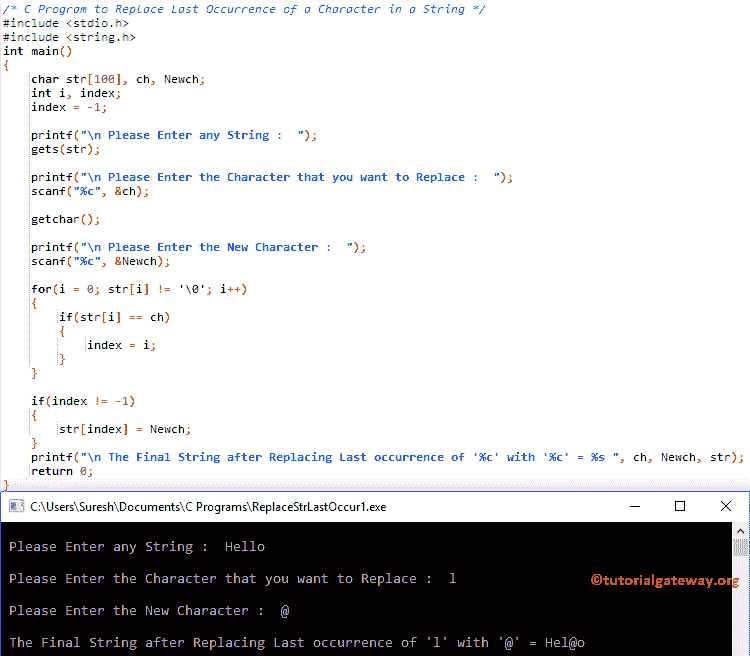

# C 程序：替换字符串中的字符的最后一次出现

> 原文：<https://www.tutorialgateway.org/c-program-to-replace-last-occurrence-of-a-character-in-a-string/>

写一个 C 程序，用例子替换字符串中的字符的最后一次出现。

## 替换字符串中的字符的最后一次出现的程序示例 1

这个 C 程序允许用户输入一个字符串(或字符数组)和一个字符值。接下来，它将查找并替换字符串中的字符的最后一次出现。

```c
/* C Program to Replace Last Occurrence of a Character in a String */

#include <stdio.h>
#include <string.h>

int main()
{
  	char str[100], ch, Newch;
  	int i, index;
  	index = -1;

  	printf("\n Please Enter any String :  ");
  	gets(str);

  	printf("\n Please Enter the Character that you want to Replace :  ");
  	scanf("%c", &ch);

  	getchar();

  	printf("\n Please Enter the New Character :  ");
  	scanf("%c", &Newch);

  	for(i = 0; str[i] != '\0'; i++)
  	{
  		if(str[i] == ch)  
		{
  			index = i;
 		}
	}

	if(index != -1)
  	{
  		str[index] = Newch;
	}

	printf("\n The Final String after Replacing Last occurrence of '%c' with '%c' = %s ", ch, Newch, str);

  	return 0;
}
```



首先，我们使用 [For 循环](https://www.tutorialgateway.org/for-loop-in-c-programming/)来迭代一个 [C 编程](https://www.tutorialgateway.org/c-programming/)字符串中的每个字符。

```c
for(i = 0; i <= strlen(str); i++)
{
	if(str[i] == ch)  
	{
		index = i;  	
	}
}
```

接下来，我们使用 [If 语句](https://www.tutorialgateway.org/if-statement-in-c/)检查索引值是否不等于-1。如果为真，则执行字符串[索引]= Newch；
str[]= Hello
ch = l
Newch = @
Index =-1

对于循环第一次迭代:对于(I = 0；i <= strlen(str); i++)
条件为真，因为我< = 5。

在 While 循环中，我们使用 [If 语句](https://www.tutorialgateway.org/if-statement-in-c/)来检查字符串[0]是否等于用户指定的字符

if(str[I]= = ch)= > if(H = = l)–条件为假。因此，I 值将增加，索引值仍然是-1。

第二次迭代:对于(I = 1；1<= 5; 1++)
if(str[I]= = ch)=>if(e = = l)–条件为假。所以，我将递增，索引值仍然是-1。

第三次迭代:for(I = 2；2<= 5; 2++)
if(str[I]= = ch)=>if(l = = l)–条件为真
指数= i
指数= 2

第三次迭代:for(I = 3；3<= 5; 3++)
if(str[I]= = ch)=>if(l = = l)–条件为真
指数= i = 3

对剩余的迭代做同样的事情。

接下来，我们使用 [If 语句](https://www.tutorialgateway.org/if-statement-in-c/)来检查索引值是否等于-1。这里，条件为真，因此，
str[index]= Newch
str[3]= @

最后，我们使用 printf 语句来打印最终的[字符串](https://www.tutorialgateway.org/c-string/)

```c
printf("\n The Last Occurrence of the Search Element '%c' is at Position %d ", ch, i + 1);
```

## 替换字符串中的字符的最后一次出现的程序示例 2

替换字符的最后一次出现出现的[程序](https://www.tutorialgateway.org/c-programming-examples/)同上。这里，我们刚刚将 For 循环替换为 [While 循环](https://www.tutorialgateway.org/while-loop-in-c/)。

```c
/* C Program to Replace Last Occurrence of a Character in a String */

#include <stdio.h>
#include <string.h> 

int main()
{
  	char str[100], ch, Newch;
  	int i, index;
  	index = -1;
  	i = 0;

  	printf("\n Please Enter any String :  ");
  	gets(str);

  	printf("\n Please Enter the Character that you want to Replace :  ");
  	scanf("%c", &ch);  	
  	getchar();

  	printf("\n Please Enter the New Character :  ");
  	scanf("%c", &Newch);

  	while(i <= strlen(str))
  	{
  		if(str[i] == ch)  
		{
  			index = i;
 		}
 		i++;
	}

	if(index != -1)
  	{
  		str[index] = Newch;
	}

	printf("\n The Final String after Replacing Last occurrence of '%c' with '%c' = %s ", ch, Newch, str);

  	return 0;
}
```

```c
 Please Enter any String :  tutorial gateway

 Please Enter the Character that you want to Replace :  t

 Please Enter the New Character :  #

 The Final String after Replacing Last occurrence of 't' with '#' = tutorial ga#eway
```

## 替换字符串中的字符的最后一次出现的程序示例 3

这个[程序](https://www.tutorialgateway.org/c-programming-examples/)替换字符的最后一次出现的出现与第一个例子相同。不过，这一次，我们应用了[函数](https://www.tutorialgateway.org/functions-in-c/)概念来分离逻辑。

```c
/* C Program to Replace Last Occurrence of a Character in a String */

#include <stdio.h>
#include <string.h>

void Replace_LastOccurrence(char *str, char ch, char Newch);

int main()
{
  	char str[100], ch, Newch;
  	int i, index;
  	index = -1;

  	printf("\n Please Enter any String :  ");
  	gets(str);

  	printf("\n Please Enter the Character that you want to Replace :  ");
  	scanf("%c", &ch);

  	getchar();

  	printf("\n Please Enter the New Character :  ");
  	scanf("%c", &Newch);

  	Replace_LastOccurrence(str, ch, Newch);

	printf("\n The Final String after Replacing Last occurrence of '%c' with '%c' = %s ", ch, Newch, str);

  	return 0;
}

void Replace_LastOccurrence(char *str, char ch, char Newch)
{
	int i, index;
  	index = -1;

	for(i = 0; str[i] != '\0'; i++)
	{
		if(str[i] == ch)
		{
			index = i;
		}  
	}

	if(index != -1)
  	{
  		str[index] = Newch;
	}
}
```

```c
 Please Enter any String :  c programming

 Please Enter the Character that you want to Replace :  m

 Please Enter the New Character :  $

 The Final String after Replacing Last occurrence of 'm' with '$' = c program$ing
```