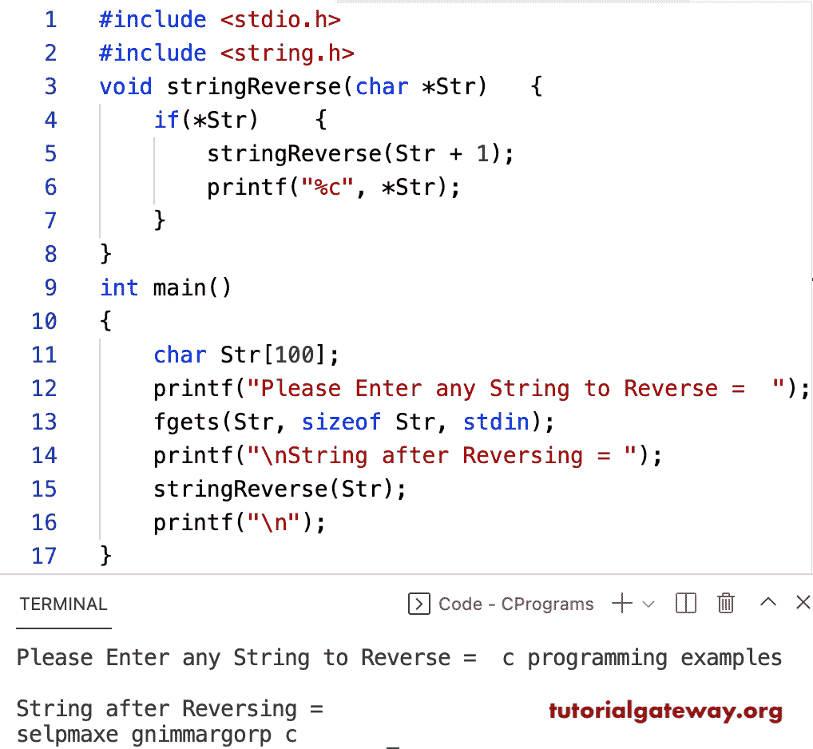

# C 程序：用递归反转字符串

> 原文：<https://www.tutorialgateway.org/c-program-to-reverse-a-string-using-recursion/>

编写一个 C 程序，使用递归或递归函数来反转字符串。在这个 c 字符串反转示例中，string reverse 函数接受字符串指针，并通过递归调用该函数来反转字符串。

```c
#include <stdio.h>
#include <string.h>

void stringReverse(char *Str)
{	
	if(*Str)
	{
		stringReverse(Str + 1);
		printf("%c", *Str);
	}
}

int main()
{
  	char Str[100];

  	printf("Please Enter any String to Reverse =  ");
  	fgets(Str, sizeof Str, stdin);

  	printf("\nString after Reversing = ");
	stringReverse(Str);
	printf("\n");
}

```



这个 c 程序使用临时变量、递归函数和指针来反转给定的字符串。

```c
#include <stdio.h>
#include <string.h>
void stringReverse(char *Str, int i, int len)
{
	char temp;	
  	if (i >= len)
  	{
		return;
  	}

	temp = *(Str + i);
	*(Str + i) = *(Str + len);
	*(Str + len) = temp;
  	stringReverse(Str, ++i, --len);
}

int main()
{
  	char Str[100];

  	printf("\nPlease Enter any String to Reverse =  ");
  	fgets(Str, sizeof Str, stdin);

  	stringReverse(Str, 0, strlen(Str) -1);

  	printf("\nString after Reversing = %s\n", Str);

  	return 0;
}

```

```c
Please Enter any String to Reverse =  hello c programmers

String after Reversing = 
sremmargorp c olleh
```

使用递归反转字符串是另一个 [c 示例](https://www.tutorialgateway.org/c-programming-examples/)。

```c
#include <stdio.h>
void stringReverse()
{	
	char ch;
	scanf("%c", &ch);

	if(ch != '\n')
	{
		stringReverse();
		printf("%c", ch);
	}
}

int main()
{ 
  	printf("Please Enter any String to Reverse =  ");
  	stringReverse();
	printf("\n");
}
```

```c
Please Enter any String to Reverse =  c examples
selpmaxe c
```