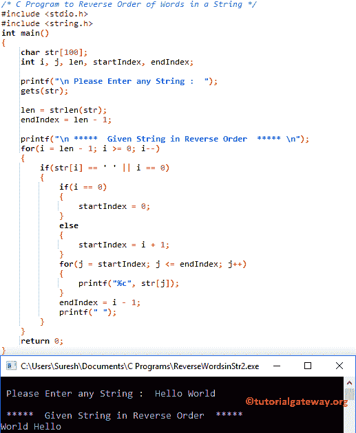

# C 程序：颠倒字符串中单词顺序

> 原文：<https://www.tutorialgateway.org/c-program-to-reverse-order-of-words-in-a-string/>

如何用一个例子编写一个倒序字符串的 C 程序？例如，教程网关将成为网关教程

## 颠倒字符串中单词顺序的 c 程序示例 1

这个用 c 语言倒排字符串中单词的程序允许用户输入一个字符串(或字符数组)和一个字符值。接下来，它将颠倒字符串中单词的顺序。

```c
/* C Program to Reverse Order of Words in a String */

#include <stdio.h>
#include <string.h>

int main()
{
  	char str[100];
  	int i, j, len, startIndex, endIndex;

  	printf("\n Please Enter any String :  ");
  	gets(str);

  	len = strlen(str);
  	endIndex = len - 1;

  	printf("\n *****  Given String in Reverse Order  ***** \n"); 	   	
  	for(i = len - 1; i >= 0; i--)
	{
		if(str[i] == ' ' || i == 0)
		{
			if(i == 0)
			{
				startIndex = 0;
			}
			else
			{
				startIndex = i + 1;
			}
			for(j = startIndex; j <= endIndex; j++)
			{
				printf("%c", str[j]);
			}
			endIndex = i - 1;
			printf(" ");				
		} 
	}

  	return 0;
}
```



在这个 C 程序中反转字符串中的单词这里，我们使用 [For Loop](https://www.tutorialgateway.org/for-loop-in-c-programming/) 来迭代字符串中的每个字符，并删除其中所有重复的字符。

```c
for(i = len - 1; i >= 0; i--)
{
	if(str[i] == ' ' || i == 0)
	{
		if(i == 0)
		{
			startIndex = 0;
		}
		else
		{
			startIndex = i + 1;
		}
		for(j = startIndex; j <= endIndex; j++)
		{
			printf("%c", str[j]);
		}
		endIndex = i - 1;
		printf(" ");				
	} 
}
```

用户在这个 C 程序中输入值来反转字符串中的单词

str[]= Hello World
len = 11
endIndex = len–1 = 10

for Loop–第一次迭代:for(I = len–1；I > = 0；I–)
为(i = 1010>= 0；10–)
接下来，它将进入 [If 语句](https://www.tutorialgateway.org/if-statement-in-c/)检查 str[i]是否等于空格或 i = 0
这个条件一旦在世界
之后到达空格(I = 5；5>= 0；5–)
if(str[5]= = ' ' | | 5 = = 0)–条件为真，则进入下一条 If 语句
If(I = = 0)=>If(5 = = 0)–条件为假，则执行 else 块内的语句
startIndex = I+1
startIndex = 6

第二次 For 循环–第一次迭代:For(j = startIndex；j <= endIndex; j++)
= >为(j = 6；6<= 10；6++)
在 For 循环中，我们使用了 [C 编程](https://www.tutorialgateway.org/c-programming/) printf 语句来打印单个字符
printf("%c "，str[j]) = > W

对 j = 7、j = 8、j= 9 和 j = 10 做同样的操作。接下来，它将开始第一个 For 循环迭代，其中 i = 4。

对 c 程序中给定字符串中的反义词 i = 4、i = 3、i = 2、i = 1 和 i = 0 做同样的操作

## 颠倒字符串中单词顺序的 c 程序示例 2

c [程序](https://www.tutorialgateway.org/c-programming-examples/)中字符串中的这个反向单词将从结束位置遍历字符串到开始位置。一旦找到空白，它将使用空值替换空白，并在该空值后打印字符串。

```c
/* C Program to Reverse Order of Words in a String */

#include <stdio.h>
#include <string.h>

int main()
{
  	char str[100];
  	int i, len;

  	printf("\n Please Enter any String :  ");
  	gets(str);

  	len = strlen(str);
  	printf("\n *****  Given String in Reverse Order  ***** \n"); 	   	
  	for(i = len - 1; i >= 0; i--)
	{
		if(str[i] == ' ')
		{
			str[i] = '\0';
			printf("%s ", &(str[i]) + 1);	
		} 
	}
	printf("%s", str);

  	return 0;
}
```

```c
Please Enter any String : Welcome To Tutorial Gateway

 *****  Given String in Reverse Order  ***** 
Gateway Tutorial To Welcome
```

## 颠倒字符串中单词顺序的 c 程序示例 3

这个[程序](https://www.tutorialgateway.org/c-programming-examples/)在 c 中反转一个字符串中的单词与第一个例子相同，但是这次我们将反转顺序的单词保存在一个单独的字符串中。

 ```c
/* C Program to Reverse Order of Words in a String */

#include <stdio.h>
#include <string.h>

int main()
{
  	char str[100], revstr[100];
  	int i, j, index, len, startIndex, endIndex;

  	printf("\n Please Enter any String :  ");
  	gets(str);

  	len = strlen(str);
  	index = 0;
  	endIndex = len - 1;

  	printf("\n *****  Given String in Reverse Order  ***** \n"); 	   	
  	for(i = len - 1; i > 0; i--)
	{
		if(str[i] == ' ')
		{
			startIndex = i + 1;

			for(j = startIndex; j <= endIndex; j++)
			{
				revstr[index] = str[j];
				index++;
			}
			revstr[index++] = ' ';
			endIndex = i - 1;				
		} 
	}
	for(i = 0; i <= endIndex; i++)
	{
		revstr[index] = str[i];
		index++;
	}
	revstr[index] = '\0';
	printf("\n Given String in Reverse Order = %s", revstr); 
  	return 0;
}
```

```c
Please Enter any String :  learn c programming with examples at tutorial gateway

 *****  Given String in Reverse Order  ***** 

 Given String in Reverse Order = gateway tutorial at examples with programming c learn
```