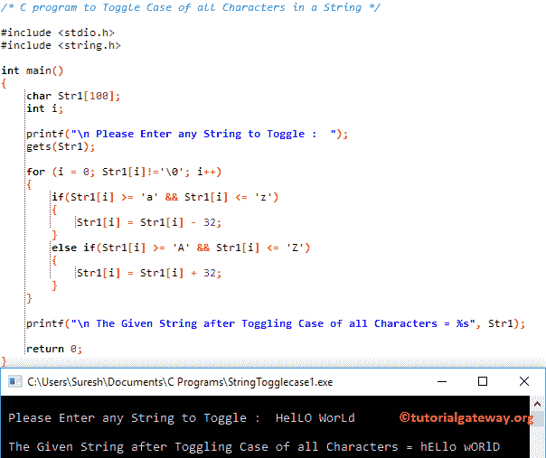

# C 程序：切换字符串中所有字符大小写

> 原文：<https://www.tutorialgateway.org/c-program-to-toggle-case-of-all-characters-in-a-string/>

如何用例子编写一个 C 程序来切换字符串中所有字符的大小写。为了演示相同的内容，我们将使用 For 循环、While 循环、函数和 ASCII 值

## 使用 For 循环切换字符串中所有字符大小写的 c 程序

这个程序允许用户输入任何字符串或字符数组。接下来，它将使用 [For 循环](https://www.tutorialgateway.org/for-loop-in-c-programming/)来迭代该字符串中的每个字符。并将小写字符转换为大写，将大写字符转换为小写。

我们已经在两篇不同的文章中解释了将[小写转换为大写](https://www.tutorialgateway.org/c-program-to-convert-string-to-uppercase/)和将[大写转换为小写](https://www.tutorialgateway.org/c-program-to-convert-string-to-lowercase/)的步骤。

```c
/* C program to Toggle Case of all Characters in a String */

#include <stdio.h>
#include <string.h>

int main()
{
  	char Str1[100];
  	int i;

  	printf("\n Please Enter any String to Toggle : ");
  	gets(Str1);

  	for (i = 0; Str1[i]!='\0'; i++)
  	{
  		if(Str1[i] >= 'a' && Str1[i] <= 'z')
  		{
  			Str1[i] = Str1[i] - 32;
		}		
  		else if(Str1[i] >= 'A' && Str1[i] <= 'Z')
  		{
  			Str1[i] = Str1[i] + 32;
		}
  	}

  	printf("\n The Given String after Toggling Case of all Characters = %s", Str1);

  	return 0;
}
```



## 使用 ASCII 值在字符串中切换字符大小写的程序

这个[程序](https://www.tutorialgateway.org/c-programming-examples/)切换字符串中的字符同上，但是这次我们使用的是[否则 If 语句](https://www.tutorialgateway.org/else-if-statement-in-c/)中的 [ASCII 表](https://www.tutorialgateway.org/ascii-table/)值。

```c
/* C program to Toggle Case of all Characters in a String */

#include <stdio.h>
#include <string.h>

int main()
{
  	char Str1[100];
  	int i;

  	printf("\n Please Enter any String to Toggle :  ");
  	gets(Str1);

  	for (i = 0; Str1[i]!='\0'; i++)
  	{
  		if(Str1[i] >= 65 && Str1[i] <= 90)
  		{
  			Str1[i] = Str1[i] + 32;
		}
		else if(Str1[i] >= 97 && Str1[i] <= 122)
  		{
  			Str1[i] = Str1[i] - 32;
		}
  	}

  	printf("\n The Given String after Toggling Case of all Characters = %s", Str1);

  	return 0;
}
```

```c
 Please Enter any String to Toggle :  TutoriAL GATEwaY

 The Given String after Toggling Case of all Characters = tUTORIal gateWAy
```

## 使用 While 循环在字符串中切换大小写的 c 程序

这个程序和上面一样，但是这次我们使用的是 [While Loop](https://www.tutorialgateway.org/while-loop-in-c/) 。

```c
/* C program to Toggle Case of all Characters in a String */

#include <stdio.h>
#include <string.h>

int main()
{
  	char Str1[100];
  	int i;

  	printf("\n Please Enter any String to Toggle :  ");
  	gets(Str1);

  	i = 0; 
  	while(Str1[i]!='\0')
  	{
  		if(Str1[i] >= 'a' && Str1[i] <= 'z')
  		{
  			Str1[i] = Str1[i] - 32;
		}		
  		else if(Str1[i] >= 'A' && Str1[i] <= 'Z')
  		{
  			Str1[i] = Str1[i] + 32;
		}
		i++;
  	}

  	printf("\n The Given String after Toggling Case of all Characters = %s", Str1);

  	return 0;
}
```

```c
 Please Enter any String to Toggle :  C PrograMMIng

 The Given String after Toggling Case of all Characters = c pROGRAmmiNG
```

## 使用函数切换字符串中所有字符大小写的程序

字符串[程序](https://www.tutorialgateway.org/c-programming-examples/)中的这个切换字符使用[函数](https://www.tutorialgateway.org/functions-in-c/)概念将逻辑与主程序分开。

```c
/* C program to Toggle Case of all Characters in a String */

#include <stdio.h> 

void String_Toggle(char []);

int main()
{
	char str[100];

	printf("\n Please Enter any String to Toggle :  ");
	gets(str);

	String_Toggle(str);

	printf("\n The Given String after Toggling Case of all Characters = %s", str);

	return 0;
}

void String_Toggle(char Str1[]) 
{
	int i;

	for (i = 0; Str1[i]!='\0'; i++)
  	{
  		if(Str1[i] >= 65 && Str1[i] <= 90)
  		{
  			Str1[i] = Str1[i] + 32;
		}
		else if(Str1[i] >= 97 && Str1[i] <= 122)
  		{
  			Str1[i] = Str1[i] - 32;
		}
  	}
}
```

```c
Please Enter any String to Toggle :  Learn C PROGRAMMING foR FreE

 The Given String after Toggling Case of all Characters = lEARN c programming FOr fREe
```